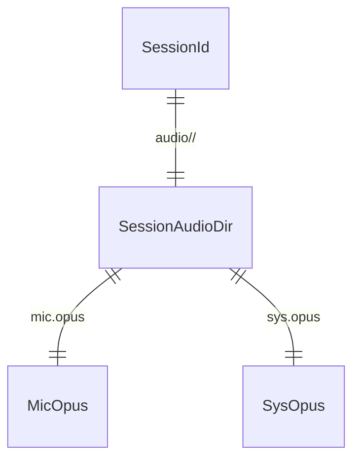

# audio-retention

## Problem

Uma reunião gravada vira um WAV estéreo de trabalho de ~690 MB/h (trilha F, `crates/audio`; pitch da fase 2, rabbit hole "Disco"). Ninguém retém isso: o critério de fechamento da fase 2 exige áudio retido e recuperável, com retenção configurável ("apagar áudio após N dias" apaga, "manter" mantém, com teste automatizado), e a ADR-0005 promete ~13 MB/h por canal. Hoje não existe código que converta o WAV, que confira a conversão antes de apagar o original, que decida quando o áudio de uma sessão expira, nem que apague a pasta de áudio de uma sessão sem risco de apagar outra coisa.

O custo de errar aqui é irreversível nos dois sentidos: apagar o WAV antes de o Opus estar íntegro perde a reunião (a reclamação nº 1 sobre o Granola, `research/02` §6.2), e um Opus estéreo de baixa taxa mistura "eu" e "eles" (ADR candidata 0014).

Quando isto entra, o pipeline da fase 2 chama uma função que deixa `audio/<id>/mic.opus` e `audio/<id>/sys.opus` validados e só então apaga o WAV, e o job de retenção pergunta a uma função pura quais sessões têm áudio vencido.

## Flow

Reusa `fala-meeting::SessionId` (ULID, 2.F1) para o nome da pasta e `UnixMillis` para o relógio, e o `hound` que já está no `Cargo.lock` para ler o WAV; não reusa nem toca `crates/audio` (fronteira da rodada).

1. WAV estéreo 48 kHz i16 da trilha F -> `fala-retention` (door 1) - lê com `hound`, separa L (mic) e R (sistema)
2. `fala-retention` - codifica cada canal com libopus (door 2) em Ogg Opus mono, 24 kbps, em `mic.opus.part` e `sys.opus.part` (door 3)
3. `fala-retention` - decodifica os dois `.part` e confere a contagem de amostras com a do WAV; renomeia para `mic.opus` e `sys.opus`; só então apaga o WAV
4. lista de sessões encerradas (`SessionId`, fim, transcrição confirmada) + `RetentionPolicy` (door 4) + agora -> `fala-retention` - devolve os ids com áudio vencido
5. `fala-retention` - apaga `audio/<id>/` de um id vencido; nada fora dessa pasta

## Impact

| Front | What changes |
| --- | --- |
| domain | new term: `RetentionPolicy` - `keep` (padrão), `delete_after_days` (1 a 3650), `delete_after_transcript`, lives in `fala-retention` |
| domain | new term: `RetainedAudio` - os dois arquivos Opus de uma sessão e a duração em amostras, lives in `fala-retention` |
| domain | existing term: "áudio retido" no design doc §3.5 era `audio/<sessão>.opus` (um arquivo); passa a ser a pasta `audio/<id>/` com dois arquivos (ADR-0014) - ninguém lê esse caminho hoje |
| domain | existing term: o design doc §3.2 põe o gravador WAV→Opus em `audio`; o encoder nasce em `fala-retention` (ADR-0014) - ninguém o chama hoje |
| stored data | nothing to migrate - nenhuma sessão foi retida ainda; o layout `audio/<id>/{mic,sys}.opus` fica fixado (door 3) |

## Relations

One-way constraints: uma pasta por `SessionId`, com exatamente esses dois nomes (door 3). No columns and no types here.

## Surface

None - nothing consumed outside: é uma biblioteca; o que sai do processo são os arquivos em disco (door 3) e a forma serializada da política (door 4), que o `Settings` vai persistir.

## Landing

| One-way door | Literal shape | Alternative rejected |
| --- | --- | --- |
| 1. crate novo | `crates/retention`, pacote `fala-retention`, depende de `fala-meeting`; linha no Code Map | dentro de `crates/audio`: a fronteira da rodada proíbe, e o painel `pipeline-audio` está mexendo nele; dentro de `fala-meeting`: poria uma dependência C (libopus + CMake) no crate de lógica pura da sessão |
| 2. dependências novas | `opus = "0.3"`, `audiopus_sys = { version = "0.2", features = ["static"] }` (libopus compilado do fonte por CMake quando o sistema não o tem; ISC + BSD-3), `ogg = "0.9"` (BSD-3), `hound = "3.5"` (já no lock, Apache-2.0); `tempfile = "3"` só em dev (já no lock) | `ffmpeg` em subprocesso: a retenção, obrigatória, dependeria de um binário que só a importação (opcional) precisa; encoder Rust puro: imaturo (pitch D2) |
| 3. formato e layout do áudio retido | `audio/<SessionId>/mic.opus` (L do WAV) e `audio/<SessionId>/sys.opus` (R), Ogg Opus RFC 7845, mono, 48 kHz, pacotes de 20 ms, VBR com alvo de 24 kbps, `OpusHead` com o pre-skip do encoder e granule final = pre-skip + amostras do WAV | Opus estéreo a 48 kbps: o intensity stereo mistura eu e eles; multistream num arquivo: exige separar os canais antes de cada envio (ADR-0014) |
| 4. forma serializada de `RetentionPolicy` | `"keep"`, `{"delete_after_days": 30}`, `"delete_after_transcript"` (serde externamente marcado, `snake_case`) | um inteiro de dias com 0 = manter: não expressa "apagar após a transcrição confirmada" |
| 5. apagar o WAV | só depois de os dois Opus decodificarem com a contagem exata de amostras do WAV e de os dois `.part` serem renomeados | apagar depois de codificar sem decodificar: um Opus truncado (disco cheio, crash) passaria e a reunião sumiria |

- Nothing else in this change is hard to reverse

## Criteria

### S1: WAV vira dois Opus mono (P1)

O áudio retido preserva "eu" e "eles" em arquivos separados, no formato fixado.

**Acceptance Criteria**

1. WHEN `retain_wav` recebe um WAV estéreo 48 kHz i16 de 10 s THEN `fala-retention` SHALL escrever `mic.opus` e `sys.opus` na pasta da sessão, cada um um stream Ogg cujo primeiro pacote é um `OpusHead` com 1 canal e 48 000 Hz de entrada e cujo segundo pacote começa com `OpusTags`
2. WHEN o canal esquerdo do WAV tem um tom de 440 Hz e o direito é silêncio digital THEN o `mic.opus` decodificado SHALL ter RMS acima de 0,05 e o `sys.opus` decodificado SHALL ter RMS abaixo de 0,001
3. The `fala-retention` SHALL codificar cada canal com alvo de 24 000 bit/s, e cada arquivo de 10 s de tom com ruído SHALL ter no máximo 40 000 bytes
4. IF o WAV não é 48 kHz, estéreo e 16 bits THEN `fala-retention` SHALL devolver `RetentionError::UnsupportedWav` com o formato encontrado e SHALL não criar nenhum arquivo na pasta da sessão

**Independent test:** `cargo test -p fala-retention encode`

### S2: validar antes de apagar o WAV (P1)

O WAV só some quando os dois Opus provaram que guardam a reunião inteira.

**Acceptance Criteria**

5. WHEN `retain_wav` termina THEN `RetainedAudio.samples` SHALL ser igual ao número de quadros do WAV, e decodificar cada arquivo SHALL devolver exatamente esse número de amostras depois de descontado o pre-skip
6. WHEN a conversão e a validação passam THEN `fala-retention` SHALL apagar o WAV, e na pasta da sessão SHALL existir só `mic.opus` e `sys.opus` (nenhum `.part`)
7. IF a escrita de um Opus falha (pasta da sessão inexistente e impossível de criar) THEN `fala-retention` SHALL devolver erro e o WAV SHALL continuar no disco com o mesmo tamanho
8. IF `validate_opus` recebe um arquivo truncado na metade ou uma contagem esperada diferente da que o arquivo contém THEN `fala-retention` SHALL devolver `RetentionError::ValidationFailed` com as duas contagens ou a causa
9. WHEN `retain_wav` roda de novo sobre uma pasta com `.part` de uma tentativa interrompida THEN `fala-retention` SHALL sobrescrevê-los e terminar como em AC 6

**Independent test:** `cargo test -p fala-retention validate`

### S3: política de retenção (P1)

Quais sessões têm o áudio vencido, com relógio falso.

**Acceptance Criteria**

10. The `RetentionPolicy::default()` SHALL ser `Keep`, e com `Keep` `audio_due` SHALL devolver lista vazia para qualquer conjunto de sessões e qualquer instante
11. WHEN a política é `DeleteAfterDays(30)` THEN `audio_due` SHALL devolver as sessões encerradas há 30 dias ou mais (inclusive exatamente 30 dias) e SHALL não devolver as encerradas há 29 dias, 23 h e 59 min
12. WHEN a política é `DeleteAfterTranscript` THEN `audio_due` SHALL devolver exatamente as sessões com transcrição confirmada
13. IF uma sessão não tem instante de fim (ainda gravando ou interrompida) THEN `audio_due` SHALL nunca devolvê-la, com qualquer política
14. IF `RetentionPolicy::delete_after_days` recebe 0 ou 3651 THEN `fala-retention` SHALL devolver `RetentionError::DaysOutOfRange`; 1 e 3650 SHALL ser aceitos
15. The `fala-retention` SHALL serializar a política como `"keep"`, `{"delete_after_days":30}` e `"delete_after_transcript"`, e desserializar cada forma de volta para o mesmo valor

**Independent test:** `cargo test -p fala-retention policy`

### S4: apagar o áudio de uma sessão (P1)

Apagar uma sessão nunca apaga outra coisa.

**Acceptance Criteria**

16. WHEN `delete_session_audio(root, id)` é chamado e `root/<id>/` existe THEN `fala-retention` SHALL remover essa pasta com o conteúdo, SHALL manter a pasta de outra sessão e um arquivo solto em `root`, e SHALL devolver `true`
17. IF `root/<id>/` não existe THEN `delete_session_audio` SHALL devolver `false` sem erro

**Independent test:** `cargo test -p fala-retention delete`

## Out of scope

| Excluded | Why |
| --- | --- |
| recuperar WAV órfão (concluir o cabeçalho na abertura) | o layout do WAV é da trilha F (ainda não integrada) e reconhecer "sessão sem `Stopped`" precisa da sessão persistida (2.F5); entra por adição quando as duas existirem |
| apagar transcrição, notas e `.md` junto com o áudio | não existem ainda (2.F4, 2.F5, 2.F6); a função de apagar sessão inteira compõe com `delete_session_audio` |
| agendar o job (na abertura e uma vez por dia) | é do desktop (fase 2); a decisão de quem vence é pura e está aqui |
| confirmação na UI antes de apagar | 2.F2 |
| tocar um trecho (`segment-playback`) | 2.F9 |
| FLAC como saída | só se o libopus não compilar; aqui compilou (registrado no `## Handoff` do `checks.md` se não compilar) |
| sessão `system_only` sem `mic.opus` | o gravador da trilha F grava estéreo sempre; um mic em silêncio custa poucos KB em VBR; omitir o arquivo muda o layout (door 3) e fica para quando a F definir o canal ausente |

## Assumptions

| Assumption | Chosen default | Rationale | Confirmed? |
| --- | --- | --- | --- |
| lugar do encoder | crate novo `fala-retention`, não `crates/audio` como diz o pitch | fronteira da rodada; o pitch não é vinculante sobre o lugar e a ADR-0014 registra | y - delegado pelo Augusto em 2026-10-02, decidido pelo painel |
| VBR ou CBR | VBR com alvo de 24 kbps (padrão do libopus), aplicação VoIP | silêncio longo no canal "eu" sai mais barato; o pitch fixa a taxa, não o modo | y - delegado pelo Augusto em 2026-10-02, decidido pelo painel |
| limite de dias | 1 a 3650 | 0 seria "apagar já", que é outra política; 10 anos cobre qualquer uso real | y - delegado pelo Augusto em 2026-10-02, decidido pelo painel |
| "dia" na retenção | 86 400 000 ms de relógio de parede desde o fim da sessão | sem fuso nem calendário no crate puro; a diferença de horário de verão não muda a intenção | y - delegado pelo Augusto em 2026-10-02, decidido pelo painel |
| leitura do WAV | `hound` (já no lock), lido em blocos de 20 ms e codificado em fluxo, sem carregar o WAV na memória | uma hora de estéreo i16 são ~690 MB; a RAM do app gravando é critério da fase 2 | y - delegado pelo Augusto em 2026-10-02, decidido pelo painel |

**Open questions:** none - all resolved or logged above.

## Observable

None - no user-facing surface: a retenção aparece em `Settings` e no "apagar sessão" da 2.F2.

## Sources

- ADR-0005 (dois canais, Opus depois, retenção configurável); ADR-0014 (`proposed`, este PR)
- `fala-research/plans/roadmap-proposta-2026-10-02.md` decisão 5; `pitches/fase-2-reuniao-videos.md` F3, D1, D2, rabbit holes "Opus estéreo" e "Disco"
