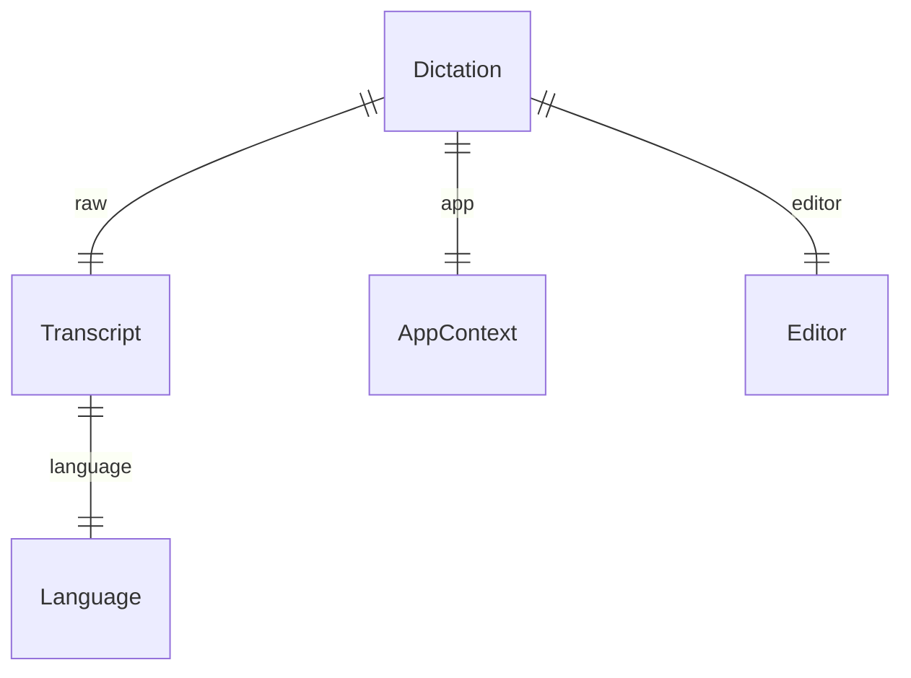

# core-contract

## Problem

`crates/core` está vazio (`crates/core/src/lib.rs` é só `//!`). Quatro trilhas desta rodada (A pipeline, B pós-processamento, C storage, F gravador; `fala-research/HANDOFF-fase-1-linux.md`) começam em paralelo e todas trocam os mesmos dados: o áudio do ditado, o texto bruto do ASR, o texto final, o idioma, o app ativo e o dicionário. Sem um contrato comum, cada trilha define a sua versão desses tipos, e a reconciliação de nomes e de forma serializada vem depois, quando C já tiver gravado linhas no SQLite com uma delas.

Quando isto entra, as quatro trilhas importam os mesmos tipos de `fala-core`, e a forma serializada do que C persiste fica fixada aqui, uma vez.

## Flow

Reusa o `thiserror` que já está em `[workspace.dependencies]`; nenhum tipo do `apps/desktop` é movido (o desktop fica intocado nesta rodada).

`single module - fala-core` (exists): define os tipos; `fala-audio` e `fala-asr` (A, F), `fala-postproc` (B) e `fala-storage` (C) os importam nas suas próprias features.

## Impact

| Front | What changes |
| --- | --- |
| domain | new term: `Language` - idioma de um ditado, `pt-BR` ou `en`, lives in `fala-core` |
| domain | new term: `DictationAudio` - samples mono f32 a 16 kHz de um ditado; nunca serializável (invariante: o áudio de ditado não sai da máquina), lives in `fala-core` |
| domain | new term: `Transcript` - texto bruto que o ASR devolve, com o idioma, lives in `fala-core` |
| domain | new term: `AppContext` - nome do app ativo, quando conhecido, lives in `fala-core` |
| domain | new term: `Dictionary` - termos do dicionário pessoal, normalizados, lives in `fala-core` |
| domain | new term: `Editor` - quem produziu o texto final: `none`, `rules` ou `llm`, lives in `fala-core` |
| domain | new term: `Dictation` - um ditado completo: bruto, final, editor e app; é o que C grava e o que "desfazer edição da IA" lê, lives in `fala-core` |
| domain | new term: `CoreError` - erros de `fala-core` (`thiserror`) |
| domain | existing doc comment of `crates/core/src/lib.rs` promete `Event`, `Settings`, `Utterance`, `Session`; passa a listar o que existe e diz que o resto entra por adição - ninguém ramifica nele hoje |
| stored data | nothing to migrate - nada persiste ainda; C será a primeira a gravar a forma serializada fixada no Landing |

## Relations

One-way constraints: a forma serializada de `Language` e `Editor` (door 1, door 2), e `DictationAudio` sem serialização (door 3). No columns and no types here.

## Surface

None - nothing consumed outside: são tipos de biblioteca dentro do workspace; a única forma que sai do processo é a serializada, tratada no Landing.

## Landing

| One-way door | Literal shape | Alternative rejected |
| --- | --- | --- |
| 1. forma serializada de `Language` | string BCP-47: `"pt-BR"`, `"en"` (`#[serde(rename = ...)]`) | nome da variante (`"PtBr"`): não é a tag que o Nemotron e o seletor usam, e C grava o valor no SQLite |
| 2. forma serializada de `Editor` | `"none"`, `"rules"`, `"llm"` (`#[serde(rename_all = "lowercase")]`) | `bool edited_by_llm`: não distingue "regras locais" de "nada aplicado", que o desfazer da IA precisa separar |
| 3. `DictationAudio` sem serialização | sem `derive(Serialize)`, provado por `static_assertions::assert_not_impl_any!(DictationAudio: serde::Serialize)` num teste | só convenção ("não derive"): uma derivação futura passaria sem ninguém notar; o `ARCHITECTURE.md` exige que o tipo não implemente serialização |
| 4. dependências novas em `fala-core` | `serde = { version = "1", features = ["derive"] }` em `[workspace.dependencies]`; `serde_json` e `static_assertions = "1"` só como dev-dependencies | sem serde no core: cada crate consumidor escreveria a própria conversão para JSON/SQL e as formas 1 e 2 divergiriam |

- Nothing else in this change is hard to reverse

## Criteria

### S1: idioma (P1)

O idioma de um ditado tem uma forma só, no texto e no JSON.

**Acceptance Criteria**

1. WHEN `Language::from_str` recebe `pt-BR`, `PT-br`, `pt` ou `en` THEN `fala-core` SHALL devolver `PtBr`, `PtBr`, `PtBr` e `En`, respectivamente
2. IF `Language::from_str` recebe qualquer outra string (`es`, `pt-PT`, vazia) THEN `fala-core` SHALL devolver `CoreError::UnknownLanguage` carregando a string recebida
3. The `fala-core` SHALL serializar `Language::PtBr` como `"pt-BR"` e `Language::En` como `"en"` em JSON, e desserializar cada string de volta para a mesma variante
4. The `fala-core` SHALL expor `Language::tag()` devolvendo `"pt-BR"` e `"en"`, o mesmo texto da forma serializada

**Independent test:** `cargo test -p fala-core language`

### S2: áudio do ditado (P1)

O áudio que o ASR recebe tem taxa fixa e não pode ser serializado.

**Acceptance Criteria**

5. The `DictationAudio` SHALL não implementar `serde::Serialize`, verificado em tempo de compilação
6. WHEN `DictationAudio::new` recebe 16 000 samples THEN `duration()` SHALL devolver exatamente 1,000 s, e `DictationAudio::SAMPLE_RATE_HZ` SHALL ser 16 000
7. WHEN `DictationAudio::new` recebe zero samples THEN `duration()` SHALL devolver 0 s e `is_empty()` SHALL devolver `true`

**Independent test:** `cargo test -p fala-core audio`

### S3: ditado, editor e dicionário (P1)

O registro que B produz e C grava atravessa JSON sem perder nada.

**Acceptance Criteria**

8. The `fala-core` SHALL serializar `Editor` como `"none"`, `"rules"` e `"llm"`
9. WHEN um `Dictation` com bruto `"oi tudo bem"`, final `"Oi, tudo bem?"`, editor `Llm` e app `Some("Slack")` vai a JSON e volta THEN `fala-core` SHALL devolver um valor igual ao original
10. WHEN `Dictation::unedited` recebe um `Transcript` e um `AppContext` THEN o `Dictation` SHALL ter o texto final igual ao bruto e editor `None`
11. WHEN `Dictionary::new` recebe `[" Fala ", "fala", "", "ADR", "  "]` THEN `terms()` SHALL devolver `["Fala", "ADR"]` (espaço das pontas removido, vazios descartados, duplicata sem diferenciar maiúsculas descartada, primeira grafia e ordem mantidas)
12. The `fala-core` SHALL compilar sem depender de `tauri` nem de nenhum `cfg(target_os)`, verificado por `scripts/check-no-tauri-in-crates.sh` saindo com 0 e por `rg 'cfg\(target_os|cfg\(windows' crates/core` sem resultado

**Independent test:** `cargo test -p fala-core`

## Out of scope

| Excluded | Why |
| --- | --- |
| `Event`, `Settings`, `Session` | nenhuma trilha desta rodada precisa deles; `Event` nasce com a ligação do desktop, `Session` com a reunião (fase 2) |
| `Utterance` (trecho fechado pelo VAD) | é de A: entra em `fala-core` por adição no plano de A, se A decidir que outro crate precisa dele |
| id, data e hora de um ditado | são do storage (C), que atribui ao gravar |
| mover tipos de `apps/desktop` | o desktop fica intocado nesta rodada (`HANDOFF-fase-1-linux.md`) |

## Assumptions

| Assumption | Chosen default | Rationale | Confirmed? |
| --- | --- | --- | --- |
| idiomas do contrato | só `pt-BR` e `en`; `auto` do Handy fica fora | o pitch da fase 1 diz "seletor pt-BR/en" e "sem mais de um idioma no mesmo ditado"; um idioma novo é variante nova, aditiva | y |
| `pt` sozinho | aceito como `PtBr` no parse, serializado sempre como `"pt-BR"` | o whisper e o Handy usam `pt`; normalizar na entrada evita duas grafias no SQLite | y |
| `AppContext` | só `app_name: Option<String>` | ADR-0004 manda só o nome do app ao LLM; executável/título de janela entram por adição quando a lista de apps desligados precisar | y |

**Open questions:** none - all resolved or logged above.

## Observable

None - no user-facing surface

## Sources

- `fala-research/HANDOFF-fase-1-linux.md` - a rodada, as trilhas que consomem este contrato e a regra de só-adição depois dele
- `ARCHITECTURE.md` § Invariantes - "o tipo que o representa não implementa serialização"
