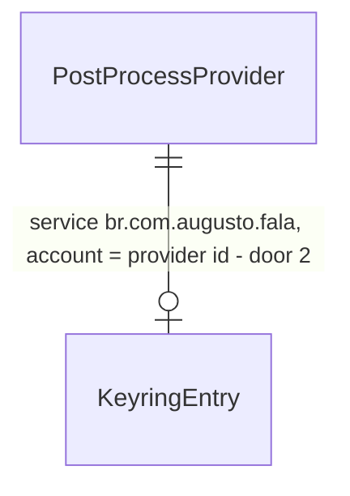

# desktop-keys — as chaves do pós-processamento do desktop saem do JSON e vão para o keyring

Profile: standard (o projeto declara `light`; a migração é porta de mão única sobre dado do usuário, e o `light` não pega um teste que passa sob a implementação errada; decidido pelo painel, delegado pelo Augusto em 2026-10-02)

## Problem

O desktop guarda as chaves de API do pós-processamento em texto puro em
`settings_store.json` (`AppSettings::post_process_api_keys`, `apps/desktop/src/settings.rs:453`,
gravado pelo `tauri-plugin-store` em `get_settings` e `write_settings`). Qualquer processo do
usuário, backup ou sincronização de pasta lê as chaves. Isso viola a ADR-0008 ("as chaves vivem
no keyring do SO") e o invariante do `AGENTS.md` ("nenhuma chave em config"). Quem paga: quem já
colou uma chave no app herdado. Evidência de volume: nenhuma no material da rodada.

Quando isto fechar, abrir o app migra cada chave não vazia do JSON para o keyring do SO
(service `br.com.augusto.fala`, account = id do provedor, o mesmo lugar do `fala-cli key set`)
e o JSON fica só com `""`. A UI e o pós-processamento continuam vendo as chaves como antes.

## Flow

Reusa `fala-secrets` (`SecretStore`, `KeyringStore`, `validate_provider`) da trilha B; o
`AppSettings` em memória e o que a UI recebe não mudam de forma.

1. `get_settings` (exists) lê `settings` do store → `serde_json::from_value` (exists) → `KeyVault::hydrate` (novo, em `settings.rs`, door 2) preenche cada chave vazia com a do keyring; chave não vazia do JSON vence (é legado ou uma migração que falhou)
2. `get_settings`/`write_settings` (exist) persistem por `to_store_value` (novo, em `settings.rs`, door 1): `KeyVault::to_disk` grava no keyring cada chave que mudou, relê para confirmar, e devolve o mapa do JSON com `""` nas chaves confirmadas e o texto só nas que o keyring recusou
3. `get_settings` persiste uma vez quando leu alguma chave não vazia do JSON, o que faz a migração na primeira abertura (door 1)
4. out: `AppSettings` com as chaves em memória para `actions.rs`, `shortcut/mod.rs` e a UI (exists, sem mudança); `settings_store.json` sem chave

## Impact

| Front | What changes |
| --- | --- |
| domain | novo termo: `KeyVault` - a ponte entre `post_process_api_keys` em memória e o keyring do SO, com um cache do que já está confirmado lá; vive em `apps/desktop/src/settings.rs` |
| domain | termo existente: `post_process_api_keys` era o lugar onde a chave vivia em disco; agora só em memória (e na IPC para a UI), com o disco no keyring |
| stored data | migração na leitura, idempotente: cada chave não vazia do JSON é gravada e relida no keyring e só então vira `""` no JSON; sem backfill, sem dual write duradouro (o texto puro só fica quando o keyring recusa) |
| build | `apps/desktop` passa a depender de `fala-secrets` (e, por ele, de `keyring` 4) |

## Relations

One-way constraints: a entrada é a mesma da trilha B (door 3 de `postproc`); id de provedor fora
de `^[a-z0-9_]{1,32}$` nunca vai ao keyring e fica no JSON. No columns and no types here.

## Surface

None - nenhum comando Tauri, evento ou campo de `AppSettings` muda; `src/bindings.ts` fica igual.

## Landing

| One-way door | Literal shape | Alternative rejected |
| --- | --- | --- |
| 1. migração do JSON para o keyring | por chave não vazia: `store.set(id, key)` → `store.get(id) == Some(key)` → só então `""` no JSON; falha em qualquer passo deixa o texto no JSON e loga `warn` com o id, nunca a chave; roda a cada persistência, então converge sozinha quando o keyring volta | apagar o JSON depois do `set` sem reler - um `set` que "dá certo" num cofre travado perde a chave; migrar só no primeiro start com flag - uma falha vira texto puro para sempre |
| 2. leitura das chaves | `AppSettings` em memória continua com `post_process_api_keys` preenchido (do JSON se não vazio, senão do keyring); cache em processo (`Mutex<HashMap>`) das chaves confirmadas, para o `get_settings` frequente não ir ao D-Bus/Credential Manager a cada chamada | tirar o campo de `AppSettings` e ler o keyring em `actions.rs`/`shortcut/mod.rs`/UI - refatora o herdado e muda `bindings.ts`, fora do escopo de K; ler o keyring em toda chamada - dezenas de idas ao cofre por ditado |

- Nothing else in this change is hard to reverse

## Criteria

### S1: Migração idempotente (P1)

Uma chave que estava no JSON passa para o keyring e some do disco, sem nunca se perder.

**Acceptance Criteria**

1. WHEN settings are loaded with a non-empty key for a valid provider id in the JSON THEN the desktop SHALL write it to the secret store, read it back equal, and persist the JSON with `""` for that provider
2. IF writing to the secret store fails, or the read-back differs, THEN the desktop SHALL keep the key's text in the persisted JSON and in memory, and SHALL log a warning that names the provider and not the key
3. IF the provider id does not match `^[a-z0-9_]{1,32}$` THEN the desktop SHALL keep that key in the JSON and not call the secret store for it
4. WHEN settings are loaded twice in a row after a successful migration THEN the second load SHALL return the same keys and SHALL not write to the secret store again

**Independent test:** os testes de `settings.rs` com um `MemoryStore` e com um store que falha.

### S2: As chaves continuam visíveis para o app (P1)

O pós-processamento e a UI não percebem a mudança.

**Acceptance Criteria**

5. WHEN the JSON has `""` for a provider and the secret store has a key for it THEN the loaded `AppSettings` SHALL carry that key in `post_process_api_keys`
6. WHEN a key is changed through `write_settings` THEN the secret store SHALL hold the new value and the persisted JSON SHALL hold `""`; WHEN it is changed to `""` THEN the secret store entry SHALL be deleted
7. The persisted `settings` JSON value SHALL never contain a key that the secret store confirmed

**Independent test:** `cargo test -p fala --lib settings::tests::<nome>`.

## Out of scope

| Excluded | Why |
| --- | --- |
| tirar `post_process_api_keys` de `AppSettings` e da IPC para a UI | refatora o herdado e o frontend; fica para a rodada que liga o desktop aos crates (ADR-0008 "Settings não tem campo de chave" segue pendente até lá) |
| tela de chaves nova / onboarding BYOK | UI, fora da rodada |
| modo portátil guardar a chave na pasta portátil | o keyring vale também no portátil; uma chave por máquina é aceitável e mais seguro que texto ao lado do `.exe` |
| apagar do keyring quando o usuário desinstala | o instalador é da trilha H |

## Assumptions

| Assumption | Chosen default | Rationale | Confirmed? |
| --- | --- | --- | --- |
| quem vence quando JSON e keyring têm chave | o JSON não vazio vence e é migrado por cima | só existe texto no JSON se é legado ou se a gravação no keyring falhou; nos dois casos é o valor mais novo | y - delegado pelo Augusto em 2026-10-02, decidido pelo painel |
| cofre indisponível na leitura | a chave aparece vazia em memória e um `warn` é logado; nada é apagado | sem cofre não há o que ler; o JSON não tem a chave para mostrar | y - delegado pelo Augusto em 2026-10-02, decidido pelo painel |
| custo por `get_settings` | uma ida ao cofre por provedor só na primeira leitura do processo; depois, cache | `get_settings` é chamado várias vezes por ditado | y - delegado pelo Augusto em 2026-10-02, decidido pelo painel |
| teste | as funções de `KeyVault` recebem `&dyn SecretStore`; os testes usam `MemoryStore` e um store que falha; o app usa `KeyringStore` | o `get_settings` precisa de `AppHandle`; testar a peça pura é o padrão dos testes já existentes em `settings.rs` | y - delegado pelo Augusto em 2026-10-02, decidido pelo painel |

**Open questions:**

| # | Kind | Question | Until answered |
| --- | --- | --- | --- |
| 1 | blocks go-live | A migração real no Windows (Credential Manager) e com o `settings_store.json` de um usuário do app herdado só é vista no Windows. | `TODO(windows)`: abrir o app com um JSON que tem chave e conferir o Credential Manager e o JSON |

## Observable

| Surface | Decision | Landing |
| --- | --- | --- |
| arquivo `settings_store.json` | o que fica em disco | AC 1, AC 2, AC 7 |
| arquivo `settings_store.json` | failure halfway | AC 2 - a chave nunca sai do JSON antes de confirmada |
| keyring do SO | id inválido | AC 3 |
| keyring do SO | repetição (idempotência) | AC 4 |
| log | o que aparece | AC 2 - id do provedor, nunca a chave |
| UI e comandos Tauri | forma dos dados | n/a - `AppSettings` e `bindings.ts` não mudam (Surface `None`) |

## Sources

- `docs/decisions/0008-distribuicao-byok-sem-backend-assinatura-e-updater-adiados.md` - chaves no keyring
- `.specs/features/postproc/plan.md` door 1 e door 3 - `fala-secrets` e o nome da entrada
- decisão do orquestrador da rodada (Lux), 2026-10-02: "K com migração idempotente que nunca apaga do JSON antes de confirmar a gravação no keyring"
