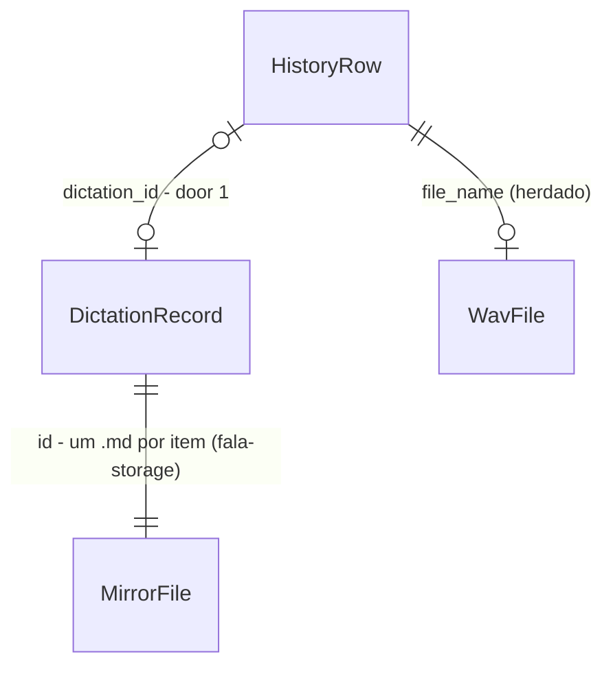

# history-undo — histórico do desktop com "desfazer edição da IA", sobre `fala-storage`

## Problem

Depois que o texto é colado, a pessoa não tem como voltar ao que ela disse quando o pós-processamento
reescreve mal. O histórico do desktop, herdado do Handy, mostra e copia só `transcription_text`, o
bruto do ASR (`front:components/settings/history/HistorySettings.tsx`), então nem o texto que foi
colado aparece nele. Ele também não sabe em que app o texto entrou nem quem editou o texto
(`managers/history.rs`, colunas `transcription_text`, `post_processed_text`, `post_process_prompt`,
`post_process_requested`), e não desfaz nada (itens W9 e W10 do delta).

Quem paga é quem dita com o LLM ligado: quando a edição troca um nome próprio, corta uma frase ou muda
o tom, o original se perde, e a pessoa precisa ditar de novo. Além disso, o histórico do desktop vive
em `history.db`, enquanto a CLI (`fala-cli history search/undo`, #40) grava e busca em `fala.sqlite`
pelo crate `fala-storage` (#29). Os dois não se enxergam, e a busca sem acento, o espelho Markdown e o
`undo`/`redo` que a trilha C escreveu não chegam ao app. A fonte não traz números de incidência de
edições ruins.

Quando isto entrar, cada ditado entregue pelo desktop vira também um item de `fala.sqlite`, com o
bruto, o texto colado, quem editou e o app. O histórico passa a mostrar o texto colado e, nos itens
que a IA editou, oferece "Desfazer edição da IA": o item passa a mostrar o original, e o original vai
para a área de transferência. "Reaplicar edição da IA" faz o caminho de volta. Os ditados que já
estavam no `history.db` são copiados para `fala.sqlite` uma vez, na abertura.

## Flow

Reusa o `Store` de `fala-storage` (gravar, `get`, `undo`, `redo`, o espelho), o `foreground_app` de
`fala-inject` (#36) e a entrega tudo-ou-nada da 1.F2 (`deliver_unless_cancelled`). O `HistoryManager`
herdado continua dono do áudio, da estrela, do título, da retenção e do retry. Nada de pipeline,
fila ou thread novos.

1. abertura -> `HistoryManager::new` (exists) - aplica a migração 5 de `history.db` (door 1), abre `fala.sqlite` e `notas/` na pasta de dados do app (door 3, `Store::open` exists) e copia para lá cada linha antiga com texto e sem vínculo, gravando o id em `dictation_id` (door 4)
2. ditado entregue -> `TranscribeAction::stop` (exists) - dentro do `save` de `deliver_unless_cancelled`, passa ao `save_entry` o texto colado e o app em foco (`fala_inject::foreground_app`, exists)
3. `HistoryManager::save_entry` (exists) - monta o `fala_core::Dictation` (bruto, final, `Editor`, `Language` das settings, app), grava por `Store::add` (exists), e grava a linha de `history.db` com o `dictation_id`
4. leitura -> `get_history_entries` (exists) - lê `history.db` e completa cada linha vinculada com o item de `fala.sqlite` (`Store::get`, exists)
5. desfazer/reaplicar -> comandos `undo_history_entry_edit` / `redo_history_entry_edit` (new, no door - placement) -> `Store::undo` / `Store::redo` (exists), que reescrevem `showing` e o `.md`; o item atualizado volta ao front e sai no evento `history-update-payload` (`updated`)
6. apagar, retenção e retry -> `HistoryManager` (exists) - apagam o item vinculado por `Store::delete` (door 5) antes da linha e do WAV; o retry troca o item por um novo com os textos novos
7. out: `HistorySettings` (exists, front) mostra o texto do item (final, ou bruto depois de desfazer), o app quando conhecido, e os botões de desfazer e reaplicar; o texto escolhido vai para a área de transferência

## Impact

| Front | What changes |
| --- | --- |
| domain | termo novo no desktop: `dictation_id` - o id (UUID v7) do item de `fala.sqlite` que corresponde a uma linha de `history.db`; nulo em transcrição que falhou e quando o store não abriu. Vive em `managers/history.rs` |
| domain | termo existente: `HistoryEntry` ganha `dictation_id` e `dictation` (bruto, final, quem editou, o que mostra, app). Quem ramifica nele hoje: `HistorySettings.tsx`, o `copy_last_transcript` do tray (`last_transcript_text`, que segue lendo `post_processed_text`) e o helper `build_entry` dos testes do tray, que ganha os dois campos nulos |
| domain | termo existente: o texto que o histórico mostra e copia era `transcription_text` (bruto); passa a ser o texto do item (o colado, ou o bruto depois de desfazer). Linhas sem vínculo seguem com `transcription_text` |
| behaviour | apagar um item, a retenção (`history_limit`, padrão 5, ou o período) e o retry passam a valer também para `fala.sqlite` e para os `.md` de `notas/Ditados/` |
| stored data | `history.db` sobe para `user_version` 5 com a coluna nula `dictation_id` (migração aditiva, linhas existentes ficam nulas). Na primeira abertura, as linhas com texto ganham um item em `fala.sqlite` e um `.md` (backfill, door 4). `history.db` não é apagado nem renomeado (door 2) |
| crate | `fala-storage` ganha `Store::delete` (door 5); o resto da API e o schema 1 não mudam |
| dependencies | `apps/desktop` passa a depender de `fala-core`, `fala-storage` e `fala-inject` (crates do workspace, sem `tauri`; ADR-0002) |
| generated | `src/bindings.ts` ganha os dois comandos e os campos novos de `HistoryEntry`, regenerado pelo export do `tauri-specta` no binário de debug |

## Relations

One-way constraints: `dictation_id` nulo por padrão e preenchido só com um id que `Store::add`
devolveu (door 1); cada `DictationRecord` criado pelo desktop tem no máximo uma linha de `history.db`
apontando para ele (o vínculo nasce junto com a linha, ou no backfill uma vez por linha). No columns
and no types here.

## Surface

Comandos Tauri novos, consumidos só pelo front deste app.

| Route | In | Out | Status |
| --- | --- | --- | --- |
| `invoke undo_history_entry_edit` | `id` (linha de `history.db`) | `HistoryEntry` com `dictation.showing = raw` | `ok`, `err-not-found`, `err-unlinked`, `err-nothing-to-undo`, `err-store-unavailable` · sem status HTTP (local; 200-599 n/a) |
| `invoke redo_history_entry_edit` | `id` | `HistoryEntry` com `dictation.showing = final` | `ok`, `err-not-found`, `err-unlinked`, `err-nothing-to-undo`, `err-store-unavailable` · sem status HTTP (local; 200-599 n/a) |
| `invoke get_history_entries` (assinatura de saída muda) | `cursor`, `limit` | `PaginatedHistory` cujas entradas têm `dictation_id` e `dictation` | `ok`, `err` (herdado) · sem status HTTP (local; 200-599 n/a) |

## Landing

| One-way door | Literal shape | Alternative rejected |
| --- | --- | --- |
| 1. vínculo em `history.db` | migração 5 de `MIGRATIONS`: `ALTER TABLE transcription_history ADD COLUMN dictation_id TEXT;` (`user_version` 5), nula, sem índice único | levar áudio, estrela e retenção para `fala.sqlite` (schema 2): põe campos só do Handy no schema e no espelho do crate, e o `reindex` a partir dos `.md` os perderia, porque a ADR-0006 tira o áudio do espelho |
| 2. destino do `history.db` | mantido no lugar, dono de `file_name` (WAV), `saved`, `title`, `timestamp`, retenção e linhas de transcrição falha; o texto continua gravado nele como hoje | apagar ou renomear depois da cópia: a reprodução do WAV, a estrela e o retry dependem dele até alguém decidir o destino dos WAVs (porta 2 do delta) |
| 3. pasta do store no desktop | `<app_data_dir>/fala.sqlite` e `<app_data_dir>/notas/Ditados/`, os mesmos padrões da CLI (door 6 da storage-history); no modo portátil, a pasta portátil | um store separado do desktop: `fala-cli history search` e `undo` não veriam os ditados do app |
| 4. backfill de `history.db` | uma vez por linha com `transcription_text` não vazio e `dictation_id` nulo, na ordem do `id`: bruto = `transcription_text`; final = `post_processed_text` ou o bruto; `edited_by` = `none` sem `post_processed_text`, `llm` com ele e `post_process_requested`, `rules` com ele e sem pedido (conversão OpenCC); `app` nulo; `created_at` = `timestamp` no fuso local; `language` = `selected_language` das settings, `pt-BR` quando não é pt nem en; depois grava o id na linha | o mapeamento literal da storage-history (`post_processed_text` sempre `llm`): marcaria como edição da IA a conversão de variante do chinês, que roda sem pós-processamento, e ofereceria "desfazer edição da IA" onde a IA não mexeu |
| 5. `Store::delete(id)` em `fala-storage` | apaga a linha (o FTS sai pelo gatilho `dictations_ad`) e depois o `.md` do item; id desconhecido devolve `StorageError::NotFound` e não muda nada; `.md` já ausente não é erro; falha ao remover o `.md` devolve `StorageError::Mirror` com a linha já apagada | deixar apagar e retenção só no `history.db`: o texto apagado ficaria em `fala.sqlite` e em `notas/`, e voltaria no próximo `reindex` |

- Nothing else in this change is hard to reverse

## Criteria

### S1: apagar um item em `fala-storage` (P1)

O crate sabe apagar um ditado sem deixar rastro no banco, no índice nem no espelho.

**Acceptance Criteria**

1. WHEN `Store::delete(id)` is called for an existing dictation THEN the store SHALL remove its row, so `get(id)` returns `NotFound` and `search` for a word only it had returns nothing, and SHALL remove its `.md`
2. IF `Store::delete` is called with an unknown id THEN the store SHALL return `NotFound` and leave every other row and `.md` untouched
3. WHEN `reindex` runs after a delete THEN the deleted dictation SHALL NOT come back

**Independent test:** `cargo test -p fala-storage --test store delete`.

### S2: cada ditado entregue vira um item de `fala.sqlite` (P1)

**Acceptance Criteria**

4. WHEN `save_entry` saves a dictation with non-empty ASR text and the store is open THEN the desktop SHALL add one `Dictation` with `raw.text` = the ASR text, `final_text` = the pasted text, `raw.language` = `selected_language` (`pt-BR` when it is neither pt nor en), `app.app_name` = the focused app passed in, and SHALL write the returned id into the new row's `dictation_id`
5. The desktop SHALL set `editor` to `none` when the pasted text equals the ASR text, to `llm` when they differ and the LLM produced the pasted text, and to `rules` when they differ and the LLM did not produce it
6. IF the store is not open, or `Store::add` fails with anything but `Mirror`, THEN the desktop SHALL still save the `history.db` row, with `dictation_id` null
7. IF `Store::add` fails only on the mirror THEN the desktop SHALL write the id it reports into `dictation_id`
8. WHEN a transcription fails THEN the desktop SHALL save the row with empty text and `dictation_id` null, adding nothing to `fala.sqlite`
9. The desktop SHALL write to `fala.sqlite` for a dictation only inside the `save` step of `deliver_unless_cancelled`, so a dictation cancelled before the last check leaves nothing in either database
10. WHEN `stop` delivers a dictation THEN the desktop SHALL pass to `save_entry` the pasted text and `fala_inject::foreground_app()` read on delivery

**Independent test:** `cargo test -p fala --lib managers::history_dictations`; no Windows, ditar no Bloco de Notas com o LLM ligado e ver o item no histórico com o app.

### S3: o `history.db` existente chega a `fala.sqlite` (P1)

**Acceptance Criteria**

11. WHEN the history manager opens `history.db` THEN it SHALL be at `user_version` 5 with a nullable `dictation_id`, existing rows keeping null
12. WHEN the history manager starts with the store open THEN every row with non-empty `transcription_text` and null `dictation_id` SHALL get one dictation mapped by door 4 and its id in `dictation_id`, and rows with empty text SHALL stay null
13. WHEN the backfill runs again THEN it SHALL add no dictation for rows already linked
14. IF `fala.sqlite` cannot be opened THEN the history manager SHALL still start, log the error and keep the inherited history working with no links

**Independent test:** `cargo test -p fala --lib managers::history_dictations::tests::backfill`.

### S4: apagar, reter e retranscrever valem para os dois bancos (P1)

**Acceptance Criteria**

15. WHEN a linked entry is deleted from the history THEN the desktop SHALL delete its dictation (row and `.md`) before deleting the `history.db` row and the WAV
16. IF deleting the dictation fails with anything but `NotFound` or `Mirror` THEN the desktop SHALL keep the `history.db` row and the WAV and return an error
17. WHEN retention cleanup removes entries THEN it SHALL delete their dictations too, and an entry whose dictation could not be deleted SHALL stay until the next cleanup
18. WHEN retry re-transcribes an entry with the store open THEN the desktop SHALL add a dictation built from the new texts (keeping the previous dictation's app), write its id into `dictation_id`, and then delete the previous dictation

**Independent test:** `cargo test -p fala --lib managers::history_dictations`.

### S5: desfazer e reaplicar a edição (P1)

**Acceptance Criteria**

19. WHEN `undo_history_entry_edit(id)` runs on a linked entry whose dictation was edited THEN the desktop SHALL set its `showing` to `raw` in `fala.sqlite` and in its `.md`, return the entry with `dictation.showing = raw`, and emit `history-update-payload` with `updated`
20. WHEN `redo_history_entry_edit(id)` runs on such an entry THEN the desktop SHALL set `showing` to `final` the same way and return the entry with `dictation.showing = final`
21. IF the entry does not exist, has no `dictation_id`, has a dictation with `editor = none`, or the store is not open THEN both commands SHALL return an error and change nothing

**Independent test:** `cargo test -p fala --lib managers::history_dictations::tests::undo`.

### S6: o histórico mostra o texto colado e desfaz a edição da IA (P1)

**Acceptance Criteria**

22. The history screen SHALL show, for each linked entry, the dictation's final text, or its raw text after an undo, and for an unlinked entry its `transcription_text`
23. The copy button SHALL copy the same text the entry shows
24. WHERE an entry's dictation has `editor = llm` and shows the final text, the screen SHALL offer "Desfazer edição da IA" (en "Undo AI edit"); WHERE it shows the raw text, "Reaplicar edição da IA" (en "Reapply AI edit"); and SHALL offer neither for other editors or unlinked entries
25. WHEN undo or redo succeeds THEN the screen SHALL replace the entry with the returned one and copy its newly shown text, with the toast "Texto original copiado" after undo and "Texto editado copiado" after redo (en "Original text copied", "Edited text copied")
26. IF undo or redo fails THEN the screen SHALL keep the entry as it was and show the toast "Não foi possível trocar o texto" (en "Couldn't switch the text")
27. WHERE an entry's dictation knows the app, the screen SHALL show "em <app>" (en "in <app>") next to the date, and nothing when the app is unknown
28. The front SHALL give every new visible string a key in both `src/i18n/locales/pt` and `src/i18n/locales/en`

**Independent test:** `bun src/components/settings/history/historyModel.test.ts`; visual com `bun run tauri dev` na sessão Windows.

## Out of scope

| Excluded | Why |
| --- | --- |
| Gravar o bruto antes do LLM (design doc §6) | contradiz a regra da 1.F2 (ditado cancelado não deixa histórico) e pede uma API de atualização do item que `fala-storage` não tem; o lugar natural é a F7b, onde a edição tardia usa `showing = raw` |
| Substituir o texto já colado no app (D10 b) | exige saber onde o texto está no campo do app alvo, context awareness fora do pitch, e arrisca editar o app errado (D10 do delta recomenda a) |
| Busca sem acento na tela do histórico | o desktop não tinha busca e nada nas semanas 3-4 a pede; o `Store::search` fica disponível para quem a fizer |
| Mover os WAVs, a estrela e a retenção para `fala.sqlite` | porta 2 do delta, sem decisão; ver door 1 e door 2 |
| "Copiar o último" do tray respeitar o desfazer | o tray segue copiando o pós-processado; D10 a limita o desfazer ao histórico |
| Marcar itens sensíveis | a lista de apps sensíveis é da F7 |

## Assumptions

| Assumption | Chosen default | Rationale | Confirmed? |
| --- | --- | --- | --- |
| Corte da F5 em F5a (fachada e migração) e F5b (UI), como o delta propõe | uma branch só, com commits por obrigação; quem publica decide se vira um ou dois PRs | as obrigações dependem umas das outras (a UI lê os campos que a fachada cria) e a pilha já está empilhada; dividir a branch não muda nenhum check | y — delegado pelo Augusto, decidido pelo executor |
| Ditado entregue com o WAV que falhou ao salvar | não grava em nenhum dos dois bancos, como hoje | o histórico herdado só grava quando o WAV salvou; mudar isso é outra feature e mexe na regra de entrega da 1.F2 | y — delegado pelo Augusto, decidido pelo executor |
| Idioma gravado no item | `selected_language` das settings no momento da gravação, `pt-BR` quando o valor guardado não é pt nem en (`auto`, `es`) | o desktop ainda não sabe o idioma por ditado (chega com a F9); a 1.F4 fixou pt-BR como padrão | y — delegado pelo Augusto, decidido pelo executor |
| Retenção em `fala.sqlite` | a mesma escolha do usuário em `history.db` (limite ou período) apaga também o item e o `.md` | a retenção é um controle de privacidade; manter o texto num segundo lugar contradiz o que a pessoa escolheu | y — delegado pelo Augusto, decidido pelo executor |
| Desfazer copia o texto | depois de desfazer ou reaplicar, o texto que passa a aparecer vai para a área de transferência | D10 a do delta: "alterna `final` e `raw` e copia o texto escolhido"; o motivo de desfazer é colar o original | y — delegado pelo Augusto, decidido pelo executor |
| Botão de desfazer em item com `editor = rules` | não aparece; o `Store` permitiria, mas o rótulo é "edição da IA" e `rules` hoje é só a conversão de variante do chinês | o pitch fala em desfazer a IA; regras locais de pt-BR chegam com a F7 | y — delegado pelo Augusto, decidido pelo executor |
| Falha ao apagar só o `.md` (`Mirror`) | a linha já saiu; o desktop registra o erro com o caminho, sem conteúdo, e segue apagando a linha de `history.db` e o WAV | não há como desfazer a remoção da linha; parar deixaria o item meio apagado e visível no histórico | y — delegado pelo Augusto, decidido pelo executor |
| Crash entre `Store::add` e a gravação do vínculo no backfill | a linha de `history.db` fica sem vínculo e ganha outro item na próxima abertura; o item anterior fica órfão em `fala.sqlite` | os dois bancos não têm transação comum; o caso exige um crash numa janela de milissegundos, uma vez por linha antiga | y — delegado pelo Augusto, decidido pelo executor |

**Open questions:** none - all resolved or logged above.

## Observable

| Surface | Decision | Landing |
| --- | --- | --- |
| screen histórico | estado vazio | existing - `settings.history.empty` herdado |
| screen histórico | carregando | existing - `settings.history.loading` herdado |
| screen histórico | erro ao carregar | existing - log no console, lista vazia (herdado) |
| screen histórico | erro ao desfazer ou reaplicar | AC 26 |
| screen histórico | não autorizado | n/a - app local de um usuário, sem conta |
| screen histórico | densidade e ordem | existing - mais recentes primeiro, 30 por página (herdado) |
| screen histórico | ação destrutiva confirma | existing - apagar não confirma no herdado; desfazer não destrói nada (reaplicar volta) |
| screen histórico | qual texto aparece e é copiado | AC 22, AC 23 |
| screen histórico | botões de desfazer e reaplicar | AC 24, AC 25 |
| screen histórico | app do item | AC 27 |
| screen histórico | texto visível novo | AC 28 |
| comandos `undo_history_entry_edit` / `redo_history_entry_edit` | forma do erro | AC 21 (`Err(String)` como os comandos herdados) |
| comandos novos | versionamento, limite de taxa | n/a - comandos internos da própria janela, gerados no `bindings.ts` junto com o front |
| documento `.md` em `notas/Ditados/` | estrutura | existing - door 4 da storage-history, sem mudança |

## Sources

- `fala-research/plans/fase-1-delta-e-semanas-3-4.md` - itens W9 e W10, feature F5, decisões D1 (strangler por feature) e D10 (desfazer só no histórico)
- `.specs/features/storage-history/plan.md` - o mapeamento de `history.db` para `fala.sqlite` e a pasta padrão (door 6)
- `.specs/features/cancel-anywhere/plan.md` - a entrega tudo-ou-nada (`deliver_unless_cancelled`)
