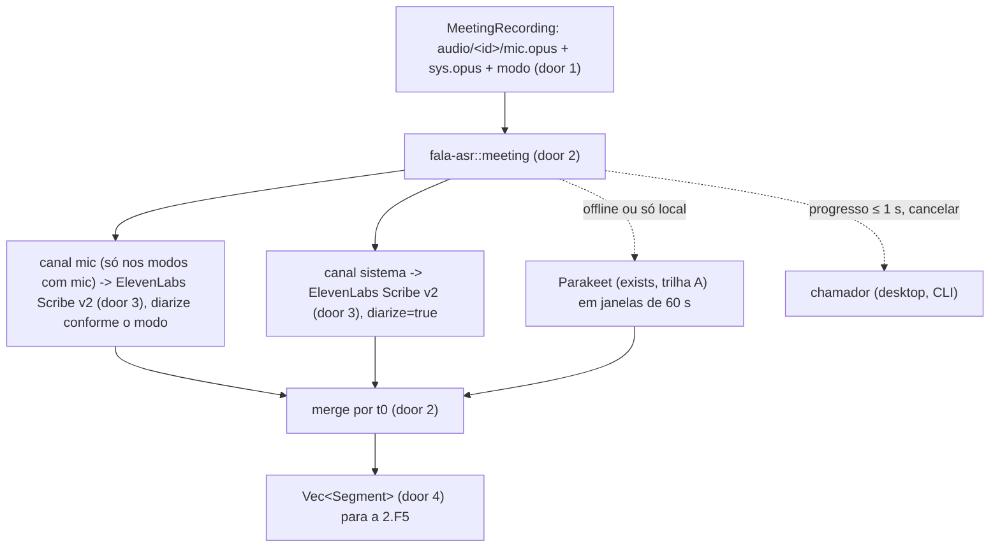
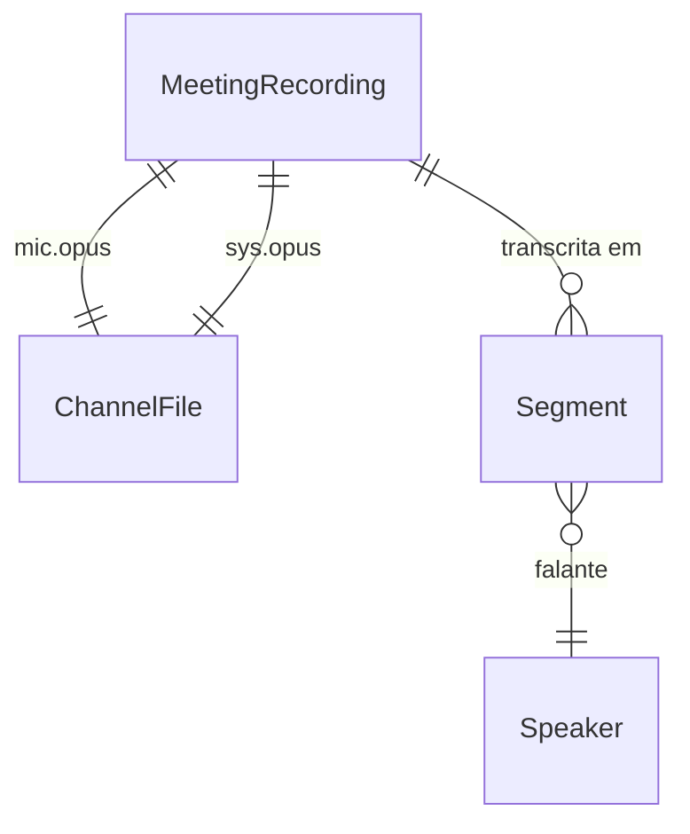

# meeting-asr

## Problem

O áudio retido de uma reunião (`audio/<id>/mic.opus` e `sys.opus`, 2.F3) não vira texto. A ADR-0005 decidiu o caminho (Scribe v2 em batch no fim, canal do mic é "eu", diarização do provedor só no canal do sistema, Parakeet local quando offline ou "só local"), mas não existe nenhum código que monte a requisição, que garanta que só áudio de reunião chega a um cliente HTTP, que junte os dois canais numa transcrição "Eu / Pessoa N" com timestamps, ou que mostre progresso. Sem isso, o slice das semanas 1-2 da fase 2 não fecha, e o critério "progresso da transcrição visível em ≤ 1 s, nunca 10 s parado" (`ARCHITECTURE.md`, orçamento) não tem onde ser medido.

Dois riscos tornam isto mais que um cliente HTTP. O payload enviado à ElevenLabs é uma porta de mão única (o que sai da máquina, agora com o dicionário como `keyterms`; pitch F4), e a ADR-0003 exige que o áudio de **ditado** nunca chegue a esse caminho, por construção e não por convenção.

Quando isto entra, o pipeline da fase 2 entrega a pasta de uma sessão e recebe uma lista ordenada de segmentos `canal, falante, t0, t1, texto`, com progresso por canal e cancelamento, e o servidor falso dos testes prova byte a byte o que sairia da máquina.

## Flow

Reusa o trait e o crate `fala-asr` da trilha A (o backend novo mora nele, ao lado do Parakeet), `fala-secrets` da trilha B para a chave (nunca em log), `ureq` 3 que a trilha B já pôs no workspace (o `reqwest::blocking` entra em pânico dentro do runtime tokio do desktop), `fala-meeting::SessionMode` (2.F1) e o layout da 2.F3.

## Impact

| Front | What changes |
| --- | --- |
| domain | new term: `MeetingRecording` - os dois arquivos retidos de uma sessão e o modo; o único tipo que um backend de rede aceita, lives in `fala-asr` |
| domain | new term: `Segment` - um trecho transcrito: `channel`, `speaker`, `t0_ms`, `t1_ms`, `text`, lives in `fala-asr` |
| domain | new term: `Speaker` - `me` (canal do mic fora do modo presencial) ou `person` com um número a partir de 1, lives in `fala-asr` |
| domain | new term: `MeetingTranscriber` - trait dos backends de reunião (Scribe, Parakeet com janela), separado de `Transcriber`, lives in `fala-asr` |
| domain | existing term: `Transcriber` (trilha A) segue só para ditado; nenhum backend de rede o implementa - quem ramifica nele hoje é só `fala-cli dictate` |
| stored data | nothing to migrate - nada persiste aqui; a forma do `Segment` (door 4) vira schema na 2.F5 |

## Relations

One-way constraints: todo `Segment` tem `channel` e `speaker` (door 4); `Speaker::Me` só no canal do mic fora do modo presencial. No columns and no types here.

## Surface

| Route | In | Out | Status |
| --- | --- | --- | --- |
| `POST https://api.elevenlabs.io/v1/speech-to-text` (externa, consumida) | header `xi-api-key`; multipart: `model_id`, `file` (um `.opus`), `language_code`, `diarize`, `timestamps_granularity`, `keyterms` (repetido) | JSON com `language_code`, `text` e `words[]` (`text`, `start`, `end`, `type`, `speaker_id`) | `200`, `401`, `422`, `429`, `5xx`, erro de rede |

## Landing

| One-way door | Literal shape | Alternative rejected |
| --- | --- | --- |
| 1. tipo de entrada dos backends de rede | `pub struct MeetingRecording { mic: PathBuf, system: PathBuf, mode: SessionMode }`, construído só a partir da pasta `audio/<id>/` (`MeetingRecording::from_session_dir`); o backend Scribe não implementa `Transcriber`, provado por `static_assertions::assert_not_impl_any!(ElevenLabsScribe: Transcriber)` | o backend aceitar `&DictationAudio` ou `&[f32]`: o guarda da ADR-0003 dependeria de convenção |
| 2. módulo novo | `crates/asr/src/meeting/` (trait `MeetingTranscriber`, `Segment`, merge, backend `elevenlabs`) | crate novo `fala-meeting-asr`: o design doc §3.2 e o `ARCHITECTURE.md` já põem "backends de nuvem para reunião" em `fala-asr` |
| 3. requisição literal à Scribe | `POST /v1/speech-to-text`, `xi-api-key: <chave do keyring>`, multipart com `model_id=scribe_v2`, `file=<mic.opus ou sys.opus>`, `language_code=por` (padrão; omitido quando o ajuste é "detectar"), `diarize=false` no mic fora do presencial e `true` no resto, `timestamps_granularity=word`, um campo `keyterms` por termo do dicionário quando o ajuste estiver ligado; nada além disso | enviar o WAV estéreo inteiro com transcrição multicanal: muda o que sai (um arquivo com os dois lados) e depende de um recurso da API não confirmado (pitch, pergunta em aberto) |
| 4. forma do `Segment` | `{"channel":"mic"|"system","speaker":"me"|{"person":N},"t0_ms":u64,"t1_ms":u64,"text":"..."}`, `N` ≥ 1; no modo presencial, os falantes do sistema continuam a numeração depois dos do mic | `speaker_id` cru da Scribe (`speaker_0`): vaza o formato do provedor para o SQLite e o frontmatter e colide entre os dois canais |
| 5. dependência | `ureq = "3"` (já em `[workspace.dependencies]` pela trilha B), multipart montado à mão; `static_assertions` em dev | `reqwest::blocking`: entra em pânico dentro do runtime tokio do desktop (decisão do `Lux` para B) |

- Nothing else in this change is hard to reverse

## Criteria

### S1: só áudio de reunião chega à rede (P1)

O guarda da ADR-0003 para o caminho da reunião existe por tipo.

**Acceptance Criteria**

1. The `fala-asr` SHALL não implementar `Transcriber` para `ElevenLabsScribe`, verificado em tempo de compilação, e a única função pública de envio SHALL receber `&MeetingRecording`
2. WHEN `MeetingRecording::from_session_dir` recebe uma pasta com `mic.opus` e `sys.opus` THEN `fala-asr` SHALL devolver os dois caminhos e o modo; IF falta um dos dois THEN SHALL devolver `AsrError::MissingChannel` com o nome do arquivo

**Independent test:** `cargo test -p fala-asr meeting::guard`

### S2: a requisição literal (P1)

O que sai da máquina é exatamente o enumerado, provado por um servidor falso local.

**Acceptance Criteria**

3. WHEN uma sessão `meeting` é transcrita contra o servidor falso THEN o servidor SHALL receber 2 requisições `POST /v1/speech-to-text`, uma com os bytes exatos de `mic.opus` e `diarize=false`, outra com os bytes exatos de `sys.opus` e `diarize=true`, ambas com `model_id=scribe_v2`, `language_code=por`, `timestamps_granularity=word`, e nenhum outro campo multipart além de `keyterms`
4. WHERE o ajuste de `keyterms` está ligado e o dicionário tem `["Fala", "ADR"]` THEN cada requisição SHALL ter exatamente dois campos `keyterms` com esses valores; WHERE está desligado THEN SHALL não ter nenhum
5. WHEN a sessão é `in_person` THEN a requisição do mic SHALL ter `diarize=true`
6. WHERE o idioma é "detectar" THEN a requisição SHALL não ter `language_code`
7. The `fala-asr` SHALL mandar a chave só no header `xi-api-key`, e nenhuma mensagem de `AsrError` (inclusive a de 401) SHALL conter a chave

**Independent test:** `cargo test -p fala-asr meeting::request`

### S3: segmentos "Eu / Pessoa N" (P1)

Os dois canais viram uma transcrição só, em ordem.

**Acceptance Criteria**

8. WHEN a resposta da Scribe traz palavras com `speaker_id` THEN `fala-asr` SHALL agrupar palavras consecutivas do mesmo falante num `Segment` com `t0_ms` da primeira e `t1_ms` da última, e ignorar itens com `type` diferente de `word` e `spacing` na contagem de falantes
9. WHILE a sessão não é `in_person`, todo segmento do canal do mic SHALL ter `speaker = me`; os do sistema SHALL ter `person` numerado a partir de 1 na ordem de primeira aparição
10. WHILE a sessão é `in_person`, os falantes do mic SHALL ser `person` 1..k e os do sistema SHALL continuar em k+1..
11. WHEN os dois canais são juntados THEN a lista SHALL estar ordenada por `t0_ms`, com o mic antes do sistema em empate
12. The `Segment` SHALL serializar exatamente na forma da door 4 e voltar igual do JSON

**Independent test:** `cargo test -p fala-asr meeting::segments`

### S4: falha, progresso e cancelamento (P1)

A transcrição nunca fica 10 s sem sinal e nunca perde o áudio.

**Acceptance Criteria**

13. IF o servidor responde `429` ou `5xx` ou a conexão cai THEN `fala-asr` SHALL devolver `AsrError::Network { retriable: true, .. }`, e os dois `.opus` SHALL continuar intactos; IF responde `401` ou `422` THEN SHALL devolver `retriable: false` com o status
14. WHILE um canal está sendo enviado ou aguardando resposta, o callback de progresso SHALL ser chamado com intervalo de no máximo 1 s (servidor falso que demora 3 s para responder: pelo menos 3 chamadas)
15. WHEN o token de cancelamento é acionado durante a espera THEN `fala-asr` SHALL devolver `AsrError::Cancelled` em até 1 s, sem esperar a resposta

**Independent test:** `cargo test -p fala-asr meeting::progress`

### S5: fallback local (P2)

Offline ou "só local", a mesma saída sai do Parakeet.

**Acceptance Criteria**

16. WHERE a sessão é "só local" THEN `fala-asr` SHALL não abrir nenhuma conexão (servidor falso recebe 0 requisições) e SHALL transcrever cada canal com o Parakeet em janelas de 60 s, devolvendo segmentos com `t0_ms` deslocado pelo início da janela
17. IF a Scribe falha com erro de rede e o chamador pede o fallback THEN `fala-asr` SHALL produzir os segmentos pelo mesmo caminho do AC 16

**Independent test:** `cargo test -p fala-asr meeting::local` (com modelo presente; `#[ignore]` sem ele)

## Out of scope

| Excluded | Why |
| --- | --- |
| chamada real à ElevenLabs | precisa da chave do Augusto e de uma gravação que ele autorize enviar (pitch F4); os testes usam só o servidor falso |
| marcadores "ditado omitido" | dependem da D11 (ADR candidata 0015) e do fan-out do mic, ainda não feitos; o merge aceita marcadores por adição |
| corte em blocos de 30 min para limites da API | rabbit hole do pitch, só se a API exigir; limites ainda não confirmados |
| persistir os segmentos | 2.F5 |
| renomear "Pessoa N" | 2.F5/2.F2 |

## Assumptions

| Assumption | Chosen default | Rationale | Confirmed? |
| --- | --- | --- | --- |
| dono do build | o painel que tiver `crates/asr` livre depois do PR da trilha A; este plano não toca `crates/asr` nesta rodada | `crates/asr` é do painel `pipeline-audio` até o PR dele entrar (regra da rodada) | y - delegado pelo Augusto em 2026-10-02, decidido pelo painel |
| progresso | por canal: bytes enviados / total no upload e um batimento "aguardando resposta" a cada 500 ms | o ureq bloqueia na resposta; o batimento vem de uma thread do chamador | y - delegado pelo Augusto em 2026-10-02, decidido pelo painel |
| cancelar | a requisição roda numa thread; cancelar devolve `Cancelled` na hora e descarta a resposta quando chegar | o ureq 3 não aborta uma requisição em voo; o custo é uma requisição paga que ninguém usa | y - delegado pelo Augusto em 2026-10-02, decidido pelo painel |
| `keyterms` | ligado por padrão, um campo por termo do `Dictionary` | pitch F4 ("atrás de um ajuste ligado por padrão", +US$ 0,05/h) | y - delegado pelo Augusto em 2026-10-02, decidido pelo painel |
| mic nos modos sem mic (`system_only`, `import`) | `from_session_dir` exige os dois arquivos (AC 2, literal), mas a Scribe só recebe `mic.opus` quando `SessionMode::has_mic()`; nos outros modos sai uma requisição só, a do sistema | menos sai da máquina, nunca mais: o mic de um modo sem mic não é fala que a pessoa pediu para transcrever, e a requisição seria paga | y - delegado pelo Augusto, decidido pelo executor (build, 2026-10-04) |
| dependências de `fala-asr` | o teste `tests/manifest.rs` da trilha A (door 2 de `pipeline-headless`, que fixa a lista exata) passa a listar também `ureq`, `static_assertions` (dev) e o que o `Flow` reusa: `fala-meeting`, `fala-secrets`, `serde`, `serde_json` | a door 5 deste plano, aprovada depois, adiciona dependências ao mesmo crate; a lista continua exata, só cresce | y - delegado pelo Augusto, decidido pelo executor (build, 2026-10-04) |

**Open questions:**

| # | Kind | Question | Until answered |
| --- | --- | --- | --- |
| 1 | blocks go-live | Nomes exatos de campo e de modelo na Scribe v2 (`model_id=scribe_v2`, `keyterms`, `timestamps_granularity`, `language_code` em ISO 639-3 `por` ou `pt`), limite de termos e de tamanho do arquivo, conferidos na documentação oficial da ElevenLabs no começo do build | a door 3 fica como está e o servidor falso prova a forma; a chamada real não liga até a conferência |
| 2 | open | A Scribe aceita Ogg Opus direto? | se não aceitar, o envio converte para outro contêiner antes; muda a door 3 (bytes do arquivo), não o que é retido |

## Observable

| Surface | Decision | Landing |
| --- | --- | --- |
| API externa `POST /v1/speech-to-text` | error shape and codes | AC 13 |
| API externa `POST /v1/speech-to-text` | who may call it | AC 7 (chave do usuário, BYOK, ADR-0008) |
| API externa `POST /v1/speech-to-text` | rate limit | AC 13 (`429` é `retriable`) |
| API externa `POST /v1/speech-to-text` | response shape | AC 8 |
| API externa `POST /v1/speech-to-text` | versioning | n/a - a rota é versionada pelo provedor (`/v1`); o `model_id` fixa o modelo |

## Sources

- ADR-0005 (Scribe v2 batch, mic é "eu", diarização só no sistema, fallback Parakeet); ADR-0003 (áudio de ditado nunca sai); ADR-0008 (chave no keyring)
- `fala-research/pitches/fase-2-reuniao-videos.md` F4 e revisão 2026-10-02 (modo presencial, idioma, `keyterms`)
