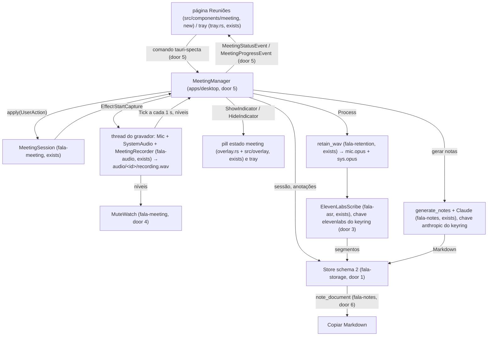
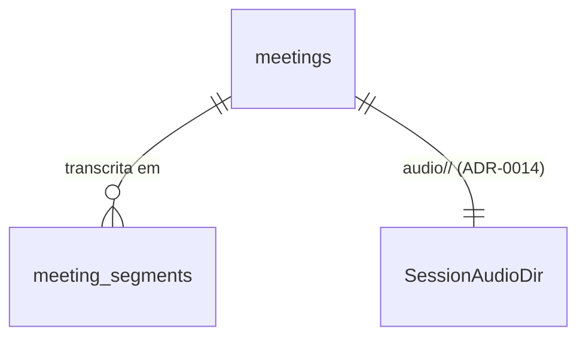

# meeting-panel (F2, parte 1)

## Problem

Uma reunião só vira áudio, transcrição e notas pelo `fala-cli`, comando por comando: `meeting --out` grava um WAV, e a retenção em Opus, a transcrição pela Scribe e as notas pelo Claude existem como bibliotecas (`fala-retention`, `fala-asr::meeting`, `fala-notes`) que nenhum app encadeia. O app desktop, que é onde o Augusto passa o dia, não tem botão de gravar, nem indicador de reunião, nem lugar para digitar anotações durante a call, nem onde ler o resultado. Por isso as reuniões reais continuam no Granola, que manda o áudio para a nuvem e não guarda nada (pitch da fase 2, "Problema": a reclamação nº 1 é captura perdida sem recuperação). Nada persiste uma reunião: o `fala.sqlite` só conhece ditados (schema 1), então mesmo a CLI não lista nem reabre uma sessão.

A ADR-0005 condiciona a gravação a três coisas que hoje não têm forma no app: só começa por clique explícito, mostra um indicador enquanto dura e avisa que a transcrição contém dados de terceiros. A ADR-0015 (proposta) diz que, sem o fan-out do mic, o ditado fica bloqueado durante a gravação e nunca se abre um segundo stream no mesmo mic. O pitch não traz número de uso; a evidência é a do Granola (`research/02` §6.2, citado no pitch).

Quando isto entra: na página "Reuniões" o Augusto pode abrir uma reunião antes da call e digitar título e pauta (rascunho, sem áudio); no tray ou na página ele clica "Gravar reunião" (online ou presencial), aceita o aviso de terceiros na primeira vez, vê a pill em estado "gravando reunião" com o tempo enquanto a call dura, digita anotações que sobrevivem a um crash, pausa, retoma, para, e a sessão aparece na lista; ao abri-la, vê a transcrição "Eu / Pessoa N" com timestamps, gera notas por template e copia o Markdown.

## Flow

Reusa a máquina de estados de `fala-meeting` (início só por `UserAction`, indicador, teto, fim por silêncio), o `MeetingRecorder`/`Mic`/`SystemAudio` de `fala-audio` do jeito que `apps/cli/src/meeting.rs` os usa, `retain_wav` de `fala-retention`, `ElevenLabsScribe` de `fala-asr::meeting`, `generate_notes`/`render_transcript`/templates de `fala-notes`, o `Store` de `fala-storage` e o `KeyringStore` de `fala-secrets`; o desktop só encadeia, não reimplementa nenhum deles.

## Impact

| Front | What changes |
| --- | --- |
| domain | new term: `MeetingManager` - fachada do desktop sobre a sessão, o gravador, a retenção, o ASR e as notas; dono da única sessão ativa, lives in `apps/desktop` |
| domain | new term: `MuteWatch` - aviso de canal mudo (~2 min de duração gravada abaixo de `SILENCE_RMS`), lives in `fala-meeting` |
| domain | new term: `MeetingRecord` / `MeetingSegment` - a sessão e os trechos persistidos, lives in `fala-storage` |
| domain | new term: rascunho - sessão criada antes de gravar (título e pauta, `started_at` nulo); é o `Idle` de `fala-meeting` persistido, sem estado novo na máquina, e vira gravação só por `UserAction::StartRecording`, lives in `fala-storage` e `apps/desktop` |
| domain | new term: `note_document` - o "Markdown da nota" para copiar: título, data, notas (ou só anotações) e transcrição, lives in `fala-notes` |
| domain | existing term: `TrayIconState::Recording` e a pill `recording` eram só do ditado; o tray passa a mostrar o ícone de gravação também durante a reunião, e a pill ganha os estados `meeting` e `meeting_paused` - quem ramifica hoje: `tray.rs::compute_desired`, `overlay.rs::overlay_dimensions`, `src/overlay/pillModel.ts` |
| domain | existing term: `TranscribeAction::start` (ditado) passa a recusar com `recording-error` `meeting_active` enquanto uma reunião grava (ADR-0015, ramo "fan-out não pronto"); quem ramifica: o `TranscriptionCoordinator`, que já volta a idle quando a gravação não começa |
| stored data | `fala.sqlite` migra de `user_version` 1 para 2 por adição (tabelas novas, nada muda em `dictations`); `reindex` continua só de ditados |
| stored data | `settings_store.json` ganha `meeting_consent_accepted_at` (ausente = nunca aceito) |
| stored data | `<app_data>/audio/<id>/` (layout da ADR-0014) recebe o WAV de trabalho `recording.wav` durante a gravação, apagado pela retenção |
| build | `apps/desktop` passa a depender de `fala-meeting`, `fala-audio`, `fala-retention`, `fala-asr`, `fala-notes`; `fala-storage` passa a depender de `fala-meeting`; o crate `windows` do desktop ganha a feature `Win32_Storage_FileSystem` (espaço livre) |

## Relations

One-way constraints: `meetings.id` é o `SessionId` ULID em texto, chave primária (door 1); `meetings.mode` só aceita os quatro valores serializados de `SessionMode` (door 1); `meeting_segments` tem chave `(meeting_id, seq)` e é apagado em cascata com a reunião (door 1); `seq` é o id que os ponteiros `^sN` das notas citam, de 1 a n na ordem por `t0_ms` (door 1). No columns and no types here.

## Surface

| Route | In | Out | Status |
| --- | --- | --- | --- |
| comando `create_meeting_draft` · `set_meeting_title` | `title` (e `id` no segundo) | id da sessão | `ok`, erro `not_found`, `storage`; sem status HTTP (IPC local; 200-599 n/a) |
| comando `start_meeting` | `mode` (`meeting` ou `in_person`), `title`, `draft_id` opcional | `MeetingStatus` | `ok`, erro `consent_required`, `already_active`, `already_started`, `dictation_active`, `insufficient_disk`, `audio_device`, `storage`; sem status HTTP (IPC local; 200-599 n/a) |
| comando `pause_meeting` · `resume_meeting` · `stop_meeting` · `extend_meeting_cap` | - | `MeetingStatus` | `ok`, erro `not_active`, `invalid_transition`, `cap_at_maximum`; sem status HTTP (IPC local; 200-599 n/a) |
| comando `meeting_status` | - | `MeetingStatus` (estado, id, modo, `recorded_ms`, níveis, mudos, teto, disco) | `ok`; sem status HTTP (IPC local; 200-599 n/a) |
| comando `accept_meeting_consent` | - | data do aceite (RFC 3339) | `ok`; sem status HTTP (IPC local; 200-599 n/a) |
| comando `save_meeting_annotations` | `id`, `text` | - | `ok`, erro `not_found`, `storage`; sem status HTTP (IPC local; 200-599 n/a) |
| comando `list_meetings` | - | `Vec<MeetingSummary>` | `ok`, erro `storage`; sem status HTTP (IPC local; 200-599 n/a) |
| comando `get_meeting` | `id` | `MeetingDetail` (resumo, anotações, segmentos, notas) | `ok`, erro `not_found`, `storage`; sem status HTTP (IPC local; 200-599 n/a) |
| comando `transcribe_meeting` · `cancel_meeting_transcription` | `id` | `Vec<MeetingSegment>` | `ok`, erro `not_found`, `still_recording`, `missing_key`, `no_audio`, `transcription`, `cancelled`, `busy`; sem status HTTP (IPC local; 200-599 n/a) |
| comando `generate_meeting_notes` | `id`, `template_id` | Markdown das notas | `ok`, erro `not_found`, `missing_key`, `unknown_template`, `notes`, `busy`; sem status HTTP (IPC local; 200-599 n/a) |
| comando `meeting_markdown` | `id` | Markdown da nota | `ok`, erro `not_found`, `storage`; sem status HTTP (IPC local; 200-599 n/a) |
| comando `meeting_templates` · `meeting_keys` · `set_meeting_transcription_key` | `key` (só o último) | templates `{id,name}`; `{elevenlabs: bool, anthropic: bool}` | `ok`, erro `invalid_key`, `keyring`; sem status HTTP (IPC local; 200-599 n/a) |
| evento `MeetingStatusEvent` | - | o mesmo `MeetingStatus`, a cada mudança e a cada 250 ms gravando | n/a - evento sem status; sem status HTTP (IPC local; 200-599 n/a) |
| evento `MeetingProgressEvent` | - | `id`, etapa (`retaining`, `transcribing{channel, done, total}`, `notes`, `done`, `failed{kind}`) | n/a - evento sem status; sem status HTTP (IPC local; 200-599 n/a) |
| evento `meeting-consent-required` | - | - (tray pediu gravar sem aceite) | n/a - evento sem status; sem status HTTP (IPC local; 200-599 n/a) |

## Landing

| One-way door | Literal shape | Alternative rejected |
| --- | --- | --- |
| 1. schema 2 do `fala.sqlite` | `CREATE TABLE meetings (id TEXT PRIMARY KEY, title TEXT NOT NULL, mode TEXT NOT NULL CHECK (mode IN ('meeting','in_person','system_only','import')), local_only INTEGER NOT NULL DEFAULT 0 CHECK (local_only IN (0,1)), created_at TEXT NOT NULL, created_ms INTEGER NOT NULL, started_at TEXT, started_ms INTEGER, ended_at TEXT CHECK (ended_at IS NULL OR started_at IS NOT NULL), recorded_ms INTEGER NOT NULL DEFAULT 0, stop_reason TEXT CHECK (stop_reason IN ('user','silence','cap_reached')), audio_retained INTEGER NOT NULL DEFAULT 0 CHECK (audio_retained IN (0,1)), annotations TEXT NOT NULL DEFAULT '', transcribed_at TEXT, notes_md TEXT, notes_template TEXT); CREATE INDEX meetings_by_time ON meetings (created_ms DESC); CREATE TABLE meeting_segments (meeting_id TEXT NOT NULL REFERENCES meetings(id) ON DELETE CASCADE, seq INTEGER NOT NULL CHECK (seq >= 1), channel TEXT NOT NULL CHECK (channel IN ('mic','system')), speaker TEXT NOT NULL, t0_ms INTEGER NOT NULL, t1_ms INTEGER NOT NULL, text TEXT NOT NULL, PRIMARY KEY (meeting_id, seq)); PRAGMA user_version = 2`; `speaker` guarda o JSON da door 4 da `meeting-asr` (`"me"` ou `{"person":N}`); **rascunho** = linha com `started_at` nulo (título e pauta em `annotations`, sem áudio), o `SessionState::Idle` persistido; `start_meeting_recording` grava `started_at` uma vez só (`WHERE started_at IS NULL`, senão `MeetingAlreadyStarted`); migração 1→2 numa transação, banco novo aplica 1 e 2 (revisado em 2026-10-09 pelo pedido do orquestrador, N5 do `research/20`, antes de qualquer código commitado) | esperar a F5 inteira (espelho `.md`, FTS, participantes): o painel não teria onde guardar a sessão; arquivos JSON por sessão: contraria a ADR-0006 (SQLite é a fonte de verdade); tabela `notes` separada: relação 1:1 sem outro consumidor, a F5 pode separar por adição; `started_at NOT NULL` (sessão só nasce gravando): fecha a nota antes de gravar (N5), que a F5 teria de abrir com migração de dado; coluna `agenda` separada: a pauta é texto da pessoa como as anotações, e a ADR-0016 já manda as anotações ao LLM e proíbe só a pauta do convite do calendário |
| 2. aviso de terceiros (ADR-0005, ADR-0016) | `AppSettings.meeting_consent_accepted_at: Option<String>`, RFC 3339 com offset local em segundos (`"2026-10-09T22:14:03-03:00"`), gravado por `accept_meeting_consent`; enquanto `None`, `start_meeting` recusa com `consent_required` e a UI mostra o texto `meeting.consent.body` (pt, fonte): "Gravar uma reunião guarda no seu computador o áudio do seu microfone e do sistema, inclusive a voz de outras pessoas. Ao transcrever, esse áudio é enviado à ElevenLabs; ao gerar notas, a transcrição e as suas anotações são enviadas à Anthropic. Transcrições e notas contêm dados pessoais de terceiros: avise quem participa e siga as regras do seu trabalho e a LGPD." com os botões "Entendi, gravar" e "Cancelar"; depois do aceite o aviso não volta | booleano `accepted`: não prova quando foi mostrado (pitch F2, portas); aviso a cada gravação: o pitch pede "na primeira vez" |
| 3. id da chave da ElevenLabs no keyring | `KeyringStore.get("elevenlabs")` (service `br.com.augusto.fala`, account `elevenlabs`); a chave das notas é a `"anthropic"` que o pós-processamento já usa (`fala_notes::KEY_PROVIDER`) | `"eleven_labs"`/`"scribe"`: nenhum precedente; o id segue o nome do provedor como `gemini` e `anthropic` |
| 4. canal mudo | `MuteWatch::new(mode)` em `fala-meeting`, `observe(recorded: Duration, levels: Levels) -> Muted { mic: bool, system: bool }`; um canal fica mudo depois de `MUTE_WARN_AFTER = 120 s` de duração gravada seguida com RMS < `SILENCE_RMS` (0,001) e deixa de estar no primeiro intervalo acima; o mic só conta quando `mode.has_mic()` | lógica no desktop: só testável compilando o app inteiro; um `Effect` novo na máquina de estados: muda o `match` de todo chamador por um aviso que não move estado |
| 5. contrato IPC da reunião | os comandos e eventos da Surface com esses nomes; erros como `MeetingError` serializado `{"kind":"consent_required"}` (`#[serde(tag = "kind", content = "detail", rename_all = "snake_case")]`); `MeetingStatus.state` ∈ `idle`, `recording`, `paused`, `stopping`, `processing`; overlay recebe `show-overlay` com `"meeting"` ou `"meeting_paused"` | erro como `String` livre (padrão dos comandos herdados): a UI não distingue `consent_required` de uma falha de disco sem casar texto |
| 6. Markdown da nota | `fala_notes::note_document(input: &NotesInput, notes_md: Option<&str>) -> String`: `# <título>` (ou `Reunião`/`Meeting` vazio), linha `<AAAA-MM-DD> <HH:MM>`, depois `notes_md` ou, sem notas geradas, o bloco `## Anotações`, depois `## Transcrição` (en: `## Transcript`) com `render_transcript`; seções vazias omitidas | Markdown montado no frontend: duplicaria `render_transcript` e as âncoras `^sN` que os ponteiros citam |
| 7. dependências | `apps/desktop`: `fala-meeting`, `fala-audio`, `fala-retention`, `fala-asr`, `fala-notes` (workspace); `windows` ganha `Win32_Storage_FileSystem`; `fala-storage`: `fala-meeting` | `fs4`/`sysinfo` para espaço livre: dependência nova para uma chamada (`statvfs` pelo `libc` que o Linux já tem; `GetDiskFreeSpaceExW` no Windows) |

- Nothing else in this change is hard to reverse

## Criteria

### S1: reunião persistida no `fala.sqlite` (P1)

Uma sessão, suas anotações, sua transcrição e suas notas ficam no SQLite e voltam iguais.

**Acceptance Criteria**

1. WHEN `Store::open` abre um banco com `user_version = 1` e ditados THEN `fala-storage` SHALL migrar para `user_version = 2` criando `meetings` e `meeting_segments`, e os ditados SHALL continuar legíveis com o mesmo conteúdo
2. WHEN `create_meeting` grava uma sessão (id, título, modo, `local_only`, início) THEN `meeting(id)` SHALL devolvê-la com `ended_at = None`, `recorded_ms = 0`, anotações vazias e sem notas
3. WHEN `finish_meeting` recebe fim, `recorded_ms` e motivo THEN `meeting(id)` SHALL devolver os três valores
4. WHEN `save_meeting_annotations` grava um texto e o `Store` é reaberto (simula crash) THEN `meeting(id).annotations` SHALL ser exatamente esse texto
5. WHEN `replace_meeting_segments` grava 3 segmentos fora de ordem THEN `meeting_segments(id)` SHALL devolvê-los ordenados por `t0_ms` com `seq` 1, 2, 3, `speaker` `me` e `{"person":N}` intactos, e `transcribed_at` preenchido; uma segunda chamada SHALL substituir, não somar
6. WHEN `save_meeting_notes` grava template e Markdown THEN `meeting(id)` SHALL devolver os dois
7. WHEN `meetings()` lista 3 sessões THEN `fala-storage` SHALL ordená-las da mais recente para a mais antiga pela criação
8. IF uma operação recebe um id sem sessão THEN `fala-storage` SHALL devolver `StorageError::NotFound` com o id
42. WHEN `create_meeting` grava uma sessão THEN ela SHALL nascer rascunho (`started_at = None`), aceitar título e anotações (pauta), e `start_meeting_recording` SHALL gravar início e modo uma única vez; IF a sessão já começou THEN SHALL devolver `StorageError::MeetingAlreadyStarted` sem mudar o início, e IF é rascunho THEN `finish_meeting` SHALL falhar

**Independent test:** `cargo test -p fala-storage --test meetings`

### S2: gravar só por clique, com aviso e indicador (P1)

A gravação começa por ação explícita, depois do aceite, e a pill e o tray mostram enquanto dura.

**Acceptance Criteria**

9. WHILE `meeting_consent_accepted_at` é `None`, `start_meeting` SHALL recusar com `consent_required` sem abrir dispositivo nem criar sessão
10. WHEN `accept_meeting_consent` roda THEN o desktop SHALL gravar `meeting_consent_accepted_at` como RFC 3339 com offset, e a UI SHALL mostrar o texto literal da door 2 antes dessa chamada
11. The desktop SHALL chamar `UserAction::StartRecording` e `ResumeRecording` só a partir dos comandos `start_meeting`/`resume_meeting` e dos itens de tray `meeting_start`/`meeting_resume`; nenhum outro caminho (inicialização, evento, timer) SHALL abrir o gravador
12. WHEN `start_meeting` é aceito THEN o desktop SHALL criar a sessão no `fala.sqlite`, abrir mic e sistema, gravar `audio/<id>/recording.wav` e emitir `MeetingStatusEvent` com `state = recording`
13. WHILE a sessão está em `recording` ou `paused`, a pill SHALL ficar visível no estado `meeting` ou `meeting_paused` (ponto e tempo gravado), inclusive com `overlay_style = none`, e um `hide-overlay` de outro caminho SHALL não escondê-la
14. WHILE a sessão está em `recording` ou `paused`, o tray SHALL mostrar o ícone de gravação e os itens "Pausar"/"Retomar" e "Parar reunião"; em `idle`, o item "Gravar reunião"
15. WHEN o item de tray "Gravar reunião" é clicado sem aceite THEN o desktop SHALL abrir a janela na página Reuniões com o aviso, sem começar a gravar
16. IF uma reunião está em `recording` ou `paused` e o atalho de ditado é acionado THEN o desktop SHALL recusar o ditado com `recording-error` `meeting_active` antes de abrir o mic do ditado, e a UI SHALL mostrar a mensagem `errors.meetingActive`
17. IF um ditado está gravando quando `start_meeting` chega THEN o desktop SHALL recusar com `dictation_active`; WHEN a reunião começa THEN o stream do mic do ditado SHALL estar fechado (um stream por dispositivo, ADR-0015) e SHALL reabrir ao fim se o modo for "sempre ligado"

**Independent test:** clicar "Gravar reunião" no app (`bun run tauri dev`) e ver aviso, pill e tray; `TODO(windows)` para a pill sem foco no Windows.

### S3: pausar, retomar, parar e avisos durante a gravação (P1)

O intervalo pausado não é gravado, e os avisos de canal mudo e de teto chegam à UI.

**Acceptance Criteria**

18. WHEN `pause_meeting` roda em `recording` THEN o gravador SHALL parar de escrever e de contar `recorded_ms`, e `MeetingStatus.state` SHALL ser `paused`; WHEN `resume_meeting` roda THEN SHALL voltar a `recording` com `recorded_ms` continuando de onde parou
19. WHEN `stop_meeting` roda em `recording` ou `paused` THEN o desktop SHALL finalizar o WAV, gravar fim, `recorded_ms` e `stop_reason = user` na sessão, esconder a pill e voltar o tray, e emitir `state = processing` e depois `idle`
20. WHEN `MuteWatch` observa 120 s de duração gravada com RMS do sistema < 0,001 THEN SHALL marcar `system = true`; com 119 s SHALL não marcar; um intervalo com RMS ≥ 0,001 SHALL desmarcar e zerar a contagem
21. WHILE o modo não tem mic, `MuteWatch` SHALL nunca marcar `mic`
22. WHILE `MuteWatch` marca um canal, `MeetingStatus.muted` SHALL refletir esse canal e a pill e a página SHALL mostrar o aviso de canal mudo
23. WHEN a sessão devolve `CapWarning` THEN `MeetingStatus.cap_remaining_ms` SHALL trazer o tempo restante e a página SHALL oferecer "Mais 1 h" (`extend_meeting_cap`); WHEN o teto ou 15 min de silêncio param a sessão THEN SHALL seguir o mesmo caminho do AC 19 com `stop_reason` `cap_reached` ou `silence`
24. WHEN `meeting_status` é chamado gravando THEN `recorded_ms` SHALL seguir os quadros escritos no WAV (`MeetingRecorder::written / 48`)

**Independent test:** `cargo test -p fala-meeting mute`; gravar, pausar 10 s, retomar e parar no app e conferir `recorded_ms` e a duração do WAV.

### S4: anotações durante a gravação, à prova de crash (P1)

O que a pessoa digita durante a call está no disco poucos segundos depois.

**Acceptance Criteria**

25. WHILE a sessão grava, a textarea de anotações SHALL chamar `save_meeting_annotations` no máximo 2 s depois da última tecla e ao perder o foco, e ao parar
26. WHEN `save_meeting_annotations` retorna `ok` THEN o texto SHALL estar no `fala.sqlite` (AC 4 prova a sobrevivência à reabertura)
43. WHEN a página cria um rascunho e a pessoa digita título e pauta antes de gravar THEN o desktop SHALL persisti-los na sessão, `start_meeting` com `draft_id` SHALL gravar nessa mesma sessão, e a pauta SHALL chegar ao `NotesInput.annotations` (que a ADR-0016 já lista no payload)

**Independent test:** digitar, esperar 3 s, matar o processo, reabrir e ver o texto na sessão.

### S5: transcrever, gerar notas e copiar (P1)

Uma sessão parada vira transcrição "Eu / Pessoa N" e notas, e o Markdown vai para o clipboard.

**Acceptance Criteria**

27. WHEN a sessão para THEN o desktop SHALL converter `recording.wav` em `mic.opus` e `sys.opus` com `retain_wav` e marcar `audio_retained`; WHERE a chave `elevenlabs` existe SHALL transcrever em seguida sem novo clique
28. WHEN `transcribe_meeting` roda numa sessão parada THEN o desktop SHALL ler a chave `elevenlabs` só do keyring, chamar `ElevenLabsScribe` com o idioma e o dicionário das settings, gravar os segmentos (AC 5) e devolvê-los; IF falta a chave THEN SHALL recusar com `missing_key` sem abrir conexão
29. IF a sessão ainda tem `recording.wav` e não tem os Opus (crash ou falha anterior) THEN `transcribe_meeting` SHALL rodar `retain_wav` antes de transcrever
30. WHILE a transcrição roda, o desktop SHALL emitir `MeetingProgressEvent` pelo menos a cada 1 s, e `cancel_meeting_transcription` SHALL devolver `cancelled` em até 1 s
31. WHEN `generate_meeting_notes` roda com um template embutido THEN o desktop SHALL montar `NotesInput` (título, data e hora locais do início, idioma, dicionário, template, anotações, segmentos com `seq` como id), chamar `generate_notes` com a chave `anthropic` do keyring, gravar o Markdown e devolvê-lo; IF falta a chave THEN SHALL recusar com `missing_key`
32. WHEN `note_document` recebe notas geradas THEN SHALL produzir `# <título>`, a linha de data e hora, o Markdown das notas e `## Transcrição` com uma linha por segmento terminada em `^s<seq>`; sem notas, SHALL pôr o bloco `## Anotações` no lugar; sem segmentos, SHALL omitir `## Transcrição`
33. WHEN a pessoa clica "Copiar Markdown" THEN a página SHALL pôr no clipboard exatamente o retorno de `meeting_markdown`
34. The desktop SHALL nunca logar a chave, o texto das anotações, dos segmentos ou das notas acima de `debug`

**Independent test:** `cargo test -p fala-notes document`; com chave real e áudio autorizado, `TODO(windows)` a chamada à Scribe e ao Claude ponta a ponta.

### S6: página Reuniões (P1)

Uma tela funcional, sem polimento, com os estados que importam.

**Acceptance Criteria**

35. WHEN a página Reuniões abre sem sessões THEN SHALL mostrar o estado vazio `meeting.list.empty` e o botão "Gravar reunião" com o seletor online/presencial
36. WHEN há sessões THEN a lista SHALL mostrar título (ou "Reunião" e a data), data e hora, duração e se tem transcrição e notas, da mais recente para a mais antiga
37. WHEN uma sessão é aberta THEN a página SHALL mostrar a transcrição como `[mm:ss] Eu|Pessoa N: texto`, as anotações, as notas e os botões "Transcrever", "Gerar notas" (com seletor de template) e "Copiar Markdown"
38. IF um comando devolve erro THEN a página SHALL mostrar a mensagem traduzida do `kind` (ou a genérica) sem perder o que estava na tela
39. WHILE transcrição ou notas rodam, os botões correspondentes SHALL ficar desabilitados com indicação de progresso, e a transcrição SHALL ter "Cancelar"
40. WHERE a chave `elevenlabs` não existe, a página SHALL mostrar um campo para colá-la que chama `set_meeting_transcription_key`, e o valor SHALL não voltar à tela depois de salvo
41. The UI SHALL passar toda string visível por i18next com `pt` e `en`, e os componentes SHALL ficar em `src/components/meeting/`

**Independent test:** `bun run lint`, `bunx tsc --noEmit`, `bun run check:translations`; abrir a página no `tauri dev`.

## Out of scope

Product capabilities only. Process and harness rules live in AGENTS.md or as Observable `n/a`.

| Excluded | Why |
| --- | --- |
| tocar trecho do áudio | F9 ainda não existe (pedido da rodada) |
| seletor de loopback e de mic | pedido da rodada; o sistema é a saída padrão e o mic é a entrada padrão |
| editor de templates, detecção de reunião, calendário, importação por URL | pedido da rodada |
| modo "só sistema" e importação de arquivo pela UI | a rodada pede online/presencial; o enum e o schema já aceitam os dois |
| toggle "só local" e fallback Parakeet | o Parakeet do crate carregaria um segundo modelo ao lado do do desktop (RAM); `local_only` fica no schema e o `fala-notes` já o respeita; parte 2 |
| espelho `.md` da reunião, FTS sobre transcrições, participantes, `reindex` de reuniões | F5 `meeting-storage`; a forma do `.md` é porta própria |
| ditado durante a reunião com zeros no mic (fan-out) | ADR-0015: sem o fan-out o ditado fica bloqueado (AC 16) |
| suspensão do SO ("continuar ou parar") | detectar suspensão é `cfg(windows)` + `WM_POWERBROADCAST`; `TODO(windows)` |
| recuperar gravação órfã na abertura ("Recuperar gravação de 14:02?") | F3; AC 29 cobre o caminho manual |
| apagar sessão, política de retenção agendada, renomear "Pessoa N", nomes sugeridos | F3/F5/D13; parte 2 |
| confirmar antes de regenerar notas editadas, "copiar aviso aos participantes" | parte 2 do F2 |
| seletor de template antes e durante a gravação | parte 2; o template é escolhido ao gerar |

## Assumptions

| Assumption | Chosen default | Rationale | Confirmed? |
| --- | --- | --- | --- |
| transcrição automática ao parar | sim, quando a chave `elevenlabs` existe; sem chave, fica o botão | o slice do pitch transcreve ao parar; o aviso aceito cobre o envio | y - delegado pelo Augusto em 2026-10-09, decidido pelo painel |
| notas automáticas | não; botão "Gerar notas" com o template escolhido | o template é escolha do usuário e a chamada é paga | y - delegado pelo Augusto em 2026-10-09, decidido pelo painel |
| dispositivo do sistema | a saída padrão: `pw-metadata 0 default.audio.sink` no host ALSA (PipeWire), `default_output_device` nos outros, por uma função nova `SystemAudio::default_name` em `fala-audio` | sem seletor nesta parte; `SystemAudio::open` exige um nome | y - delegado pelo Augusto em 2026-10-09, decidido pelo painel |
| título | opcional na página, vazio no tray; a UI mostra "Reunião" + data quando vazio | gravar não pode esperar digitação | y - delegado pelo Augusto em 2026-10-09, decidido pelo painel |
| teto | `RecordingCap::default()` (3 h), sem ajuste na UI | ajuste é Settings da parte 2 | y - delegado pelo Augusto em 2026-10-09, decidido pelo painel |
| espaço livre | medido em `<app_data>/audio`; falha na medição vale como desconhecido e não bloqueia (log `warn`) | bloquear por erro de medição perderia a reunião | y - delegado pelo Augusto em 2026-10-09, decidido pelo painel |
| ritmo dos eventos | `MeetingStatusEvent` a 4 Hz gravando, `Tick` da sessão a 1 Hz | barras de nível precisam de mais que 1 Hz; a sessão não | y - delegado pelo Augusto em 2026-10-09, decidido pelo painel |
| `bindings.ts` | regenerado por um build debug do desktop e versionado no PR da UI | só a UI o consome; gerar a cada PR custa um build pesado por PR | y - delegado pelo Augusto em 2026-10-09, decidido pelo painel |
| pill na reunião | a janela de overlay existente, estado `meeting`: ponto vermelho e tempo; `meeting_paused`: ponto cinza e tempo; canal mudo: ponto âmbar | D5 (b) do pitch; o redesign da UI vem depois na rodada | y - delegado pelo Augusto em 2026-10-09, decidido pelo painel |

**Open questions:** none block the build; the two below are logged.

| # | Kind | Question | Until answered |
| --- | --- | --- | --- |
| 1 | blocks go-live | A Scribe aceita o Ogg Opus direto (pergunta 2 do `meeting-asr`) e com que limites, conferido com a chave real | a transcrição real não é testada nesta rodada; o caminho está ligado e falha com `transcription` legível |
| 2 | open | ADR-0006 manda espelho `.md`; as reuniões ficam só no SQLite até a F5 | perder o `fala.sqlite` perde transcrições e notas (o áudio fica); registrado para o Augusto |

## Observable

| Surface | Decision | Landing |
| --- | --- | --- |
| screen Reuniões | empty state | AC 35 |
| screen Reuniões | loading state | AC 39 |
| screen Reuniões | error state | AC 38 |
| screen Reuniões | unauthorised state | n/a - app local de um usuário; o "não autorizado" é a chave ausente, AC 40 |
| screen Reuniões | density and ordering | AC 36 |
| screen Reuniões | destructive action confirms | n/a - não há apagar nesta parte; parar não descarta (AC 19, ADR-0005) |
| screen aviso de terceiros | copy | AC 10, door 2 |
| tray | estados e itens | AC 14, AC 15 |
| pill | estados | AC 13, AC 22 |
| comandos IPC `*meeting*` | error shape and codes | door 5, AC 9, AC 28, AC 38 |
| comandos IPC `*meeting*` | who may call it | n/a - só as janelas do próprio app (capabilities do Tauri existentes) |
| comandos IPC `*meeting*` | versioning, rate limit | n/a - app e frontend saem no mesmo binário |
| documento Markdown da nota | structure | AC 32 |
| documento Markdown da nota | what the reader does next | n/a - colar onde quiser; os ponteiros `^sN` resolvem dentro do próprio documento |
| coleção lista de sessões | grouping, ordering, duplicates | AC 7, AC 36; duplicata n/a - id ULID é chave primária |

## Sources

- ADR-0005 (clique explícito, indicador, aviso de terceiros), ADR-0006 (SQLite), ADR-0008 (chaves no keyring), ADR-0014 (layout `audio/<id>/`), ADR-0015 (ditado bloqueado sem fan-out), ADR-0016 (payload das notas)
- `fala-research/pitches/fase-2-reuniao-videos.md` F2, D5, D12 e "Semanas 1-2"
