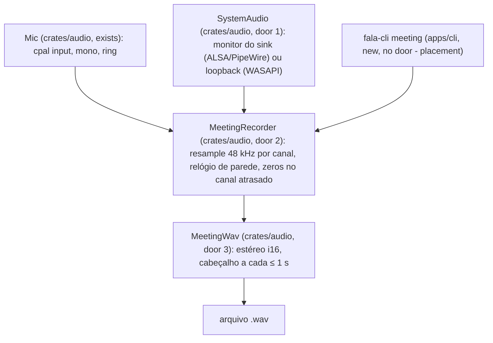

# meeting-recorder — mic + sistema num WAV estéreo à prova de crash, em `crates/audio`

## Problem

A gravação de reunião só existe como spike: `fala-cli record` (`apps/cli/src/record/capture.rs`)
abre mic e sistema pelo `cpal`, pareia os frames por índice de chegada e aborta quando um stream
fica 5 s sem entregar frames. No Windows, o loopback do WASAPI não entrega frames enquanto nenhum
app toca áudio (relatório 04, PR #14): uma reunião com pausa no áudio do sistema abortaria ou
dessincronizaria. O spike também recusa o mic Bluetooth, que só abre a 16 kHz mono, porque exige
48 kHz. A fase 2 precisa disso dentro de `crates/audio`, sem Tauri, para o desktop chamar depois.

Quando isto fechar, `fala-cli meeting --out <wav> --system <sink>` grava até Enter (ou EOF) num
WAV estéreo 48 kHz (L = mic, R = sistema) cujo cabeçalho é reescrito a cada ≤ 1 s, de modo que um
processo morto deixe o arquivo legível até o último segundo; um canal que para de entregar frames
vira silêncio no ritmo do relógio em vez de abortar a gravação (design doc §3.4).

## Flow

Reusa de `crates/audio` o `Mic` (door 1 da trilha A) e o `Resampler`, que ganha um construtor
para taxa de saída arbitrária; o `hound` passa de dev-dependency a dependency para o WAV.

1. entrada: `fala-cli meeting` -> `Cli` clap em `apps/cli/src/main.rs` (exists) - valida flags; `--out` não gravável, `--system` ou `--mic` sem correspondência saem com 2 antes de gravar
2. fontes: `Mic::open` (exists) e `SystemAudio::open` (door 1) entregam mono f32 na taxa de cada dispositivo
3. `MeetingRecorder::tick(now)` (door 2), a cada 100 ms - reamostra cada canal para 48 kHz, escreve pares até `relógio − 250 ms`, completando com zeros o canal que não entregou e descartando o atraso acima de 500 ms
4. `MeetingWav` (door 3) - escreve os pares e reescreve o cabeçalho a cada ≤ 1 s
5. fim: Enter ou EOF no stdin -> `MeetingRecorder::finish` (door 2) escreve o que falta até o relógio e finaliza o WAV
6. out: o WAV; no stderr, o indicador de gravação no começo e a cada 60 s (ADR-0005) e um resumo ao fim; exit 0/1/2

## Impact

| Front | What changes |
| --- | --- |
| domain | novo termo: `preenchimento` - zeros escritos num canal que ficou mais de 250 ms atrás do relógio de parede; contados por canal e relatados no fim |
| domain | `crates/core` (S0): nada usado nem criado; o áudio de reunião não é `DictationAudio` |
| ADR | ADR-0005: gravação só por ação explícita e com indicador - a CLI só grava quando chamada e loga o indicador no começo e a cada 60 s; a máquina de estados com `UserAction::StartRecording` é do desktop, fora daqui. ADR-0007: sem `cfg(target_os)`; Linux e Windows se separam pelo nome do host do `cpal`, como no spike |
| ADR | decisão 3 do roadmap de 2026-10-02 (ADR candidata 0015, pedido do Lux): um só stream de mic alimentará o ditado e o gravador, com zeros e marcador no canal do mic da reunião durante um ditado. Não é implementado aqui; a door 2 deixa isso possível porque o gravador recebe frames empurrados e nunca abre o mic, então o fan-out vira um consumidor a mais do mesmo `Mic` |
| ADR | decisão 9 do roadmap: a captura do sistema no Linux pelo plugin ALSA do PipeWire (door 1) diverge do design doc §3.2 (`pipewire-rs`); a ADR-0013 (`proposed`) entra neste PR registrando isso |
| build | `hound = "3.5.1"` sai de `[dev-dependencies]` e entra em `[dependencies]` de `crates/audio` (já no lockfile); o teste de manifesto da door 1 da trilha A ganha essa linha no mesmo commit (door 4 abaixo) |
| stored data | nada a migrar; o WAV é um arquivo novo escolhido por `--out` |

## Relations

`None - no stored-data shape change` (o WAV é saída do comando, não um dado do app; o storage de reuniões é da fase 2 com a trilha C).

## Surface

| Route | In | Out | Status |
| --- | --- | --- | --- |
| `fala-cli meeting` | `--out <wav>` (obrigatório), `--system <parte do nome>` (Linux: `node.name` do sink do PipeWire; Windows: dispositivo de saída), `--mic <parte do nome>` (default: entrada padrão); stdin: Enter ou EOF para | o WAV; stderr: indicador, progresso a cada 60 s e resumo (`wall_s`, frames, preenchimento e descarte por canal) | `0` gravou e finalizou, `1` falha em tempo de execução (stream não abre, escrita do WAV), `2` entrada inválida (`--out` não gravável, `--system`/`--mic` sem correspondência); sem status HTTP (comando local; 200-599 n/a) |

## Landing

| One-way door | Literal shape | Alternative rejected |
| --- | --- | --- |
| 1. captura do áudio do sistema em `crates/audio` | `SystemAudio::open(name: &str) -> Result<SystemAudio, AudioError>`; host ALSA: `PIPEWIRE_NODE=<name>` e `PIPEWIRE_ALSA='{ stream.capture.sink = true }'` antes de abrir o dispositivo `pipewire`, removidas logo depois (o mecanismo medido pelo spike 04, door 1 do `cli-record`), com a abertura serializada por um `Mutex` estático em `crates/audio`, porque as variáveis valem para o processo todo (ADR-0013, `proposed`, neste PR); outros hosts: o dispositivo de saída cujo nome contém `name`, aberto como entrada (loopback do WASAPI). Mesma interface do `Mic`: `sample_rate()`, `drain_into(&mut Vec<f32>)`. `SystemAudio::check(name) -> Result<(), AudioError>` valida sem abrir stream: no ALSA, o `node.name` exato na saída de `pw-dump` em subprocesso (opção c da ADR-0013); nos outros hosts, parte do nome de um dispositivo de saída. O `Mic::open` segura a mesma trava, para não abrir o mic com as variáveis do monitor no ambiente | crate `pipewire`: libpipewire-dev + bindgen no CI, é o caminho da fase 3. `cfg(target_os)` em vez do nome do host: o `cpal` já decide o host em tempo de execução e o spike provou assim |
| 2. regra do relógio | `MeetingRecorder` não abre dispositivo nenhum: quem chama empurra os frames de cada canal (`push_mic(&[f32])`, `push_system(&[f32])`, na taxa declarada em `MeetingRecorder::new(mic_rate, system_rate, wav)`) e chama `tick(now)`/`finish(now)`. O relógio é o tempo de parede desde o começo × 48 000; a cada `tick`, cada canal escreve até `relógio − 250 ms`: frames reais primeiro, zeros para o que faltar (`preenchimento`); o que um canal tiver além de 500 ms à frente do que já foi escrito é descartado do mais antigo e contado. No `finish`, escreve até o relógio, sem os 250 ms | parear por índice de chegada (o spike): um canal sem frames trava o outro e obriga o vigia de 5 s. Abortar no vigia: perde a reunião num Windows sem Voicemeeter. Ressincronizar por timestamp do `cpal`: não é exposto de forma portátil |
| 3. formato do WAV de reunião | 48 kHz, 2 canais, i16, L = mic, R = sistema; cabeçalho reescrito por `hound::WavWriter::flush()` a cada ≤ 1 s; um processo morto deixa o arquivo legível até o último flush; no fim, `finalize()` | Opus durante a gravação: precisa de encoder novo no grafo e o design doc só converte no fim. Dois arquivos mono: o alinhamento vira problema do leitor |
| 4. dependências de `crates/audio` | a door 1 da trilha A mais `hound = "3.5.1"` em `[dependencies]` (sai de `[dev-dependencies]`, que fica vazia) | um crate novo para reunião: o handoff põe a captura em `crates/audio`, módulo próprio |

- Nada mais aqui é difícil de reverter: tamanho dos rings, intervalo de progresso e layout dos módulos mudam no diff.

## Criteria

### S1: o WAV de reunião sobrevive a um crash (P1)

**Acceptance Criteria**

1. WHEN pares são escritos e o intervalo de flush (≤ 1 s) passa THEN `MeetingWav` SHALL reescrever o cabeçalho, de modo que um leitor aberto sem `finalize` leia exatamente os pares escritos até o último flush
2. WHEN a gravação termina THEN o arquivo SHALL ser um WAV de 48 000 Hz, 2 canais, 16 bits, com o mic em L e o sistema em R

**Independent test:** `cargo test -p fala-audio --lib meeting` com escrita, flush e `std::mem::forget` do escritor (simula o processo morto).

### S2: o relógio manda, não o stream (P1)

**Acceptance Criteria**

3. WHILE o canal do sistema não entrega nenhum frame, o gravador SHALL escrever zeros em R no ritmo do relógio e o mic em L sem perda, sem erro, por qualquer duração (provado com 10 s de relógio falso e um stream falso mudo)
4. WHILE o mic não entrega nenhum frame, o gravador SHALL escrever zeros em L do mesmo modo
5. WHEN os dois canais entregam 48 kHz no ritmo do relógio THEN L e R SHALL conter exatamente as amostras entregues, na ordem, sem zero inserido e com preenchimento 0
6. WHEN um canal entrega mais de 500 ms à frente do que já foi escrito THEN o gravador SHALL descartar o excesso mais antigo e contá-lo
7. WHEN um canal entrega a 16 000 ou 44 100 Hz THEN o gravador SHALL reamostrar para 48 000 Hz, e a duração escrita SHALL seguir o relógio
8. WHEN `finish` é chamado THEN o gravador SHALL escrever os pares até o relógio (sem a folga de 250 ms) e finalizar o WAV

**Independent test:** `cargo test -p fala-audio --lib meeting` com relógio e fontes falsos.

### S3: `fala-cli meeting` grava no Linux (P2)

**Acceptance Criteria**

9. WHEN `meeting --out <wav> --system <sink>` roda e o stdin chega ao fim N s depois do indicador de gravação (o instante em que o relógio começa; precisado na rodada 2 da verificação) THEN a CLI SHALL sair com 0 e deixar um WAV de 48 kHz estéreo com N s ± 0,5 s
10. IF `--system` ou `--mic` não corresponde a nenhum dispositivo, ou `--out` não é gravável THEN a CLI SHALL sair com 2, com o nome ou o caminho no stderr, sem criar o WAV
11. WHILE grava, a CLI SHALL logar o indicador de gravação no começo e a cada 60 s (ADR-0005)

**Independent test:** `cargo test -p fala-cli --test meeting` (os casos de gravação de verdade são `#[ignore]` e leem `FALA_TEST_SINK`, como os do `record`).

## Out of scope

| Excluded | Why |
| --- | --- |
| Opus, retenção, ASR de reunião, notas, calendário | fase 2 com nuvem (handoff: só o gravador local) |
| detecção de fim por 15 min de silêncio e de sessão de áudio | regras do desktop (design doc §3.4) |
| o guard "L e R idênticos" do spike | falso positivo com mic com gate e sistema mudo (auditoria da fase 0, §4); não é portado |
| mensagem dedicada para `0x8889000A` (dispositivo em uso) | `TODO(windows)`: só aparece no Windows; aqui vira o erro genérico do stream com o texto do `cpal` |
| trocar o `fala-cli record` para o crate | o `record` é o instrumento de medida do spike 04 (pareamento por índice); mudar a regra dele mudaria o que ele mede |
| validação no Windows | `TODO(windows)`; a regra do relógio é provada com fonte falsa, que é o comportamento do loopback sem stream ativo |

## Assumptions

| Assumption | Chosen default | Rationale | Confirmed? |
| --- | --- | --- | --- |
| folga do relógio | 250 ms antes de preencher; descarte acima de 500 ms | cobre o jitter de callback (10-20 ms) e o período do ring do ALSA sem preencher à toa; 500 ms limita a dessincronia que um burst atrasado pode causar | y — delegado pelo Augusto em 2026-10-02, decidido pelo painel |
| flush do cabeçalho | a cada 1 s | design doc §3.4 ("gravado em disco a cada segundo") | y — delegado pelo Augusto em 2026-10-02, decidido pelo painel |
| nome do comando | `fala-cli meeting`, ao lado do `record` | o `record` segue como instrumento do spike 04 | y — delegado pelo Augusto em 2026-10-02, decidido pelo painel |
| taxa de qualquer mic | qualquer taxa de entrada, reamostrada para 48 kHz | o mic Bluetooth só abre a 16 kHz (relatório 04) | y — delegado pelo Augusto em 2026-10-02, decidido pelo painel a pedido do Lux |

**Open questions:** none - all resolved or logged above.

## Observable

| Surface | Decision | Landing |
| --- | --- | --- |
| comando `fala-cli meeting` | formato e verbosidade da saída | AC 11; Surface |
| comando `fala-cli meeting` | cada flag e seu default | Surface; AC 9, AC 10 |
| comando `fala-cli meeting` | exit codes | Surface; AC 9, AC 10 |
| comando `fala-cli meeting` | o que imprime quando falha no meio | existing - o `main.rs` loga o erro com `{:#}` e sai com o código da falha; o WAV fica legível até o último flush (AC 1) |
| comando `fala-cli meeting` | estado vazio (sistema mudo a reunião inteira) | AC 3 |

## Sources

- `~/projects/fala-research/HANDOFF-fase-1-linux.md` - a trilha F e as fronteiras
- `~/projects/fala-research/plans/fase-0-fechamento-auditoria.md` §4 - loopback sem frames no Windows, guard falso positivo, mic Bluetooth a 16 kHz
- `docs/design/2026-10-fala-v1.md` §3.4 - dois streams, 48 kHz, WAV a cada segundo
- `docs/spikes/04-captura-dupla.md` e `.specs/features/cli-record/plan.md` - o mecanismo de captura medido
