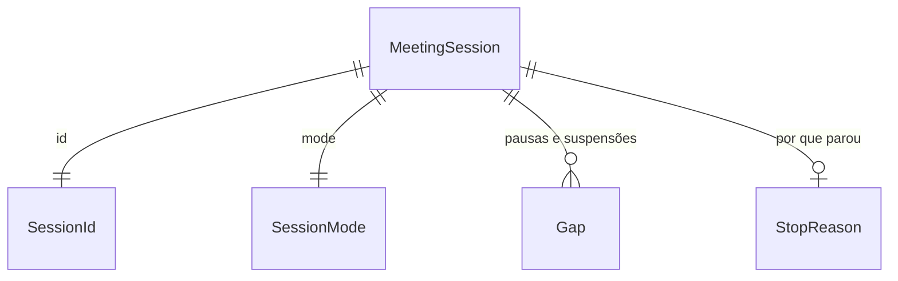

# meeting-session

## Problem

Não existe "uma reunião" no código. Nada amarra o clique de início, o indicador visível, a pausa, a suspensão do SO e o fim de uma gravação de reunião, e a ADR-0005 exige duas coisas que hoje não têm onde morar: nenhuma gravação começa sem `UserAction::StartRecording`, e o indicador é um estado obrigatório da máquina de estados da sessão (seção Confirmação da ADR). O Granola perde reuniões em silêncio (reclamação nº 1, `research/02` §6.2) e uma gravação esquecida cresce ~690 MB/h de WAV (pitch da fase 2, rabbit hole "Disco").

O pitch da fase 2 e a decisão 6 do roadmap (`plans/roadmap-proposta-2026-10-02.md`) fixam o comportamento: `Paused` com retomar por ação do usuário, quatro modos de sessão, suspensão do SO que fecha o cabeçalho e pergunta "continuar ou parar", teto padrão de 3 h configurável de 1 a 8 h que para e manda processar, nunca descarta. O desktop e o gravador real (trilha F, `crates/audio`) ainda não existem para isso; esta feature entrega a lógica pura que os dois vão obedecer.

Quando isto entra, o gravador da trilha F e o painel da 2.F2 recebem de `fala-meeting` uma lista ordenada de efeitos (mostrar indicador, começar captura, fechar cabeçalho, processar) e não têm como começar uma captura sem o clique.

## Flow

Reusa o `thiserror` e o `serde` que já estão em `[workspace.dependencies]` e o `getrandom` 0.3 que já está no `Cargo.lock`; não reusa nada de `crates/audio` (o gravador da trilha F ainda não integrou; a ligação é de uma rodada posterior).

`single module - fala-meeting` (door 1): o chamador (desktop ou CLI, depois) entrega uma `Input` com o instante de parede; `MeetingSession::apply` valida a transição e devolve `Vec<Effect>` em ordem; o chamador executa os efeitos no gravador (trilha F) e na UI (2.F2). Nada persiste nesta feature.

## Impact

| Front | What changes |
| --- | --- |
| domain | new term: `SessionId` - ULID de uma sessão de reunião, vai para a pasta `audio/<id>/` (2.F3), o SQLite e o frontmatter (2.F5), lives in `fala-meeting` |
| domain | new term: `SessionMode` - `meeting`, `in_person`, `system_only`, `import`, lives in `fala-meeting` |
| domain | new term: `UserAction` - ação explícita do usuário: `StartRecording`, `PauseRecording`, `ResumeRecording`, `StopRecording`, `ExtendCap`; é o único caminho para iniciar e retomar (ADR-0005), lives in `fala-meeting` |
| domain | new term: `SessionState` - `Idle`, `Recording`, `Paused`, `Suspended`, `Stopping`, `Stopped`; `Recording`, `Paused` e `Suspended` carregam um `Indicator`, lives in `fala-meeting` |
| domain | new term: `Effect` - o que o chamador executa após uma transição (indicador, captura, aviso, processar), lives in `fala-meeting` |
| domain | new term: `RecordingCap` - teto da duração gravada, 1 a 8 h, padrão 3 h, lives in `fala-meeting` |
| domain | existing term: `Session` em `ARCHITECTURE.md`/design doc §3.2 está listado em `crates/core`; nasce em `fala-meeting` porque `crates/core` está fechado para esta trilha e nenhum outro crate o consome ainda - ninguém ramifica nele hoje |
| stored data | nothing to migrate - nada persiste; o formato serializado de `SessionId` e `SessionMode` fica fixado (doors 3 e 4) para a 2.F3 e a 2.F5 |

## Relations

One-way constraints: `SessionId` é ULID em texto de 26 caracteres (door 3); `SessionMode` só aceita os quatro valores (door 4). No columns and no types here.

## Surface

None - nothing consumed outside: é uma biblioteca dentro do workspace; a forma que sai do processo (pasta, SQLite, frontmatter) é só a serializada de `SessionId` e `SessionMode`, tratada no Landing.

## Landing

| One-way door | Literal shape | Alternative rejected |
| --- | --- | --- |
| 1. crate novo | `crates/meeting`, pacote `fala-meeting`, `fala-meeting = { path = "crates/meeting" }` em `[workspace.dependencies]`, linha no Code Map do `ARCHITECTURE.md` | tipos de sessão em `fala-core`: o core está fechado para esta trilha (só adição, e a rodada não deu essa adição a este painel) e nenhum outro crate consome `Session` ainda; o design doc §3.2 já prevê `meeting` |
| 2. máquina de estados | `Idle → Recording ⇄ Paused`; `Recording`/`Paused → Suspended` (SO); `Suspended → Recording` só por `ResumeRecording`; `Recording`/`Paused`/`Suspended → Stopping → Stopped`; as variantes que capturam ou aguardam carregam `Indicator`, e o tipo `MeetingSession` só nasce em `Idle` | a máquina do pitch original sem `Paused` nem `Suspended`: a decisão 6 do roadmap diz que entrar depois custa mais, porque `Paused` muda o que conta como gravado e o que o indicador mostra |
| 3. formato do `SessionId` | ULID Crockford base32, 26 caracteres maiúsculos (`01J9Z3K8M4Q7R2S5T6V7W8X9YZ`), serializado como string; gerado de `unix_ms` + 80 bits do `getrandom` | UUID v4: não ordena por tempo, e a pasta `audio/` e o SQLite ficam em ordem aleatória; data + título: muda quando o título muda e colide no mesmo dia (pitch F1, portas) |
| 4. forma serializada de `SessionMode` | `"meeting"`, `"in_person"`, `"system_only"`, `"import"` (`#[serde(rename_all = "snake_case")]`) | nome em português (`"reuniao"`): os identificadores do repo e do frontmatter já são em inglês (`Editor` serializa `"llm"`); nome da variante (`"InPerson"`): estilo diferente do `Editor` |
| 5. dependência nova | `getrandom = "0.3"` em `[workspace.dependencies]` (já no `Cargo.lock` como 0.3.4, MIT/Apache-2.0) | crate `ulid`: puxa `rand` 0.9 inteiro para gerar 80 bits; entropia passada pelo chamador: cada consumidor (desktop, CLI) repetiria a geração |

- Nothing else in this change is hard to reverse

## Criteria

### S1: início só por ação explícita, com indicador (P1)

Nenhuma captura começa sem o clique, e nenhuma acontece sem indicador.

**Acceptance Criteria**

1. WHEN `MeetingSession::new` cria uma sessão THEN `fala-meeting` SHALL colocá-la em `Idle`, e nenhum construtor público SHALL criar uma sessão em outro estado (teste de compilação)
2. WHEN uma sessão em `Idle` recebe `UserAction::StartRecording` com 2 GiB ou mais livres THEN `fala-meeting` SHALL ir para `Recording` e devolver exatamente `[ShowIndicator(Recording), StartCapture]`, nessa ordem
3. The `fala-meeting` SHALL levar `Idle` a `Recording` só com `UserAction::StartRecording`: todas as outras entradas em `Idle` (as outras quatro ações, `Tick`, `OsSuspended`, `OsResumed`, `CaptureFinalized`) SHALL deixar a sessão em `Idle` sem nenhum `StartCapture`
4. WHILE a sessão está em `Recording`, `Paused` ou `Suspended`, `indicator()` SHALL devolver `Some` com o tipo `Recording`, `Paused` ou `Suspended`, respectivamente; nos demais estados SHALL devolver `None`
5. IF `UserAction::StartRecording` chega com menos de 500 MiB livres THEN `fala-meeting` SHALL recusar com `SessionError::InsufficientDisk` carregando os bytes livres e os que faltam até 500 MiB, e a sessão SHALL continuar em `Idle`
6. WHEN `UserAction::StartRecording` chega com 500 MiB ou mais e menos de 2 GiB livres THEN `fala-meeting` SHALL iniciar e devolver `[WarnLowDisk { free_bytes }, ShowIndicator(Recording), StartCapture]`
7. IF a sessão está no modo `import` e recebe `UserAction::StartRecording` THEN `fala-meeting` SHALL recusar com `SessionError::ModeDoesNotRecord` e continuar em `Idle`

**Independent test:** `cargo test -p fala-meeting start`

### S2: pausar e retomar (P1)

O intervalo pausado não é gravado, e só o usuário retoma.

**Acceptance Criteria**

8. WHEN uma sessão em `Recording` recebe `UserAction::PauseRecording` THEN `fala-meeting` SHALL ir para `Paused` e devolver `[PauseCapture, ShowIndicator(Paused)]`
9. WHEN uma sessão em `Paused` recebe `UserAction::ResumeRecording` THEN `fala-meeting` SHALL ir para `Recording` e devolver `[ShowIndicator(Recording), ResumeCapture]`
10. The `fala-meeting` SHALL levar `Paused` ou `Suspended` a `Recording` só com `UserAction::ResumeRecording`: nenhuma outra entrada SHALL produzir `StartCapture` ou `ResumeCapture` a partir desses estados
11. WHEN uma sessão é pausada aos 10 min gravados entre os instantes T1 e T2 de parede e retomada THEN `gaps()` SHALL conter um `Gap { kind: Pause, audio_offset: 10 min, from: T1, to: Some(T2) }`
12. IF uma ação do usuário chega num estado que não a aceita (por exemplo `PauseRecording` em `Paused`, `StopRecording` em `Idle`, qualquer ação em `Stopping` ou `Stopped`) THEN `fala-meeting` SHALL devolver `SessionError::InvalidTransition` com o estado e a ação, sem mudar o estado

**Independent test:** `cargo test -p fala-meeting pause`

### S3: parar e processar, nunca descartar (P1)

Todo fim de sessão manda processar.

**Acceptance Criteria**

13. WHEN uma sessão em `Recording`, `Paused` ou `Suspended` recebe `UserAction::StopRecording` THEN `fala-meeting` SHALL ir para `Stopping` com `StopReason::User` e devolver `[FinalizeCapture]`
14. WHEN uma sessão em `Stopping` recebe `CaptureFinalized` THEN `fala-meeting` SHALL ir para `Stopped` e devolver `[HideIndicator, Process]`, nessa ordem
15. The `fala-meeting` SHALL emitir `Process` exatamente uma vez em todo caminho que termina em `Stopped`, e `Effect` SHALL não ter variante que apague ou descarte áudio
16. WHILE a sessão está em `Recording` e os níveis RMS dos canais considerados ficam abaixo de 0,001 por 15 min de duração gravada seguidos THEN `fala-meeting` SHALL ir para `Stopping` com `StopReason::Silence` e devolver `[FinalizeCapture]`; no modo `system_only` SHALL considerar só o canal do sistema
17. WHEN um `Tick` em `Recording` traz um nível acima de 0,001 num canal considerado THEN `fala-meeting` SHALL zerar a contagem de silêncio

**Independent test:** `cargo test -p fala-meeting stop`

### S4: teto de duração (P1)

Uma gravação esquecida para sozinha e é processada.

**Acceptance Criteria**

18. WHEN `RecordingCap::from_hours` recebe 1 a 8 THEN `fala-meeting` SHALL devolver o teto em horas; IF recebe 0 ou 9 THEN SHALL devolver `SessionError::CapOutOfRange`; e `RecordingCap::default()` SHALL ser 3 h
19. WHEN a duração gravada informada por `Tick` alcança o teto menos 10 min pela primeira vez THEN `fala-meeting` SHALL devolver `[CapWarning { remaining: 10 min }]` uma única vez por teto
20. WHEN a duração gravada alcança o teto THEN `fala-meeting` SHALL ir para `Stopping` com `StopReason::CapReached` e devolver `[FinalizeCapture]`
21. WHEN uma sessão em `Recording` ou `Paused` recebe `UserAction::ExtendCap` THEN `fala-meeting` SHALL somar 1 h ao teto da sessão e rearmar o aviso; IF o teto já é 8 h THEN SHALL devolver `SessionError::CapAtMaximum` sem mudar o teto
22. WHILE a sessão está em `Paused` ou `Suspended`, um `Tick` SHALL não avançar a duração gravada, a contagem de silêncio nem o teto

**Independent test:** `cargo test -p fala-meeting cap`

### S5: suspensão do SO (P2)

Ao suspender, o cabeçalho é fechado; ao voltar, o usuário decide.

**Acceptance Criteria**

23. WHEN uma sessão em `Recording` ou `Paused` recebe `OsSuspended` THEN `fala-meeting` SHALL ir para `Suspended` e devolver `[FinalizeCapture, ShowIndicator(Suspended)]`
24. WHEN uma sessão em `Suspended` recebe `OsResumed` THEN `fala-meeting` SHALL continuar em `Suspended` e devolver `[AskContinueOrStop]`
25. WHEN uma sessão em `Suspended` recebe `UserAction::ResumeRecording` THEN `fala-meeting` SHALL ir para `Recording`, devolver `[ShowIndicator(Recording), ResumeCapture]` e registrar um `Gap { kind: Suspend, .. }`

**Independent test:** `cargo test -p fala-meeting suspend`

### S6: identidade e modo da sessão (P1)

O id e o modo têm uma forma só, no texto e no JSON.

**Acceptance Criteria**

26. WHEN `SessionId::from_parts` recebe `unix_ms = 1_727_000_000_000` e uma entropia fixa THEN `fala-meeting` SHALL devolver um texto de 26 caracteres Crockford base32 maiúsculos cujos 10 primeiros codificam o `unix_ms`, e `SessionId::from_str` SHALL devolver o mesmo valor a partir desse texto
27. IF `SessionId::from_str` recebe um texto com tamanho diferente de 26 ou com caractere fora do alfabeto Crockford (`I`, `L`, `O`, `U`) THEN `fala-meeting` SHALL devolver `SessionError::InvalidSessionId`
28. WHEN dois `SessionId::generate` são chamados com o mesmo `unix_ms` THEN `fala-meeting` SHALL devolver ids diferentes, e um id gerado com `unix_ms` maior SHALL ordenar depois como texto
29. The `fala-meeting` SHALL serializar `SessionMode` como `"meeting"`, `"in_person"`, `"system_only"` e `"import"`, e `SessionId` como a string de 26 caracteres, e desserializar cada um de volta para o mesmo valor
30. The `fala-meeting` SHALL compilar sem depender de `tauri` e sem nenhum `cfg(target_os)` ou `cfg(windows)`, verificado por `scripts/check-no-tauri-in-crates.sh` e por `rg` sem resultado em `crates/meeting`

**Independent test:** `cargo test -p fala-meeting id`

## Out of scope

| Excluded | Why |
| --- | --- |
| ditado durante a reunião (D11: zeros no canal do mic e marcador "ditado omitido") | precisa da ADR candidata 0015, que esta rodada não deu a este painel, e do fan-out do mic em `crates/audio` (trilha A/F); a máquina daqui não muda com ela (é um efeito novo, aditivo) |
| aviso de canal mudo (~2 min) | é da 2.F2 no pitch (painel e pill); a lógica de nível entra por adição quando a 2.F2 abrir |
| `fala-cli meet start|stop|pause|resume` | `apps/cli` está fora das fronteiras deste painel nesta rodada; o gravador real (trilha F) também não integrou |
| ligar ao gravador de `crates/audio` | trilha F do painel `pipeline-audio`, ainda não integrada |
| `Event` e `Session` em `fala-core` | `crates/core` está fechado para este painel; mover para o core é adição futura quando a UI consumir |
| persistir a sessão (SQLite, frontmatter, pasta) | 2.F5 e 2.F3 |
| fim pelo horário do calendário e pela sessão de áudio | 2.F8 (só perguntam, D6) |

## Assumptions

| Assumption | Chosen default | Rationale | Confirmed? |
| --- | --- | --- | --- |
| o que o teto mede | duração **gravada** (sem pausas nem suspensão), informada pelo gravador em cada `Tick` | o teto existe por causa do WAV que cresce e da gravação esquecida; o tempo pausado não cresce o WAV, e a duração vinda dos frames escritos não sofre com saltos do relógio de parede | y - delegado pelo Augusto em 2026-10-02, decidido pelo painel |
| "mais 1 h" acima de 8 h | recusado (`CapAtMaximum`); ao bater 8 h a sessão para e processa, e o usuário começa outra | 8 h é o máximo configurável da decisão 6; a sessão seguinte não perde nada | y - delegado pelo Augusto em 2026-10-02, decidido pelo painel |
| retomar de `Suspended` volta para onde | sempre `Recording`, mesmo se estava pausada antes de suspender | "continuar" na pergunta é a ação explícita de gravar; voltar pausado pediria um segundo clique sem ganho | y - delegado pelo Augusto em 2026-10-02, decidido pelo painel |
| limiar de silêncio | RMS linear < 0,001 (≈ −60 dBFS) nos canais considerados | "RMS, sem VAD" do pitch; −60 dBFS fica abaixo do piso de ruído de um mic de notebook e acima do silêncio digital; ajustável sem mudar o formato | y - delegado pelo Augusto em 2026-10-02, decidido pelo painel |
| unidade de disco | MiB/GiB binários (500 MiB, 2 GiB) | o Windows mostra espaço livre em unidades binárias com o rótulo "MB/GB"; a mensagem bate com o que o usuário vê | y - delegado pelo Augusto em 2026-10-02, decidido pelo painel |
| sessão `import` | existe no enum, mas a máquina de gravação a recusa; a 2.F7 cria a entrada dela | importação não captura; o enum entra agora porque é porta de mão única (decisão 6) | y - delegado pelo Augusto em 2026-10-02, decidido pelo painel |
| entrada que não se aplica | ação do usuário inválida → `InvalidTransition`; entrada do sistema (`Tick`, `OsSuspended`, `OsResumed`, `CaptureFinalized`) fora de lugar → nada acontece, sem erro | o usuário precisa saber que o clique não valeu; o sistema manda ticks e eventos de energia sem saber o estado, e errar nisso só encheria log | y - delegado pelo Augusto em 2026-10-02, decidido pelo painel |
| relógio | o chamador passa o instante de parede (`UnixMillis`) em cada `apply`; o crate nunca lê o relógio, exceto `SessionId::generate` que lê só a entropia | lógica pura e testável com relógio falso (decisão da rodada) | y - delegado pelo Augusto em 2026-10-02, decidido pelo painel |

**Open questions:** none - all resolved or logged above.

## Observable

None - no user-facing surface: os efeitos `ShowIndicator`, `CapWarning`, `WarnLowDisk` e `AskContinueOrStop` viram tela na 2.F2; o texto é de lá.

## Sources

- ADR-0005 (Confirmação: `UserAction::StartRecording` e indicador como estado obrigatório)
- `fala-research/plans/roadmap-proposta-2026-10-02.md` decisões 2 e 6; `pitches/fase-2-reuniao-videos.md` F1, D6, D12
