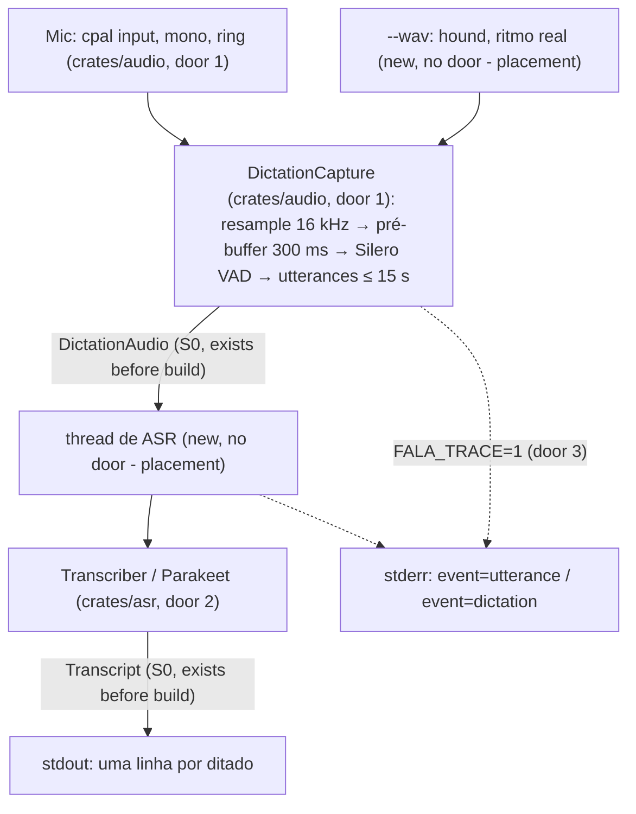

# pipeline-headless — mic → VAD → Parakeet → texto, sem UI

## Problem

O ditado do Fala ainda não existe fora do código herdado do Handy: captura, VAD, resample e ASR
vivem em `apps/desktop/src/audio_toolkit` e `managers/`, presos ao Tauri, e só rodam com a janela
aberta. `crates/audio` e `crates/asr` são `//!` vazios e `fala-cli dictate` sai com "ainda não foi
implementado". Sem a máquina Windows, o slice da fase 1 sobre o desktop não roda; o handoff da
rodada de 2026-10-02 inverteu a ordem: a lógica nasce nos crates e é exercitada pela CLI.

Quem paga é o orçamento de latência: "soltar → texto no campo (frase < 10 s, ASR local, sem LLM)"
tem meta de 700 ms e máximo de 1,0 s (design doc §5), e ninguém mediu isso de ponta a ponta. O
único número é do benchmark: Parakeet v3 int8 com RTF 0.097 nesta máquina (spike 01, rodada
Linux), ou seja ~0,97 s para 10 s de fala transcritos de uma vez, quase no máximo; no Windows, o
alvo da fase 1, o RTF é 0,063 (~0,63 s para 10 s, PR #20), com só ~70 ms de folga sobre a meta
para o VAD, a junção e o custo fixo por chamada. A carga do modelo leva ~2,3 s no Linux e ~3,5 s
no Windows, contra a meta de 3 s do início a frio. O design doc
§3.3 conta com utterances fechadas pelo VAD sendo transcritas enquanto a pessoa ainda fala, de
modo que ao soltar só falte a última; isso não foi provado.

Quando isto fechar, `fala-cli dictate --model <dir>` carrega o Parakeet, abre o microfone, e cada
par de Enter é um ditado cujo texto sai numa linha do stdout; `--wav <arquivo>` toca um arquivo
pelo mesmo pipeline no ritmo do tempo real; `FALA_TRACE=1` mostra o tempo de cada etapa e o
"soltar → texto" de cada ditado.

## Flow

Reusa o que o desktop já embarca e que já está no `Cargo.lock`: `cpal` para o mic, `rubato`
para o resample, `vad-rs` com o `silero_vad_v4.onnx` versionado para o VAD, `transcribe-rs` para
o Parakeet; o desenho do segmentador (onset, pre-roll, hangover) segue o `SmoothedVad` do
desktop, sem copiar o desktop nem tocá-lo.

1. entrada: `fala-cli dictate` -> `Cli` clap em `apps/cli/src/main.rs` (exists) - valida flags; modelo ou VAD ausente sai com 2 antes de abrir o mic
2. fonte: no modo mic, o stream `cpal` (door 1) fica aberto desde o começo e empurra mono f32 num ring; no modo `--wav`, a CLI lê o arquivo e entrega blocos de 10 ms no ritmo do relógio
3. `DictationCapture` (door 1) - reamostra para 16 kHz o tempo todo e mantém os últimos 300 ms; no `start` (primeiro Enter ou início do WAV) esses 300 ms abrem a sessão; o VAD fecha utterances por silêncio ou aos 15 s e as entrega como `DictationAudio`
4. thread de ASR na CLI - recebe as utterances em ordem, chama `Transcriber::transcribe` (door 2) enquanto a gravação continua
5. fim da sessão em `DictationCapture` (door 1), no segundo Enter ou no fim do WAV - esvazia o resampler e fecha a utterance aberta; a CLI espera a fila de ASR, junta os textos em ordem e imprime a linha
6. out: o texto no stdout; logs e, com `FALA_TRACE=1`, as linhas de trace (door 3) no stderr; exit 0/1/2

## Impact

| Front | What changes |
| --- | --- |
| domain | novo termo: `utterance` - trecho de fala contínua que o VAD fecha (silêncio de 450 ms depois de fala) ou que é cortado aos 15 s; vira um `DictationAudio` e uma chamada ao `Transcriber`. O `Utterance` que o `//!` de `crates/core` cita não existe ainda; se o S0 o criar com outro sentido, o termo aqui muda no mesmo commit |
| domain | novo termo: `pré-buffer` - os 300 ms de áudio anteriores ao início do ditado, mantidos enquanto o mic está aberto (design doc §5, "nunca perder a primeira sílaba"); diferente do pre-roll do VAD (450 ms antes do onset, dentro da sessão) |
| domain | `crates/core` (S0): usa `DictationAudio`, `Transcript` e `Language` como o S0 os definir; nada é criado ou editado em `crates/core` por esta feature. Se faltar um construtor de que o pipeline precisa, o build espera e diz isso |
| ADR | contradiz a letra da ADR-0003 em dois pontos: runtime `transcribe-rs` (ONNX Runtime) em vez de sherpa-onnx, e Silero v4 em vez de v6. Decidido com o Augusto em 2026-10-02: seguir, com a ADR-0009 (`proposed`) em `docs/decisions/` neste PR. Pela auditoria da fase 0 (pedido do Lux, 2026-10-02), a 0009 reafirma a decisão inteira da 0003 com os números medidos nas duas máquinas, para a 0003 poder virar `superseded` sem nada pendurado |
| build | `crates/audio` passa a linkar `cpal` (libasound no Linux), `rubato`, `rtrb` e `vad-rs` (ONNX Runtime); `crates/asr` passa a linkar `transcribe-rs` (ONNX Runtime). Todos já estão no lockfile via `apps/desktop` e `apps/cli`; nenhum pacote novo no grafo, só arestas novas. `[workspace.dependencies]` não muda (dependências declaradas em cada crate, como faz `apps/cli`) |
| stored data | nada a migrar. O modelo Parakeet é lido de `--model`; esta feature não baixa modelo |

## Relations

`None - no stored-data shape change` (nada é persistido; o texto sai no stdout).

## Surface

| Route | In | Out | Status |
| --- | --- | --- | --- |
| `fala-cli dictate` | `--model <dir>` (obrigatório: pasta `parakeet-tdt-0.6b-v3-int8`), `--vad <onnx>` (default: `apps/desktop/resources/models/silero_vad_v4.onnx` do repo), `--mic <parte do nome>` (default: entrada padrão), `--wav <arquivo>` (substitui o mic), `--language <pt-BR ou en>` (default `pt-BR`); env `FALA_TRACE=1` | stdout: uma linha por ditado (textos das utterances aparados, em ordem, separados por um espaço; linha vazia se não houve fala). stderr: instruções, logs e trace | `0` terminou (EOF no stdin ou fim do WAV), `1` falha em tempo de execução (stream do mic, inferência), `2` entrada inválida (modelo ou VAD ausente/ilegível, WAV ilegível, `--mic` sem correspondência, idioma desconhecido); sem status HTTP (comando local; 200-599 n/a) |

## Landing

| One-way door | Literal shape | Alternative rejected |
| --- | --- | --- |
| 1. dependências de `crates/audio` | em `crates/audio/Cargo.toml`: `cpal = "0.16.0"`, `rtrb = "0.4.0"`, `rubato = "0.16.2"`, `vad-rs = { git = "https://github.com/cjpais/vad-rs", default-features = false }`, `log = "0.4"`, `thiserror.workspace = true`; dev: `hound = "3.5.1"`. Mesmas versões e mesma fonte git do `apps/desktop` (já liberada em `deny.toml`) | Silero v6 com `ort` direto: exigiria código de inferência próprio e um `.onnx` novo versionado; adiado pela ADR-0009 (rascunho). `earshot` (o outro VAD do desktop): não é o que a ADR-0003 escolhe. `webrtc-vad`: dependência nova fora do lockfile |
| 2. trait de ASR que o desktop e a reunião vão copiar | `pub trait Transcriber: Send { fn transcribe(&mut self, audio: &DictationAudio, language: Language) -> Result<Transcript, AsrError>; }`; `AsrError` (`thiserror`) com `ModelLoad { path, reason }` e `Inference(String)`; implementação `Parakeet::load(dir: &Path) -> Result<Parakeet, AsrError>` (int8, `transcribe-rs = { version = "0.3.8", features = ["onnx"] }` em `crates/asr/Cargo.toml`) | idioma fixo na construção: o design doc §3.3 quer "um idioma por ditado com seletor na pill", então o idioma é por chamada. `transcribe_file(path)` do design doc §3.2: fica para quando houver decodificação de arquivo (`fala-cli transcribe`), fora daqui. Usar `CoreError` direto: os crates usam `thiserror` próprio (AGENTS.md) |
| 3. formato do trace | com `FALA_TRACE=1`, linhas no stderr pelo `log` com target `fala_trace` em nível `info`, mensagem só com pares `chave=valor` separados por espaço: `event=utterance dictation=<n> index=<i> audio_ms=<int> asr_ms=<int> before_release=<0\|1>` e `event=dictation dictation=<n> audio_ms=<int> utterances=<k> flush_ms=<int> tail_asr_ms=<int> release_to_text_ms=<int>`. Nunca texto ditado | JSON por linha: mais pesado de ler no terminal e o desktop vai emitir o mesmo trace pelo `log`. Tabela Markdown no stdout: o stdout é só o texto |

| 4. evento de carga no trace (aditivo, pedido do Lux em 2026-10-02 pela auditoria da fase 0) | com `FALA_TRACE=1`, antes do primeiro ditado, uma linha no mesmo canal da door 3: `event=load model_ms=<int> vad_ms=<int>`; a carga fica fora do `release_to_text_ms` e do `asr_ms` | somar a carga ao primeiro ditado: esconderia o início a frio (~3,5 s no Windows) dentro de um número que tem meta de 700 ms |

- Nada mais aqui é difícil de reverter: os parâmetros do VAD, o tamanho do ring e a divisão em módulos se acertam no diff.

## Criteria

### S1: o áudio do mic vira utterances de 16 kHz (P1)

`crates/audio` recebe amostras na taxa do dispositivo e entrega utterances `DictationAudio` a 16 kHz.

**Acceptance Criteria**

1. WHEN amostras mono a 48 000 Hz ou 44 100 Hz são reamostradas THEN o resampler SHALL entregar, depois de esvaziado, `in_len × 16000 / in_rate` amostras a menos de 480 (um quadro de 30 ms) de diferença
2. WHEN um seno de 440 Hz a 48 000 Hz é reamostrado THEN a saída a 16 000 Hz SHALL ter frequência de 440 Hz ± 1 % (contada por cruzamentos de zero)
3. WHEN `start` é chamado THEN a captura SHALL abrir a sessão com as últimas 4 800 amostras (300 ms a 16 kHz) recebidas antes do `start`, na ordem, seguidas das amostras posteriores sem lacuna nem repetição
4. IF menos de 4 800 amostras chegaram antes do `start` THEN a captura SHALL abrir a sessão com todas as que chegaram
5. WHEN, durante a sessão, o VAD marca voz por 60 ms (2 quadros) THEN a captura SHALL abrir uma utterance que começa até 450 ms (15 quadros) antes do primeiro quadro de voz, limitada ao início da sessão
6. WHEN, depois de voz, o VAD marca silêncio por 450 ms (15 quadros) THEN a captura SHALL fechar a utterance e entregá-la enquanto a sessão continua
7. WHILE a voz continua, WHEN a utterance atinge 240 000 amostras (15 s) THEN a captura SHALL entregá-la e continuar numa nova utterance, sem amostra perdida nem duplicada entre as duas
8. WHEN `stop` é chamado com uma utterance aberta THEN a captura SHALL entregá-la com todas as amostras até o `stop`, incluindo o que estava no resampler
9. IF nenhuma voz foi detectada na sessão THEN `stop` SHALL não entregar nenhuma utterance
10. WHEN o Silero v4 versionado classifica 3 s de silêncio digital THEN a captura SHALL entregar 0 utterances, e WHEN classifica um trecho de fala real THEN SHALL entregar pelo menos 1

**Independent test:** `cargo test -p fala-audio` com um VAD roteirizado e com o Silero sobre silêncio; o teste de fala real lê `FALA_TEST_SPEECH_WAV`.

### S2: o Parakeet transcreve uma utterance (P1)

`crates/asr` define o `Transcriber` e a única implementação, Parakeet v3 int8.

**Acceptance Criteria**

11. WHEN `Parakeet::transcribe` recebe uma utterance de fala real em pt-BR THEN SHALL devolver um `Transcript` com texto não vazio e o idioma pedido
12. IF a pasta do modelo não existe ou não tem os arquivos int8 do Parakeet THEN `Parakeet::load` SHALL falhar com `AsrError::ModelLoad` cujo texto contém o caminho
13. IF a utterance tem menos de 1 600 amostras (100 ms) THEN `transcribe` SHALL devolver texto vazio sem rodar o modelo

**Independent test:** `cargo test -p fala-asr`; os testes com modelo leem `FALA_TEST_PARAKEET_DIR` e `FALA_TEST_SPEECH_WAV` e são `#[ignore]`, como os do `bench`.

### S3: `fala-cli dictate` dita de ponta a ponta (P1)

Enter começa, Enter para, o texto sai no stdout; `--wav` faz o mesmo com um arquivo.

**Acceptance Criteria**

14. WHEN `dictate --wav <arquivo>` roda THEN a CLI SHALL entregar o arquivo ao pipeline no ritmo do relógio (tempo de parede ≥ duração do arquivo − 100 ms) e tratar o fim do arquivo como o soltar da tecla
15. WHEN um ditado termina THEN a CLI SHALL imprimir no stdout uma única linha com os textos das utterances aparados, na ordem das utterances, separados por um espaço
16. IF o ditado não teve fala THEN a CLI SHALL imprimir uma linha vazia e seguir com exit 0
17. WHILE a sessão grava, WHEN o VAD fecha uma utterance THEN a CLI SHALL transcrevê-la sem esperar o soltar (com `FALA_TRACE=1`, toda utterance menos a última de um ditado de pelo menos 2 utterances sai com `before_release=1`)
18. WHERE `FALA_TRACE=1`, a CLI SHALL escrever no stderr uma linha `event=utterance` por utterance e uma `event=dictation` por ditado no formato da door 3, sem nenhuma palavra do texto ditado
19. WHERE `FALA_TRACE` não é `1`, a CLI SHALL não escrever nenhuma linha `event=`
20. WHEN, no modo mic, o stdin entrega uma linha THEN a CLI SHALL começar um ditado, e a linha seguinte SHALL terminá-lo; WHEN o stdin chega ao fim THEN SHALL terminar o ditado aberto, se houver, e sair com 0
21. IF `--model` aponta para uma pasta sem o Parakeet, `--vad` para um arquivo ilegível ou `--wav` para um arquivo ilegível THEN a CLI SHALL sair com 2 e uma mensagem com o caminho, sem abrir o microfone
22. IF `--mic` não corresponde a nenhum dispositivo de entrada THEN a CLI SHALL sair com 2 listando os dispositivos de entrada
23. WHERE `FALA_TRACE=1`, a CLI SHALL escrever no stderr, antes de qualquer linha `event=utterance`, exatamente uma linha `event=load` no formato da door 4
24. IF `--language` não é `pt-BR` nem `en` THEN a CLI SHALL sair com 2 e uma mensagem com o valor recebido, antes de carregar qualquer modelo (adicionado na rodada 2 da verificação)

**Independent test:** `FALA_TRACE=1 fala-cli dictate --model <dir> --wav <corte de 8 s>` imprime o texto e o trace; o modo mic só com o Augusto falando, quando ele liberar.

## Out of scope

| Excluded | Why |
| --- | --- |
| baixar o modelo Parakeet | o desktop já baixa; a CLI recebe `--model`. Download nos crates vem com a ligação do desktop |
| `transcribe_file` e `fala-cli transcribe <arquivo>` | precisa decodificar formatos (ffmpeg); não é o caminho do ditado |
| parciais na tela durante o ditado | o design doc as quer para ditado > 30 s; a CLI imprime só no fim |
| hotkey, pill, pós-processamento, inserção | trilhas e fases próprias (B, E, `hotkey`, `inject`) |
| Esc cancela, double-tap hands-free, aviso aos 19 min e corte aos 20 | regras de UX do desktop (§3.3); a CLI não tem esse loop |
| watchdog do mic parado | o `record` tem um; no ditado curto um mic parado aparece como linha vazia. Entra com a ligação do desktop |
| Silero v6 | ADR-0009 (rascunho) adia; `vad-rs` só lê o v4 |
| ligar o desktop aos crates | rodada posterior, depois dos spikes Windows (handoff) |
| validação no Windows | `TODO(windows)`; o job do CI da trilha G vai rodar `cargo test` lá |

## Assumptions

| Assumption | Chosen default | Rationale | Confirmed? |
| --- | --- | --- | --- |
| parâmetros do VAD | limiar 0.3, quadro de 30 ms (480 amostras), onset 60 ms, pre-roll 450 ms, hangover 450 ms | os mesmos do desktop (`managers/audio.rs`, perfil offline), que já roda com eles || y — delegado pelo Augusto em 2026-10-02, confirmado pelo Lux |
| idioma no Parakeet | o v3 detecta o idioma sozinho; `--language` só preenche `Transcript.language` | o `transcribe-rs` não recebe idioma para o Parakeet || y — delegado pelo Augusto em 2026-10-02, confirmado pelo Lux |
| vários ditados por execução | no modo mic, pares de Enter repetem até EOF; o modelo carrega uma vez | medir várias frases sem pagar ~2,3 s de carga a cada uma || y — delegado pelo Augusto em 2026-10-02, confirmado pelo Lux |
| caminho do VAD por padrão | o `.onnx` versionado em `apps/desktop/resources/models/`, resolvido a partir do `CARGO_MANIFEST_DIR` do `fala-cli` | a CLI é ferramenta de desenvolvimento rodada do repo; só leitura, não toca o desktop || y — delegado pelo Augusto em 2026-10-02, confirmado pelo Lux |
| ritmo do `--wav` | blocos de 10 ms, cada um entregue no instante do relógio que lhe corresponde | aproxima o callback do `cpal` sem depender do mic | y (Augusto, 2026-10-02) |
| ADR-0003 | seguir com `transcribe-rs` e Silero v4; ADR-0009 (`proposed`) neste PR | handoff manda `transcribe-rs`; `vad-rs` só lê v4 | y (Augusto, 2026-10-02) |

**Open questions:** none - all resolved or logged above. O S0 entrou em `feat/core-contract` (`91f4e0d`) com `DictationAudio::samples()` e `into_samples()`; a ADR-0009 entra neste PR em `docs/decisions/` com status `proposed` (fronteira ampliada pelo Lux em 2026-10-02) e o Augusto a aceita ao revisar o PR.

## Observable

| Surface | Decision | Landing |
| --- | --- | --- |
| comando `fala-cli dictate` | formato e verbosidade da saída | AC 15, AC 18, AC 19 |
| comando `fala-cli dictate` | cada flag e seu default | Surface; AC 14, AC 20, AC 21, AC 22 |
| comando `fala-cli dictate` | exit codes | Surface; AC 16, AC 20, AC 21, AC 22, AC 24 |
| comando `fala-cli dictate` | o que imprime quando falha no meio | existing - o `main.rs` loga o erro com `{:#}` e sai com o código do `Failure`, como `bench` e `record`; o ditado em curso é perdido e nada sai no stdout para ele |
| comando `fala-cli dictate` | ditado sem fala (estado vazio) | AC 16 |
| trace `FALA_TRACE` | formato e quem lê | door 3, door 4; AC 18, AC 23 |

## Sources

- `~/projects/fala-research/HANDOFF-fase-1-linux.md` - a trilha A, as fronteiras e o contrato S0 proposto
- `docs/design/2026-10-fala-v1.md` §3.3 e §5 - o fluxo com utterances durante a gravação e o orçamento soltar → texto
- `docs/decisions/0003-asr-do-ditado-local-parakeet-via-sherpa-onnx.md` - a decisão que o rascunho da ADR-0009 ajusta
