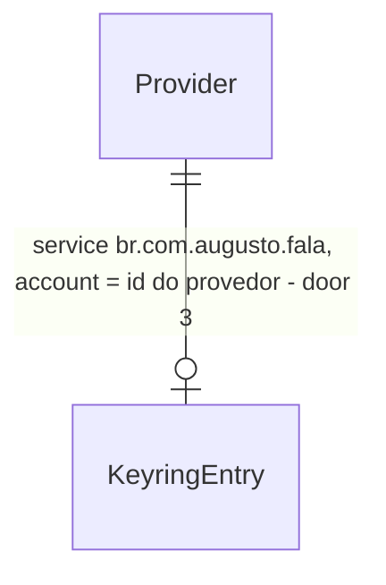

# postproc — regras pt-BR, Gemini com fallback de 2 s e chaves no keyring

Profile: standard (aprovado pelo Lux em 2026-10-02; o projeto declara `light`, ver `checks.md`)

## Problem

Hoje o texto que o Parakeet devolve chega ao campo do jeito que saiu do ASR: com "hã", "ahn",
"eu eu eu", espaços duplos e o nome dos produtos escrito como soou ("charge bee" em vez de
"ChargeBee"). O que existe para limpar isso vive só em `apps/desktop` (herdado do Handy:
`audio_toolkit/text.rs`, fillers só de en/de/fr e fuzzy por Soundex inglês; `llm_client.rs`,
OpenAI-compatível), acoplado ao Tauri e impossível de exercitar pelo `fala-cli`. `crates/postproc`
é só um `//!`.

A ADR-0004 decide Gemini Flash-Lite acima de ~15 palavras, com dicionário e nome do app no
prompt, e exige: "nunca enviar o conteúdo do campo ativo ou tela, só o texto ditado, o nome do
app e o dicionário; se a resposta passar de 2 s, inserir o texto bruto". A confirmação dela
("teste de integração com servidor falso verifica o payload enviado ... e o comportamento de
timeout") ainda não existe. A ADR-0008 exige chave no keyring do SO; não há código nos crates que
leia ou grave o keyring, e o desktop guarda as chaves em texto puro no `tauri-plugin-store`
(`settings.rs:453`, trilha K).

Quem paga: o usuário, que corrige à mão cada filler e cada nome próprio, e o projeto, que não
tem prova de que só texto sai da máquina. Evidência de volume: nenhuma no material da rodada.

Quando isto fechar, `printf '%s' "$CHAVE" | fala-cli key set gemini` guarda a chave no keyring,
e `echo "hã então eu eu eu acho que a charge bee ..." | fala-cli format --llm --app Slack`
imprime o texto final: regras locais sempre, Gemini quando passa de 15 palavras, e o texto das
regras se o Gemini demorar mais de 2 s ou falhar.

## Flow

Reusa `ureq` (já no `Cargo.lock` via `hf-hub`/`ort`) como cliente HTTP e os tipos do contrato S0
de `fala-core`; não reaproveita `apps/desktop/src/llm_client.rs` (preso ao Tauri, OpenAI-compat).

1. stdin → `fala-cli key {set,status,delete} <provedor>` (subcomando novo em `apps/cli/src/main.rs`, exists) → `fala-secrets` (door 1) `KeyringStore` grava, lê ou apaga a entrada `br.com.augusto.fala` / `<provedor>` (door 3) via `keyring` (door 2)
2. stdin → `fala-cli format [--llm] [--app NOME] [--model ID] [--lang pt-BR|en] [--dictionary ARQ] [--disable-app NOME]...` (subcomando novo, exists o binário) → monta `Transcript`, `AppContext`, `Dictionary` de `fala-core` (exists após S0)
3. com `--llm`: `fala-secrets` (door 1) lê a chave `gemini` → `Option<ApiKey>`; sem chave, sai com 2 antes de formatar
4. `fala-postproc` (exists, vazio) `Rules` (implementa `Formatter`, door 5): fillers, gaguejo, dicionário, espaços, maiúscula inicial → texto das regras
5. `fala-postproc` `Postprocessor` decide: LLM ligado, chave presente, app fora da lista desligada e > 15 palavras → `Gemini` (implementa `Formatter`) faz `POST generateContent` com timeout de 2 s (door 4); senão, ou em timeout/erro, fica o texto das regras
6. out: `Dictation` de `fala-core` (bruto, final, quem editou, app) mais o motivo do fallback; o CLI imprime o final no stdout e `editor: regras` ou `editor: llm` (e `fallback: <motivo>`) no stderr

Nenhum `#[cfg(target_os)]` em `fala-secrets` nem em `fala-postproc`: o `keyring` 4 com a feature
`v1` escolhe o cofre por SO dentro dele (ADR-0007).

## Impact

| Front | What changes |
| --- | --- |
| domain | novo termo: `Formatter` - transforma texto ditado em texto final dado app, dicionário e idioma; vive em `fala-postproc` |
| domain | novo termo: `Rules` - o `Formatter` local e determinístico; sempre roda, e é o fallback do LLM |
| domain | novo termo: `ApiKey` - segredo de um provedor; sem `Display`, sem `Serialize`, `Debug` redigido; vive em `fala-secrets` |
| domain | novo termo: `SecretStore` - lê, grava e apaga `ApiKey` por id de provedor; `KeyringStore` (SO) e `MemoryStore` (teste); vive em `fala-secrets` |
| domain | termo existente: `custom_words` do desktop é o `Dictionary` do S0 aqui; o desktop não muda e continua com o próprio matcher fuzzy até a ligação (duplicação aceita no handoff) |
| stored data | nada a migrar em B: as entradas `br.com.augusto.fala`/`<provedor>` no keyring só nascem por `fala-cli key set`; o JSON do desktop é da trilha K |
| build | crate novo `crates/secrets` (linha nova no Code Map do `ARCHITECTURE.md`); dependência nova `keyring` 4 (puxa `zbus-secret-service-keyring-store` no Linux, `zbus` 5 já está no lock, e `windows-native-keyring-store` no Windows); `ureq` 3 passa a ser dependência direta de `fala-postproc`; `fala-cli` ganha `fala-postproc` e `fala-secrets` |
| process | testes de `fala-postproc` sobem um servidor TCP local (std, sem dependência nova) e nunca tocam a rede; o teste do keyring real é `#[ignore]` e roda à mão no Linux com gnome-keyring |

## Relations

One-way constraints: no máximo uma entrada por (service, provedor) (door 3); o id do provedor
casa `^[a-z0-9_]{1,32}$`, o mesmo formato dos ids do desktop (`openai`, `bedrock_mantle`), para
K gravar no mesmo lugar. No columns and no types here.

## Surface

Só os subcomandos que esta feature adiciona ao `fala-cli`.

| Route | In | Out | Status |
| --- | --- | --- | --- |
| `fala-cli key set <provedor>` | chave na primeira linha do stdin | stderr: `chave de <provedor> guardada` | `0`, `1` (keyring indisponível ou falhou), `2` (provedor inválido ou stdin vazio) · sem status HTTP (comando local; 200-599 n/a) |
| `fala-cli key status <provedor>` | - | stdout: `definida` ou `ausente` | `0`, `1`, `2` · sem status HTTP (comando local; 200-599 n/a) |
| `fala-cli key delete <provedor>` | - | stderr: `chave de <provedor> removida` (também se já estava ausente) | `0`, `1`, `2` · sem status HTTP (comando local; 200-599 n/a) |
| `fala-cli format` | texto no stdin; `--llm`, `--app`, `--model` (padrão `gemini-2.5-flash-lite`), `--lang` (padrão `pt-BR`), `--dictionary` (um termo por linha), `--disable-app` (repetível) | stdout: texto final; stderr: `editor: regras` ou `editor: llm`, e `fallback: <motivo>` (`timeout`, `http <código>`, `rede` ou `resposta inválida`) quando houver | `0` (inclusive com fallback), `1` (keyring indisponível com `--llm`), `2` (uso inválido, `--llm` sem chave, arquivo de dicionário ilegível) · sem status HTTP (comando local; 200-599 n/a) |

## Landing

| One-way door | Literal shape | Alternative rejected |
| --- | --- | --- |
| 1. crate novo `fala-secrets` | `crates/secrets`, pacote `fala-secrets`, depende de `keyring` e `thiserror`; `pub struct ApiKey`, `pub trait SecretStore { fn get(&self, provider: &str) -> Result<Option<ApiKey>, SecretError>; fn set(&self, provider: &str, key: &ApiKey) -> Result<(), SecretError>; fn delete(&self, provider: &str) -> Result<(), SecretError>; }` | módulo em `fala-postproc` - K faria o desktop depender do pós-processamento só pelas chaves, e as chaves de ASR de reunião (fase 2) morariam no crate errado (decidido com o Augusto) |
| 2. dependência `keyring` | `keyring = "4"` em `[workspace.dependencies]` (feature padrão `v1`: Windows Credential Manager, Secret Service via zbus no Linux) | `keyring-core` + crates de store por SO - exigiria `#[cfg(target_os)]` em `fala-secrets`, que a ADR-0007 reserva a `hotkey`, `audio`, `inject` e desktop |
| 3. nome da entrada no keyring | service `br.com.augusto.fala` (o `identifier` do `tauri.conf.json`), account = id do provedor (`gemini`, `openai`, ...), valor = a chave em texto | service `fala` - genérico, colide no namespace compartilhado do Secret Service; uma entrada só com um JSON de todas as chaves - uma leitura corrompida perde todas e o blob do Credential Manager tem limite de 2560 bytes |
| 4. contrato com o Gemini | `POST {base}/v1beta/models/{model}:generateContent`, `base` padrão `https://generativelanguage.googleapis.com`; chave só no header `x-goog-api-key`, URL sem query string; corpo com exatamente `systemInstruction`, `contents` (1 parte `user`) e `generationConfig` (`temperature: 0`); texto lido de `candidates[0].content.parts[].text`; cliente `ureq` 3 bloqueante com `timeout_global` de 2 s | `?key=` na URL - a chave vaza em log de URL e em erro do cliente; endpoint OpenAI-compat do Gemini - a camada compat rejeita os campos de reasoning (comentário em `llm_client.rs`) e fica um degrau além da API documentada; `reqwest` assíncrono - põe runtime `tokio` e trait async em `fala-postproc`, e o `reqwest::blocking` entra em pânico dentro do runtime `tokio` do desktop quando a ligação acontecer (motivo confirmado pelo Lux em 2026-10-02) |
| 5. trait `Formatter` (precedente que A e o desktop copiam) | `pub trait Formatter: Send + Sync { fn format(&self, text: &str, ctx: &FormatContext<'_>) -> Result<String, PostprocError>; }` com `FormatContext { app: &AppContext, dictionary: &Dictionary, language: &Language }`; síncrono; quem editou é decidido pelo `Postprocessor`, que compõe `Rules` + LLM opcional e devolve `Dictation` | trait async - força runtime em todo chamador; cada `Formatter` devolver `Dictation` - a atribuição "regras ou LLM" é do compositor, não de cada etapa |

- Nothing else in this change is hard to reverse (o texto do prompt, a lista de fillers e os nomes internos mudam num commit)

## Criteria

### S1: Regras locais pt-BR (P1)

Texto com fillers, gaguejo e nomes do dicionário sai limpo sem rede.

**Acceptance Criteria**

1. WHERE the language is `pt-BR` the `Rules` formatter SHALL remove the filler tokens `hã`, `hãã`, `ãh`, `ahn`, `hum`, `humm`, `hmm`, `uh`, `uhm`, `éé` as whole words, case-insensitive, with one trailing `,` or `.` each: `então, hã, eu acho` → `Então, eu acho`
2. IF the language is not `pt-BR` THEN the `Rules` formatter SHALL remove only `uh`, `uhm`, `hmm` and keep the pt-BR-only tokens: `ahn ok` (en) → `Ahn ok`
3. WHEN the same word appears 3 or more times in a row (case-insensitive) THEN the `Rules` formatter SHALL keep one: `eu eu eu acho` → `Eu acho`; `o que que é` stays `O que que é`
4. WHEN a sequence of 1 to 3 words, compared without case, accents, hyphens and inner punctuation, equals a dictionary term THEN the `Rules` formatter SHALL replace it with the term's spelling and keep the surrounding punctuation: with `ChargeBee` and `Itaú`, `a charge bee e o itau.` → `A ChargeBee e o Itaú.` and `charge-bee` → `ChargeBee`
5. IF a candidate sequence crosses a `,` `.` `;` `:` `?` `!` THEN the `Rules` formatter SHALL not join it: `charge, bee` stays `Charge, bee`
6. IF a word only contains a dictionary term as a prefix or suffix THEN the `Rules` formatter SHALL leave it unchanged: `chargebeex` stays `Chargebeex`
7. The `Rules` formatter SHALL collapse runs of whitespace to one space, remove a space before `,` `.` `;` `:` `?` `!`, trim both ends, and upper-case the first letter
8. IF the input is empty or only whitespace THEN the `Postprocessor` SHALL return an empty final text with editor rules and make no HTTP request

**Independent test:** `echo "hã eu eu eu acho que a charge bee" | fala-cli format --dictionary <(echo ChargeBee)` imprime `Eu acho que a ChargeBee`.

### S2: Gemini acima de 15 palavras, só texto, com fallback de 2 s (P1)

O LLM formata ditados longos e nunca segura o texto por mais de 2 s.

**Acceptance Criteria**

9. WHILE the LLM is enabled, a key is present and the app is not in the disabled list, WHEN the rules output has more than 15 whitespace-separated words THEN the `Postprocessor` SHALL send one request to Gemini and return the response text, trimmed, as the final text with editor LLM
10. WHEN the rules output has 15 words or fewer THEN the `Postprocessor` SHALL make no HTTP request and return the rules output with editor rules
11. WHERE the active app's name equals an entry of the disabled-app list, ignoring case, the `Postprocessor` SHALL make no HTTP request and return the rules output with editor rules
12. The Gemini request SHALL have a JSON body whose only top-level keys are `systemInstruction`, `contents` and `generationConfig`, whose `systemInstruction` text is the fixed prompt followed by the dictionary terms, and whose single `contents` part is exactly the app name and the rules output in the fixed template - no other text
13. The Gemini request SHALL carry the key only in the `x-goog-api-key` header, with a request URL that has no query string, at path `/v1beta/models/<model>:generateContent`
14. IF Gemini has not answered within 2 s of the request start THEN the `Postprocessor` SHALL return the rules output with editor rules and fallback `timeout`, in under 2.5 s of wall time
15. IF Gemini answers a non-2xx status, the connection fails, or the body has no non-empty `candidates[0].content.parts[].text` THEN the `Postprocessor` SHALL return the rules output with editor rules and fallback `http <status>`, `rede` or `resposta inválida` respectively
16. The `PostprocError` and fallback messages SHALL not contain the dictated text or the key, even when the server echoes them in its error body

**Independent test:** os testes de `fala-postproc` com o servidor falso: payload capturado, resposta lenta de 3 s e resposta 500.

### S3: Chaves no keyring do SO (P1)

Uma chave guardada por `fala-secrets` sobrevive ao processo e nunca aparece em texto.

**Acceptance Criteria**

17. WHEN a key is set for a provider THEN a later `get` for that provider SHALL return the same key, through the OS keyring for `KeyringStore`
18. WHEN a provider's key is deleted THEN `get` SHALL return none, and IF the key was already absent THEN `delete` SHALL succeed
19. IF the provider id does not match `^[a-z0-9_]{1,32}$` THEN `get`, `set` and `delete` SHALL return `InvalidProvider` without touching the store
20. IF the key to set is empty or only whitespace THEN `set` SHALL return `EmptyKey` without touching the store
21. IF the OS keyring cannot be reached THEN `KeyringStore` SHALL return `Unavailable` instead of panicking
22. The `ApiKey` type SHALL format under `Debug` as `ApiKey([REDACTED])` and SHALL not implement `Display` or `Serialize`

**Independent test:** `cargo test -p fala-secrets -- --ignored` contra o gnome-keyring desta máquina, com service de teste.

### S4: fala-cli key e format (P2)

A chave e o formatador são usáveis sem UI.

**Acceptance Criteria**

23. WHEN `fala-cli key set <provedor>` reads a non-empty line from stdin THEN the CLI SHALL store it and exit 0, never writing the key to stdout or stderr
24. IF `fala-cli key set` reads an empty stdin THEN the CLI SHALL exit 2 and store nothing
25. WHEN `fala-cli key status <provedor>` runs THEN the CLI SHALL print `definida` or `ausente` on stdout and exit 0
26. WHEN `fala-cli format` reads text from stdin THEN the CLI SHALL print the final text on stdout, `editor: regras` or `editor: llm` on stderr, and exit 0, also when a fallback happened
27. IF `fala-cli format --llm` finds no `gemini` key THEN the CLI SHALL exit 2 with a message that names `fala-cli key set gemini`, before any HTTP request
28. IF the keyring is unavailable for `key *` or `format --llm` THEN the CLI SHALL exit 1 with a message that says the keyring is unavailable

**Independent test:** `printf 'nao-e-chave' | fala-cli key set teste_cli && fala-cli key status teste_cli && fala-cli key delete teste_cli`.

## Out of scope

| Excluded | Why |
| --- | --- |
| "aplicar edição" com o resultado tardio do LLM | precisa de histórico (trilha C) e de UI; B devolve o fallback e descarta a resposta tardia |
| `fala-cli dictate --llm` | `dictate` é da trilha A, feita em paralelo; a ligação é uma linha depois que A e B entrarem |
| casamento aproximado (fuzzy) do dicionário | decidido com o Augusto: exato nas regras, aproximado fica com o LLM |
| API explícita de context caching do Gemini | o prefixo estável (prompt + dicionário primeiro) já serve ao cache implícito; cache explícito tem custo de armazenamento e TTL a decidir |
| persistir dicionário e lista de apps desligados | é `Settings` (core/storage); B recebe os dois como parâmetro |
| segundo backend (Claude Haiku) e retry | a ADR-0004 escolheu um provedor; retry estoura o orçamento de 2 s |
| guarda contra o LLM "responder" o ditado em vez de formatá-lo | é qualidade de prompt; entra quando houver corpus de ditados para medir |
| ligação do desktop ao `fala-postproc` | rodada posterior (handoff); K só migra as chaves |

## Assumptions

| Assumption | Chosen default | Rationale | Confirmed? |
| --- | --- | --- | --- |
| modelo padrão | `gemini-2.5-flash-lite`, trocável por `--model` e pelo construtor | ADR-0004 ao pé da letra; a troca para 3.5 é ADR nova (ver pergunta 1) | y - Augusto, 2026-10-02 |
| o que o LLM recebe | a saída das regras, não o texto cru do ASR | menos tokens e o mesmo conteúdo ditado; continua sendo "só o texto ditado" da ADR-0004 | y - delegado pelo Augusto em 2026-10-02, confirmado pelo Lux |
| contagem de palavras | tokens separados por espaço na saída das regras; liga com 16 ou mais | "acima de ~15 palavras" da ADR-0004, lido como estritamente maior | y - delegado pelo Augusto em 2026-10-02, confirmado pelo Lux |
| janela dos 2 s | do início do request até o fim do corpo (`timeout_global` do `ureq`), sem contar as regras | as regras levam microssegundos; o orçamento de 2 s do design doc §5 é dominado pela rede | y - delegado pelo Augusto em 2026-10-02, confirmado pelo Lux |
| idioma do prompt | um prompt fixo em pt-BR que manda manter o idioma do ditado | pt-BR é o idioma-fonte; um prompt por idioma é otimização sem corpus para medir | y - delegado pelo Augusto em 2026-10-02, confirmado pelo Lux |
| comparação de app desligado | igualdade do nome do app sem caixa | `AppContext` só traz o nome; regex ou id de processo é desenho de UI | y - delegado pelo Augusto em 2026-10-02, confirmado pelo Lux |
| `temperature` | `0` | formatação quer saída estável; nenhum outro campo de `generationConfig` (o 2.5 Flash-Lite já vem sem thinking) | y - delegado pelo Augusto em 2026-10-02, confirmado pelo Lux |
| chave no stdin | primeira linha, sem o `\n` final; sem `rpassword` | evita dependência nova; quem digita interativamente vê o eco, documentado no `--help` | y - delegado pelo Augusto em 2026-10-02, confirmado pelo Lux |
| tipos do S0 | `Transcript`, `AppContext`, `Dictionary`, `Editor`, `Dictation`, `Language` de `feat/core-contract` (91f4e0d); "editor regras" = `Editor::Rules`, "editor LLM" = `Editor::Llm`; "não pt-BR" = `Language::En` | conferido no S0 commitado; `crates/core` só é lido | y - delegado pelo Augusto em 2026-10-02, confirmado pelo Lux |

**Open questions:**

| # | Kind | Question | Until answered |
| --- | --- | --- | --- |
| 1 | blocks go-live | A doc do Gemini (consultada em 2026-10-02) restringe `gemini-2.5-flash-lite` a contas que já o usaram e recomenda `gemini-3.5-flash-lite` para projetos novos. Uma chave nova de colega pode receber erro e cair sempre no fallback. Trocar o padrão pede ADR nova substituindo a ADR-0004 no modelo. | o padrão fica 2.5; o Augusto faz o smoke com a própria chave nos dois modelos (`--model`) |

## Observable

| Surface | Decision | Landing |
| --- | --- | --- |
| command `fala-cli key set` | output format and verbosity | AC 23 |
| command `fala-cli key set` | flags and defaults | n/a - só o argumento posicional `<provedor>`; nenhuma flag |
| command `fala-cli key set` | exit codes | AC 23, AC 24, AC 28 |
| command `fala-cli key set` | failure halfway | n/a - uma escrita só no keyring; ou grava ou sai com 1 sem nada gravado |
| command `fala-cli key status` | output format and exit codes | AC 25, AC 28 |
| command `fala-cli key delete` | output, exit codes, absent key | AC 18, AC 28 |
| command `fala-cli key *` | invalid provider id | AC 19 (exit 2 no Surface) |
| command `fala-cli format` | output format and verbosity | AC 26 |
| command `fala-cli format` | flags and defaults | Surface (`--model` `gemini-2.5-flash-lite`, `--lang` `pt-BR`, sem `--llm` só regras) |
| command `fala-cli format` | exit codes | AC 26, AC 27, AC 28 |
| command `fala-cli format` | failure halfway | AC 14, AC 15 - o LLM falha e o texto das regras sai mesmo assim, com exit 0 |
| command `fala-cli format` | empty input | AC 8 |
| outgoing request Gemini | error shape it returns | AC 15 |
| outgoing request Gemini | rate limit behaviour | AC 15 - `429` é um non-2xx e cai no fallback `http 429` |
| outgoing request Gemini | versioning | Landing 4 - `v1beta` fixo, como na doc atual |

## Sources

- `docs/decisions/0004-pos-processamento-por-llm-na-nuvem-so-texto.md` - limiar de ~15 palavras, payload só texto + app + dicionário, fallback de 2 s, confirmação por servidor falso
- `docs/decisions/0008-distribuicao-byok-sem-backend-assinatura-e-updater-adiados.md` - chaves no keyring do SO
- https://ai.google.dev/api/generate-content e https://ai.google.dev/gemini-api/docs/models (2026-10-02) - formato do `generateContent`, header `x-goog-api-key`, restrição de acesso ao 2.5
