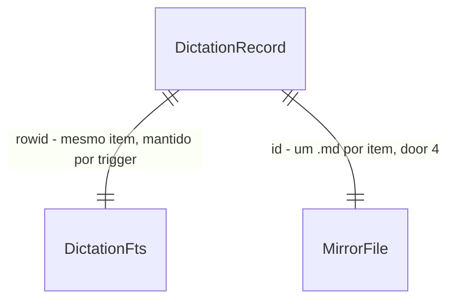

# storage-history — histórico de ditado em SQLite FTS5 com espelho Markdown

## Problem

Um ditado que o LLM reescreveu mal some depois de colado: o desktop herdado guarda
`transcription_text` e `post_processed_text` em `history.db` (`apps/desktop/src/managers/history.rs`),
mas não guarda em qual app o texto entrou nem quem o editou, não volta ao bruto de um item, busca
só por `LIKE` e não deixa nada legível fora do app. A ADR-0006 decidiu SQLite (FTS5
`unicode61 remove_diacritics 2`, WAL) como fonte de verdade com espelho Markdown e `fala-cli reindex`,
e `crates/storage` ainda é só um `//!`. O pitch da fase 1 põe "histórico com 'desfazer edição da IA'"
nas semanas 3-4. O design doc §6 pede que o histórico grave o bruto antes do LLM, para o ditado
sobreviver a um crash. Não há número de incidente: o custo é de produto (não dá para confiar no LLM
sem um desfazer) e de dados (sem espelho, não há sync por pasta entre o Windows e o Linux).

Quando isto fechar, `crates/storage` guarda cada `Dictation` (bruto, final, quem editou, app) em
`fala.sqlite`, escreve `Ditados/AAAA-MM-DD/HHMMSS-<id>.md`, busca sem acento, alterna o item entre
final e bruto, e reconstrói o banco a partir dos `.md`. O `fala-cli history add|search|undo|redo` e o
`fala-cli reindex` exercitam tudo isso sem UI, até A ligar o `dictate` e uma rodada posterior ligar o
desktop.

## Flow

Reusa o `rusqlite` 0.37 `bundled` que o desktop já compila (o FTS5 vem ligado no `libsqlite3-sys`
bundled), o `uuid`, o `chrono`, o `serde_json` e o `dirs` 6 que já estão no `Cargo.lock`, e o tipo
`Dictation` do S0 em `fala-core`. Não toca no `history.db` nem no `HistoryManager` do desktop.

1. `fala-cli history <add|search|undo|redo>` ou `fala-cli reindex` -> `Cli` clap em `apps/cli/src/main.rs` (exists) - resolve `--data-dir` e `--notes-dir` (door 6) e abre o store
2. `fala_storage::Store::open(db, notes_dir)` (new, crate `fala-storage` exists vazio) - abre `fala.sqlite` em WAL com `busy_timeout`, aplica o schema por `user_version` (door 1, door 2)
3. `Store::add(&fala_core::Dictation, created_at)` - gera o id (door 3), grava a linha e o índice FTS numa transação, **depois** escreve o `.md` (door 4) por arquivo temporário + rename
4. `Store::search(query, limit)` (new, no door - placement per conventions) - transforma a consulta em termos FTS5 entre aspas com prefixo, junta com a tabela e devolve os registros mais recentes primeiro
5. `Store::undo(id)` / `Store::redo(id)` - troca `showing` entre `raw` e `final` (door 5) e reescreve o `.md` daquele item
6. `Store::reindex()` (new, no door - placement per conventions) - lê todo `Ditados/**/*.md`, valida cada um, e numa transação apaga e regrava as linhas e o FTS
7. out: stdout da CLI (tabela Markdown ou o texto mostrado), `fala.sqlite` e `Ditados/` em disco; exit 0/1/2

## Impact

| Front | What changes |
| --- | --- |
| domain | novo termo: `DictationRecord` - um `Dictation` persistido, com `id`, `created_at` e `showing`; vive em `fala-storage` (não em `fala-core`, que só recebe adições do S0) |
| domain | novo termo: `showing` - qual dos dois textos do item vale agora (`final` ou `raw`); "desfazer" põe `raw`, "reaplicar" põe `final`; quem lê o histórico decide o que mostrar e colar por ele |
| domain | termo do S0 usado sem mudança: `Dictation { raw: Transcript { text, language }, final_text, editor: Editor, app: AppContext { app_name } }` (`feat/core-contract` 91f4e0d); `Editor` serializa `none`/`rules`/`llm`, os mesmos literais da door 5, gravados sob o nome `edited_by` |
| stored data | nada a migrar: `fala.sqlite` é um arquivo novo, ao lado do `history.db` do desktop na mesma pasta; cada um tem o seu `user_version`, e nenhum dos dois abre o arquivo do outro. Quando o desktop virar fachada, a cópia de `transcription_history` para cá é: `transcription_text` -> bruto, `post_processed_text` -> final (`edited_by = llm`) ou o bruto (`none`), `app` vazio, `timestamp` -> `created_at`; não feita nesta rodada |
| build | `fala-storage` passa a depender de `rusqlite` (`bundled`), `uuid` (feature `v7`), `chrono`, `serde_json`, `thiserror`, `log`; `fala-cli` de `fala-storage` e `dirs`; todos já no `Cargo.lock`, entram em `[workspace.dependencies]` de forma aditiva |
| docs | `ARCHITECTURE.md` não muda: o crate já está no Code Map com esta descrição |

## Relations

One-way constraints: `id` único e imutável, gerado na criação e preservado pelo `reindex` (door 3);
`showing` não nulo, só `raw` ou `final` (door 5); `edited_by` não nulo, só `none`, `rules` ou `llm`
(door 5). No columns and no types here.

## Surface

Só os subcomandos que esta feature cria. Flags comuns aos dois: `--data-dir <dir>` (default
`<dirs::data_dir()>/br.com.augusto.fala`) e `--notes-dir <dir>` (default `<data-dir>/notas`).

| Route | In | Out | Status |
| --- | --- | --- | --- |
| `fala-cli history add` | `--raw <texto>`, `[--final <texto> --edited-by <rules ou llm>]`, `[--app <nome>]` | stdout: o `id` criado | exit `0` gravado · `1` falha de banco ou de espelho (com o id, se a linha ficou) · `2` argumentos · sem status HTTP (local; 200-599 n/a) |
| `fala-cli history search` | `[<consulta>]`, `[--limit N]` (default 20) | stdout: tabela Markdown com as colunas `id`, `quando`, `app`, `editado_por`, `mostrando`, `texto` | exit `0` (inclusive sem resultado) · `1` falha de banco · `2` argumentos · sem status HTTP (local; 200-599 n/a) |
| `fala-cli history undo` / `redo` | `<id>` | stdout: o texto que o item passa a mostrar | exit `0` · `1` id inexistente, item sem edição ou falha de banco/espelho · `2` argumentos · sem status HTTP (local; 200-599 n/a) |
| `fala-cli reindex` | (só as flags comuns) | stdout: `N ditados reindexados, M arquivos ignorados`; stderr: um caminho e o motivo por arquivo ignorado | exit `0` com M = 0 · `1` com M > 0 ou falha de banco · `2` argumentos ou pasta `Ditados/` inexistente · sem status HTTP (local; 200-599 n/a) |
| `fala_storage` (API Rust) | `Store::open`, `add`, `get`, `search`, `undo`, `redo`, `reindex` | `DictationRecord`, `Vec<DictationRecord>`, `ReindexReport` · `StorageError` | `Ok`, `Err(NotFound)`, `Err(NothingToUndo)`, `Err(Mirror { id })`, `Err(Db)`, `Err(Io)` · sem status HTTP (local; 200-599 n/a) |
| `fala_storage::Store::add_sensitive` (API Rust, adicionada com a door 8) | `&Dictation`, `created_at` | `DictationRecord` com `sensitive = true`; todo `DictationRecord` ganha o campo `sensitive` | os mesmos de `add`: `Ok`, `Err(Mirror { id })`, `Err(Db)`, `Err(Io)` · sem status HTTP (local; 200-599 n/a) |

## Landing

| One-way door | Literal shape | Alternative rejected |
| --- | --- | --- |
| 1. arquivo e versão do schema | `fala.sqlite` na pasta passada pelo chamador, `PRAGMA journal_mode = WAL`, `PRAGMA busy_timeout = 5000`, `PRAGMA user_version = 1` depois do schema 1; migrações futuras sobem esse número | uma tabela nova dentro de `history.db`: o `user_version` do desktop (rusqlite_migration, hoje 4) e o do crate seriam o mesmo pragma no mesmo arquivo e um atropelaria o outro |
| 2. índice de busca | `CREATE VIRTUAL TABLE dictations_fts USING fts5(raw, final, content='dictations', content_rowid='rowid', tokenize='unicode61 remove_diacritics 2')`, mantida por triggers de insert/update/delete; os dois textos indexados | só o final indexado: uma palavra que o LLM tirou some da busca, e o bruto é exatamente o que a pessoa lembra ter dito |
| 3. identificador do item | UUID v7 em texto minúsculo com hífens (`0199a3f2-5c1e-7b3a-9d4e-2f6a8c0b1e27`), único, gerado no `add`, igual no banco, no nome do `.md` e no frontmatter; o `rowid` inteiro fica interno ao FTS | `INTEGER AUTOINCREMENT`: dois computadores sincronizando a mesma pasta `Ditados/` (ADR-0006) geram o mesmo `42`, e o `reindex` funde ou perde um dos dois |
| 4. formato do espelho | `<notes-dir>/Ditados/<AAAA-MM-DD>/<HHMMSS>-<id>.md` em hora local; frontmatter entre linhas `---`, uma chave por linha no formato `chave: <valor JSON>` (JSON é YAML válido, o Obsidian lê) nas chaves `id`, `created_at` (RFC 3339 com offset local), `app` (`null` se ausente), `edited_by`, `showing`, `raw`; corpo = o texto final exato seguido de um `\n`; escrito em `<arquivo>.tmp` e renomeado | um `.md` por dia: o texto ditado precisaria de escape para um `## ` não virar seção (decidido com o Augusto em 2026-10-02). YAML de verdade (`serde_yaml`): dependência nova e descontinuada para um frontmatter que só este crate escreve |
| 5. valores persistidos dos enums | `edited_by` ∈ `none`, `rules`, `llm`; `showing` ∈ `final`, `raw`; os mesmos literais no banco e no frontmatter | booleano `undone`: não distingue "nada a desfazer" de "mostrando o final" quando `edited_by = none` |
| 7. idioma do item (adicionado no rebase sobre o S0) | coluna e chave de frontmatter `language` com a tag BCP-47 do `fala_core::Language` (`"pt-BR"`, `"en"`), obrigatória; a CLI ganha `history add --language <pt-BR ou en>`, default `pt-BR` | não persistir o idioma: o `reindex` não reconstruiria o `Transcript` do `Dictation` |
| 8. marca de ditado sensível (adicionado em 2026-10-02, decisão 8 opção c do roadmap) | coluna `sensitive INTEGER NOT NULL DEFAULT 0 CHECK (sensitive IN (0, 1))` no schema 1 (nada foi distribuído, então entra sem subir o `user_version`); no frontmatter, a chave opcional `sensitive: true` escrita depois de `raw` só quando verdadeira; ausente ou `false` = não sensível; outro valor faz o `.md` ser ignorado; `Store::add` grava `false` e `Store::add_sensitive` grava `true`; nenhum filtro nesta feature | só marcar depois, numa feature futura: a coluna exigiria `user_version = 2` e uma migração, e os `.md` já sincronizados não teriam a chave |
| 6. pasta padrão da CLI | `<dirs::data_dir()>/br.com.augusto.fala/fala.sqlite` (a mesma `app_data_dir` do desktop, identifier do `tauri.conf.json`) e `<data-dir>/notas/Ditados/` | `~/.local/share/fala/` do design doc §3.5: o desktop já grava na pasta do identifier, e a ligação teria que mover uma das duas (decidido com o Augusto em 2026-10-02) |

- Nothing else in this change is hard to reverse: nomes de função, layout dos módulos, colunas
  além das portas acima e o texto das mensagens mudam num commit, e nada fora do repo os consome
  ainda.

## Criteria

### S1: gravar e buscar (P1)

Um ditado gravado volta pela busca, com ou sem acento.

**Acceptance Criteria**

1. WHEN `Store::add` recebe um `Dictation` THEN the system SHALL gravar uma linha com id UUID v7, `created_at`, bruto, final, `edited_by`, app e `showing = final`, e devolver esse `DictationRecord`
2. WHEN `Store::add` grava THEN the system SHALL confirmar a linha no SQLite antes de criar o `.md`, de modo que um espelho que falha deixa a linha no banco
3. WHEN `Store::search("acao")` roda sobre um item cujo final contém "ação" THEN the system SHALL devolver esse item
4. WHEN a consulta casa uma palavra que só existe no bruto THEN the system SHALL devolver o item
5. WHEN `Store::search` recebe dois termos THEN the system SHALL devolver só os itens que contêm os dois, cada termo também casando como prefixo (`amanh` acha "amanhã")
6. IF a consulta contém sintaxe FTS5 (`"`, `*`, `(`, `NEAR`, `-`) THEN the system SHALL tratá-la como texto literal e nunca devolver erro de sintaxe
7. WHEN a consulta é vazia ou só espaços THEN the system SHALL devolver os itens mais recentes, até o limite
8. The system SHALL ordenar o resultado da busca por `created_at` decrescente e cortar em `limit`
9. The system SHALL abrir `fala.sqlite` em `journal_mode = wal`, com `busy_timeout` de 5000 ms e `user_version = 1`

**Independent test:** `cargo test -p fala-storage` grava três ditados num diretório temporário e busca "acao", uma palavra só do bruto e uma sintaxe FTS5 crua.

### S2: espelho Markdown (P1)

Cada item tem um `.md` que um humano lê e o `reindex` reconstrói.

**Acceptance Criteria**

10. WHEN um item é gravado THEN the system SHALL escrever `<notes-dir>/Ditados/<AAAA-MM-DD>/<HHMMSS>-<id>.md` na data e hora locais do `created_at`, com o frontmatter e o corpo da door 4
11. WHEN o bruto ou o final contém `---`, `## `, aspas, quebras de linha ou acentos THEN the system SHALL escrever um `.md` que o `reindex` lê de volta com o bruto e o final byte a byte iguais
12. IF a escrita do `.md` falha THEN the system SHALL devolver `StorageError::Mirror` com o id, e a linha SHALL continuar no banco e na busca
35. The system SHALL gravar o `language` do `Transcript` no banco e no frontmatter, e o `reindex` SHALL devolvê-lo igual; um `.md` com `language` fora de `pt-BR`/`en` conta como ignorado (AC 21)
13. The system SHALL nunca deixar um `.md` parcial com o nome final: escreve `<nome>.md.tmp` e renomeia

37. The system SHALL persistir em cada item o campo `sensitive` (falso por padrão): `Store::add_sensitive` grava verdadeiro no banco e `sensitive: true` no frontmatter; `Store::add` grava falso no banco e não escreve a chave; o `reindex` SHALL ler a chave ausente ou `false` como falso, `true` como verdadeiro, e ignorar com motivo o `.md` com outro valor (door 8). Nenhuma busca, sync ou destino filtra por ele nesta feature

**Independent test:** gravar um item com `---\n## x\n"aspas"` no final e conferir o arquivo e a leitura de volta.

### S3: desfazer e reaplicar a edição (P1)

Um item editado alterna entre final e bruto, sem perder nenhum dos dois.

**Acceptance Criteria**

14. WHEN `Store::undo(id)` roda num item com `edited_by` `rules` ou `llm` THEN the system SHALL pôr `showing = raw`, manter o final guardado, reescrever o `.md` com `showing: "raw"` e devolver o registro
15. WHEN `Store::redo(id)` roda num item com `showing = raw` THEN the system SHALL pôr `showing = final` e reescrever o `.md`
16. WHEN `undo` roda num item que já está em `raw`, ou `redo` num item em `final` THEN the system SHALL devolver o registro sem mudança
17. IF `undo` ou `redo` roda num item com `edited_by = none` THEN the system SHALL devolver `StorageError::NothingToUndo` e não mudar nada
18. IF o id não existe THEN `get`, `undo` e `redo` SHALL devolver `StorageError::NotFound`

**Independent test:** gravar um item `llm`, `undo`, conferir `showing` no banco e no `.md`, `redo`, conferir de novo.

### S4: reindex a partir dos `.md` (P1)

Apagar o banco e rodar `reindex` devolve a mesma busca (confirmação da ADR-0006).

**Acceptance Criteria**

19. WHEN `reindex` roda sobre uma pasta `Ditados/` THEN the system SHALL recriar uma linha por `.md` válido com o mesmo id, `created_at`, bruto, final, `edited_by`, app e `showing` do arquivo
20. WHEN um conjunto de itens é gravado, alguns desfeitos, o `fala.sqlite` apagado (com `-wal` e `-shm`) e `reindex` roda THEN `search` SHALL devolver os mesmos ids, na mesma ordem e com os mesmos campos, para as mesmas consultas
21. IF um `.md` não tem frontmatter válido, falta uma chave obrigatória ou tem um enum fora da door 5 THEN the system SHALL ignorá-lo, contá-lo em `ReindexReport` com o caminho e o motivo, e reindexar os outros
22. IF dois `.md` trazem o mesmo id THEN the system SHALL manter um, contar o outro como ignorado com o motivo `id duplicado`, e não falhar
23. WHEN `reindex` roda num banco que já tem linhas THEN the system SHALL substituí-las numa única transação, de modo que uma falha no meio deixa o banco como estava
24. The system SHALL ignorar arquivos que não terminam em `.md` (inclusive `.md.tmp`) sem contá-los

**Independent test:** o teste de round-trip do AC 20, mais `fala-cli reindex` à mão depois de `rm fala.sqlite*`.

### S5: `fala-cli history` e `fala-cli reindex` (P1)

Os quatro subcomandos e o reindex sem UI.

**Acceptance Criteria**

25. WHEN `fala-cli history add --raw <t>` roda sem `--final` THEN the system SHALL gravar final = bruto e `edited_by = none`, imprimir só o id no stdout e sair com 0
36. WHEN `fala-cli history add` roda sem `--language` THEN the system SHALL gravar `pt-BR`; IF `--language` não é `pt-BR`, `pt` ou `en` (sem diferenciar maiúsculas, como `Language::from_str`) THEN SHALL sair com 2
26. IF `--final` vem sem `--edited-by`, ou `--edited-by` sem `--final` THEN `fala-cli history add` SHALL sair com 2 antes de abrir o banco
27. WHEN `fala-cli history search [<consulta>]` roda THEN the system SHALL imprimir no stdout uma tabela Markdown com cabeçalho `id | quando | app | editado_por | mostrando | texto`, uma linha por item, `texto` sendo o texto do lado de `showing`, com `|` escapado como `\|` e quebras de linha trocadas por espaço
28. WHEN a busca não acha nada THEN `fala-cli history search` SHALL imprimir só o cabeçalho da tabela e sair com 0
29. WHEN `fala-cli history undo <id>` ou `redo <id>` dá certo THEN the system SHALL imprimir no stdout o texto que o item passa a mostrar e sair com 0
30. IF o id não existe ou o item não tem edição THEN `undo`/`redo` SHALL sair com 1 e dizer o motivo no stderr
31. WHEN `fala-cli reindex` termina THEN the system SHALL imprimir `N ditados reindexados, M arquivos ignorados` no stdout, um `<caminho>: <motivo>` por arquivo ignorado no stderr, e sair com 0 se M = 0 e com 1 se M > 0
32. IF `<notes-dir>/Ditados` não existe THEN `fala-cli reindex` SHALL sair com 2 sem criar nem apagar o banco
33. WHERE `--data-dir` e `--notes-dir` não são dados THEN the system SHALL usar `<dirs::data_dir()>/br.com.augusto.fala` e `<data-dir>/notas`, criando as pastas se não existirem (menos no caso do AC 32)
34. The system SHALL nunca escrever texto ditado (bruto ou final) em log acima de `debug`

**Independent test:** `fala-cli history add --raw "acao de amanha" --final "Ação de amanhã." --edited-by llm --data-dir /tmp/f`, depois `search acao`, `undo <id>`, `rm /tmp/f/fala.sqlite*`, `reindex`, `search acao` de novo.

## Out of scope

Product capabilities only. Process and harness rules live in AGENTS.md or as Observable `n/a`.

| Excluded | Why |
| --- | --- |
| Migrar `transcription_history` do desktop para `fala.sqlite` | o handoff da rodada: o desktop só vira fachada depois dos spikes Windows; o mapeamento fica registrado em `Impact` |
| Apagar um ditado (linha + `.md`) e retenção | o desktop já tem os dois sobre `history.db`; entram quando ele virar fachada, com a política de retenção dele |
| Ligar o `fala-cli dictate` ao store | é da trilha A; o `Store::add` é o ponto de ligação |
| Reunião, notas, áudio no storage | fase 2 (`Reuniões/`, `audio/<sessão>.opus`); o schema 1 é só de ditados |
| Editar o texto de um item à mão | não está no pitch; o desfazer alterna entre os dois textos que já existem |
| Sincronizar o banco entre máquinas | o sync é da pasta `Ditados/`; cada máquina roda `reindex` (ADR-0006) |
| Observar a pasta e reindexar sozinho quando o sync traz arquivos novos | precisa de watcher e de política de conflito; `reindex` manual por enquanto |

## Assumptions

Defaults that are not already a numbered criterion. Drop a row once it is.

| Assumption | Chosen default | Rationale | Confirmed? |
| --- | --- | --- | --- |
| Campos do `Dictation` do S0 | conferidos no rebase sobre 91f4e0d: o idioma vem em `raw.language` e é persistido (door 7, AC 35, AC 36); o resto bate com o plano | Confirmed? y — delegado pelo Augusto em 2026-10-02, decidido pelo painel | y |
| `created_at` | o chamador passa o instante; a CLI usa `chrono::Local::now()`; o banco guarda RFC 3339 com offset | a pasta do dia e o `HHMMSS` do nome são da hora local de quem ditou; o offset preserva isso depois do sync | n |
| Ordem da busca | `created_at` decrescente, não `bm25` | é um histórico: a pessoa procura "aquele ditado de ontem"; a relevância pode vir quando a lista crescer | n |
| Um `.md` editado à mão no Obsidian | o `reindex` aceita o que estiver no arquivo, inclusive um corpo final alterado | o espelho é legível de propósito; o banco é reconstruível dele | n |
| Escritas concorrentes (desktop e CLI no mesmo arquivo) | WAL + `busy_timeout` 5000 ms; cada `.md` tem nome único pelo id | o SQLite serializa os escritores; não há dois escritores no mesmo `.md` | n |
| `undo`/`redo` com falha no espelho | a mudança de `showing` fica no banco e a chamada devolve `StorageError::Mirror` | mesma regra do AC 12: banco primeiro, espelho depois | n |

**Open questions:** none - all resolved or logged above. O bloqueio do S0 caiu com `feat/core-contract` 91f4e0d (2026-10-02).

## Observable

Worksheet, not the review. `n/a` needs its reason. One row may group the same decision
across several routes.

| Surface | Decision | Landing |
| --- | --- | --- |
| command `fala-cli history search` | output format | AC 27, AC 28 |
| command `fala-cli history add` | output format | AC 25 |
| command `fala-cli history undo/redo` | output format | AC 29 |
| command `fala-cli reindex` | output format | AC 31 |
| all `fala-cli history *`, `reindex` | every flag and its default | AC 25, 26, 33, 36; `--limit` default 20 (Surface) |
| all `fala-cli history *`, `reindex` | exit codes | AC 25, 28, 29, 31 (0); AC 30, 31 (1); AC 26, 32 (2) |
| all `fala-cli history *`, `reindex` | verbosity | AC 34; o stdout é só o resultado, erros no stderr como nos outros subcomandos |
| command `fala-cli reindex` | what it prints when it fails halfway | AC 23 (banco intacto), AC 31 (arquivos ignorados nomeados) |
| collection `Ditados/` | grouping criterion | AC 10 - uma pasta por dia local |
| collection `Ditados/` | naming | AC 10 - `HHMMSS-<id>.md` |
| collection `Ditados/` | ordering | AC 8 no banco; no disco, a ordem lexicográfica do nome é a cronológica do dia |
| collection `Ditados/` | duplicates | AC 22 |
| collection `Ditados/` | the exception that does not fit | AC 21 (arquivo inválido), AC 24 (arquivo que não é `.md`) |
| document `.md` do espelho | structure | AC 10, door 4 |
| document `.md` do espelho | what the reader does next | n/a - é para ler e sincronizar; editar à mão é aceito pelo `reindex` (Assumptions) |
| API Rust `fala_storage` | error shape | Surface: `StorageError` com `NotFound`, `NothingToUndo`, `Mirror { id }`, `Db`, `Io`; AC 12, 17, 18 |
| API Rust `fala_storage` | versioning | AC 9 - `user_version`; a API é interna ao workspace |
| API Rust `fala_storage` | who may call it, rate limits | n/a - biblioteca local, sem rede nem usuários |
| screen | n/a - nenhuma tela; o histórico do desktop continua sobre `history.db` nesta rodada |

## Sources

- `docs/decisions/0006-storage-sqlite-fts5-com-espelho-markdown.md` - SQLite fonte de verdade, FTS5 `unicode61 remove_diacritics 2`, WAL, espelho, `fala-cli reindex`, teste de round-trip
- `docs/design/2026-10-fala-v1.md` §3.3, §3.5, §6 - "histórico grava bruto + final + app", "aplicar edição", pasta `Ditados/`, bruto antes do LLM
- `~/projects/fala-research/HANDOFF-fase-1-linux.md` - trilha C, convivência com `transcription_history` sem migrar, contrato S0
