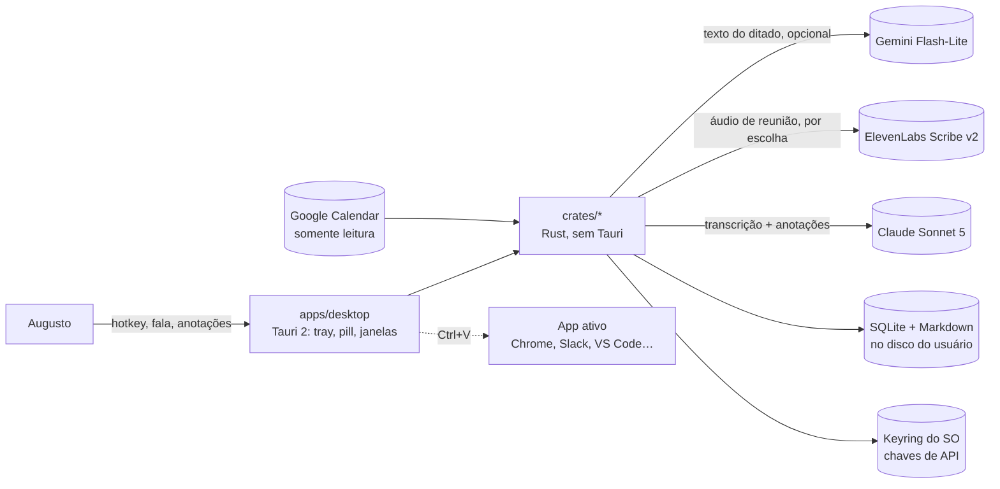

# Fala v1 — design doc

**Autor:** Augusto · **Data:** 2026-09-26 · **Status:** rascunho para congelar no primeiro commit de código
**Formato:** mini design doc (Google) + orçamento de performance e riscos (TDD de estúdio). Congela quando a fase 1 começa; divergências posteriores viram ADR, não edição aqui.
**Leitura complementar:** `pitches/00-brief.md` (por quê), `docs/decisions/` (o que não muda), `ARCHITECTURE.md` (codemap vivo), `fala-research/research/03` e `04` (evidência).

## 1. Contexto e escopo

Fala substitui dois apps proprietários de nuvem: Wispr Flow (ditado por voz com hotkey global e pós-processamento por LLM) e Granola (gravação de reunião sem bot, transcrição, notas enriquecidas). Nenhum dos dois faz reconhecimento de voz local; a "mágica" de ambos é ASR mais LLM com contexto, e a diarização do Granola no desktop é só a separação entre canal do microfone e canal do sistema.

Escopo da v1: Windows 11 primeiro, Ubuntu 25.04 GNOME Wayland depois; pt-BR como idioma principal; uso pessoal, com colegas instalando e usando as próprias chaves de API. Fork do Handy (Tauri 2, MIT) como base do ditado; módulo de reunião novo.

## 2. Objetivos e não-objetivos

**Objetivos**

- Ditado push-to-talk e hands-free que insere texto pronto no campo ativo de qualquer app, com ASR local em pt-BR e latência dentro do orçamento da seção 5.
- Formatação por LLM na nuvem, recebendo só texto, automática e desligável por app, com desfazer por item.
- Gravação de reunião e de áudio do sistema em dois canais sincronizados, com áudio retido; transcrição em batch (nuvem por padrão, local como fallback) e notas enriquecidas a partir das anotações do usuário.
- Importação de arquivo e URL para transcrição.
- Busca local por texto em ditados, transcrições e notas; espelho Markdown no disco.
- Instalador Windows e pacote Linux; funcionamento sem chave de API (modo só local).

**Não-objetivos (v1)**

- macOS; mobile; backend; login; sync por servidor; telemetria remota.
- Bot em reunião; diarização acústica de mais de 4 falantes; speaker tags lendo a UI do Meet/Zoom.
- Context awareness (ler tela ou campo ativo), Command Mode por voz, snippets, estilo por categoria de app: fase 4, se houver.
- Transcrição ao vivo com parciais na tela durante o ditado: evolução (Nemotron streaming), não v1.
- Assinatura de código e auto-update: adiados.

## 3. Design

### 3.1 Visão de sistema (C4 nível 1-2)



Tudo roda no processo do usuário. As três setas para serviços externos são opcionais e desligáveis; a de ditado nunca carrega áudio.

### 3.2 Crates e fronteiras

| Crate | Responsabilidade | Depende de | Plataforma |
|---|---|---|---|
| `core` | tipos (`Event`, `Settings`, `Utterance`, `Session`), config, dicionário pessoal, erros | — | neutro |
| `hotkey` | trait `Hotkey { press, release }`; Windows: hook `WH_KEYBOARD_LL` via `rdev`; Linux: portal GlobalShortcuts via `ashpd`, fallbacks evdev e toggle por CLI | core | por SO |
| `audio` | trait `Source`; mic via `cpal`; loopback Windows via `cpal` em device de saída (ou `wasapi` por PID); Linux via `pipewire-rs` no monitor do sink; VAD Silero; resample `rubato`; gravador WAV→Opus estéreo L=mic R=sistema | core | por SO |
| `asr` | trait `Transcriber { transcribe(segment) ; transcribe_file(path) }`; backends: `sherpa-onnx` (Parakeet v3 int8), `nemo-speech-cpp` (Nemotron, futuro), `elevenlabs`, `groq`, `soniox` | core | neutro |
| `postproc` | trait `Formatter`; regras determinísticas pt-BR (fillers, dicionário por regex); backend `gemini` com prompt cacheado e contexto de app; `undo` por item | core | neutro |
| `inject` | trait `Injector`; Windows: `arboard` + `SendInput` Ctrl+V com restore, `enigo` Unicode para < 50 caracteres; Linux: `wl-copy` + portal RemoteDesktop, fallback `ydotool key`, fallback "ficou no clipboard" | core | por SO |
| `meeting` | calendário Google (OAuth PKCE, `events.list`), detecção (sessões de áudio ativas / mic em uso), sessão de gravação, importação de arquivo/URL (`yt-dlp` + `ffmpeg`), enriquecimento de notas com templates (Claude) | core, audio, asr, storage | neutro + por SO na detecção |
| `storage` | SQLite via `rusqlite` (`bundled`, `fts5`, WAL) com FTS `unicode61 remove_diacritics 2`; espelho Markdown com frontmatter YAML; caminho por SO | core | neutro |
| `apps/desktop` | casca Tauri 2: tray, pill (Windows), janelas de settings, histórico, notas; comandos e eventos; i18n pt-BR | todos | — |
| `apps/cli` | `fala-cli dictate | record | transcribe <arquivo> | bench` para spikes, benchmark e uso headless | todos menos desktop | — |

**Invariantes**

1. Nada em `crates/` importa `tauri`. Toda integração de UI passa por `core::Event`.
2. Áudio de ditado nunca é enviado pela rede. O tipo que representa áudio de ditado não implementa serialização para os clientes HTTP.
3. Nenhuma chave de API em código, config versionada ou log. Chaves vivem no keyring do SO (`keyring` crate).
4. Gravação de reunião só começa por ação explícita do usuário e mostra indicador visível enquanto dura.
5. Toda decisão registrada em `docs/decisions/` só muda por ADR novo.

### 3.3 Fluxo do ditado

```mermaid
sequenceDiagram
  participant K as hotkey
  participant A as audio
  participant V as VAD
  participant T as asr
  participant P as postproc
  participant I as inject
  participant UI as desktop
  K->>UI: press (t0)
  UI->>UI: pill visível (< 100 ms)
  K->>A: start (pré-buffer de 300 ms já corrente)
  loop enquanto pressionado
    A->>V: frames 16 kHz
    V-->>T: utterance fechada (≤ 15 s)
    T-->>UI: texto parcial da utterance
  end
  K->>A: release (t1)
  A->>V: flush
  V->>T: última utterance
  T->>P: texto bruto + app ativo + dicionário
  alt LLM ligado para este app e texto > 15 palavras
    P->>P: Gemini Flash-Lite (≤ 700 ms) 
  else
    P->>P: regras locais
  end
  P->>I: texto final
  I->>UI: inserido (t2) ou botão "Colar"
  UI->>UI: pill some; histórico grava bruto + final + app
```

Regras de UX herdadas dos produtos de referência: toque curto sem áudio é descartado; double-tap em 0,5 s vira hands-free; Esc cancela; aviso aos 19 min e corte aos 20; um idioma por ditado com seletor na pill.

Se o LLM passar de 2 s, o texto bruto é inserido e a versão formatada fica disponível em "aplicar edição". Se a inserção falhar, o texto fica no clipboard e a pill mostra "Colar".

### 3.4 Fluxo da reunião

1. **Antes:** o calendário lista reuniões prováveis; 2 minutos antes, uma notificação própria do app oferece "Gravar 'Título'?". Sem calendário, a detecção por sessão de áudio ativa (Zoom, Teams, Chrome com mic em uso) oferece o mesmo. Nunca grava sozinho.
2. **Durante:** dois streams (mic e loopback), resample para 48 kHz, WAV estéreo gravado em disco a cada segundo (à prova de crash); painel com notepad em branco, barras de nível e tempo restante; o usuário digita gatilhos curtos. Transcrição ao vivo é opcional e vem depois (Nemotron streaming ou WebSocket).
3. **Fim:** detectado por silêncio de 15 min, fim da sessão de áudio ou horário do calendário, sempre com botão "Parar". WAV vira Opus (24 kbps por canal).
4. **Depois:** cada canal vai ao ASR escolhido (Scribe v2 por padrão, com diarização só no canal do sistema; Parakeet local se offline ou se o usuário pediu). "Eu" é tudo do canal do mic. Transcrição com timestamps + anotações + evento do calendário vão ao Claude Sonnet 5 com o template escolhido; saída em Markdown com texto humano e texto gerado distinguíveis e ponteiro de cada linha para o trecho do transcript.
5. **Vídeos e arquivos:** modo "gravar áudio do sistema" sem mic e sem calendário; importação de arquivo e URL via `yt-dlp` e `ffmpeg`. Mesma sessão, mesmo pipeline.

### 3.5 Storage

- `~/.local/share/fala/` (Linux) ou `%APPDATA%\fala\` (Windows): `fala.sqlite` (WAL), `audio/<sessão>.opus`, `models/`.
- Pasta de notas escolhida pelo usuário: `Reuniões/2026-09-26 Título.md` com frontmatter (data, participantes, evento, caminho do áudio) e `Ditados/` opcional. SQLite é a fonte de verdade da busca; os `.md` são o espelho para Obsidian e sync por pasta.
- Retenção de áudio configurável (padrão: manter). "Apagar trecho" e "apagar sessão" removem áudio, transcrição e notas juntos.

### 3.6 Configuração e segredos

`Settings` único em `core`, persistido por `tauri-plugin-store` no desktop e por arquivo TOML na CLI. Chaves de API no keyring do SO, nunca no store. Lista de apps onde o LLM fica desligado, dicionário pessoal e templates de notas são dados do usuário, exportáveis em JSON.

### 3.7 O que o fork impõe (grau de restrição)

O Handy é um único crate `handy` em `src-tauri/`, frontend React + TypeScript + Tailwind com Bun, padrão "managers" (Audio, Model, Transcription, History) em estado Tauri, comandos e eventos gerados por `tauri-specta`, `tauri-plugin-store` para settings, i18next obrigatório. Traz `transcribe-rs` (ONNX: Parakeet, Moonshine), `vad-rs`, `cpal`, `rdev`, `enigo`, `rubato`, `rodio`, single-instance com flags de CLI, overlay Windows, tray, autostart, download de modelos no primeiro uso, updater e workflows de release.

Mantemos: frontend e toolchain (React, Bun, Tailwind, i18next), managers como ponto de partida, `transcribe-rs`, VAD, hotkey e overlay do Windows, download de modelos, workflow de release. Reestruturamos: o crate único vira workspace (`crates/` + `apps/`), com a regra de que nada em `crates/` importa Tauri; os managers viram fachadas finas sobre os crates. Removemos: marca, ícones, sponsor, Nix, traduções, `AI_POLICY.md`, `CRUSH.md`, updater ligado. Renomeamos: identificadores, `tauri.conf.json` (`br.com.augusto.fala`), variáveis de ambiente `HANDY_*` → `FALA_*`.

## 4. Alternativas consideradas

| Decisão | Escolhida | Rejeitadas e por quê | Evidência |
|---|---|---|---|
| Framework | Tauri 2 | Electron (120-150 MB, 800 MB RAM no Wispr); Flutter e Slint/iced (tray e hotkey Linux imaturos); Python (não distribui hotkey + overlay); .NET (só Windows) | research/04 §1 |
| Base de código | fork do Handy | do zero (2-3 semanas a mais reimplementando settings, histórico, modelos); Whispering (menos Windows resolvido); anarlog/Hyprnote (monorepo enorme, renomeado duas vezes) | research/04 §7 |
| ASR do ditado | Parakeet-TDT-0.6B-v3 int8 via sherpa-onnx, utterance-level | Whisper turbo em CPU (1,5-3x tempo real, 2-5 s por chunk); nuvem (áudio sai da máquina; para sem rede); Kyutai/Moonshine (sem pt); Voxtral/Qwen3-ASR (só GPU) | research/03 §1 |
| Pós-processamento | Gemini 2.5 Flash-Lite automático | Haiku 4.5 (1,2 s); LLM local (10-15 s em CPU); só regras (perde "na verdade…", listas, tom) | research/03 §6 |
| ASR de reunião | ElevenLabs Scribe v2 batch | Soniox (mais barato, RT com diarização, sem WER pt público); Groq whisper (sem diarização); Gemini Transcribe (diarização só ≤ 30 min); Parakeet local (2x mais erros em nomes e números) | research/03 §2-3 |
| Diarização | canal mic = eu; diarização do provedor só no canal do sistema | pyannote local (30-60 min por hora em CPU); Sortformer (≤ 4 falantes, fica como fallback offline) | research/03 §4 |
| Injeção de texto Windows | clipboard + Ctrl+V com restore; SendInput para textos curtos | UI Automation (cobertura irregular em Electron; ninguém dos projetos de referência usa) | research/04 §3 |
| Storage | SQLite + FTS5 + espelho Markdown | só Markdown (busca ruim); só SQLite (sem Obsidian, sem sync por pasta); libsql/Turso (sync que não queremos) | research/04 §8 |
| Hotkey Windows | hook `WH_KEYBOARD_LL` | `RegisterHotKey` (sem key-up, inviabiliza push-to-talk) | research/04 §2 |

## 5. Orçamento de latência e recursos

Medido pelo log interno de etapas (`FALA_TRACE=1`) a cada milestone; primeira validação do overlay com câmera a 240 fps.

| Evento | Meta | Máximo | Fonte |
|---|---|---|---|
| Tecla → pill visível e áudio capturando | ≤ 50 ms | 100 ms | Nielsen "instantâneo"; Swink |
| Barras da pill | ≤ 1 frame de atraso, sem stutter | — | — |
| Soltar → texto no campo (frase < 10 s, ASR local, sem LLM) | ≤ 700 ms | 1,0 s | limite de fluxo de pensamento |
| Idem com LLM | ≤ 1,2 s | 2,0 s; acima disso insere o bruto | — |
| Ditado longo (> 30 s) | parciais a cada ≤ 1 s | — | evolução |
| Reunião: progresso da transcrição | visível em ≤ 1 s, cancelável | 10 s sem progresso | Nielsen |
| Idle na bandeja com modelo carregado | < 1 % CPU, < 300 MB RAM | — | contraste com 800 MB do Wispr |
| Início a frio até hotkey funcionar | ≤ 3 s | 5 s | — |
| Pré-buffer de áudio | 300 ms contínuos | — | nunca perder a primeira sílaba |

## 6. Preocupações transversais

- **Privacidade e dados.** O que sai da máquina, por fluxo: ditado, só texto e só com LLM ligado; reunião, áudio dos dois canais para o provedor escolhido, por sessão, com aviso; notas, transcrição e anotações para o Claude. Tudo desligável. Retenção local configurável. Transcrições de reunião contêm dados pessoais de terceiros: aviso na UI, e a política interna de classificação da informação e a LGPD continuam valendo para uso no trabalho (ver ADR-0005).
- **Segurança.** Chaves no keyring; nenhum segredo em log; `cargo deny` em CI; sem auto-update até haver chave do updater guardada fora do repo (ADR-0008); instalador sem assinatura por enquanto, com aviso do SmartScreen documentado.
- **Confiabilidade.** WAV gravado incrementalmente durante a reunião; recuperação de ditado após crash (histórico grava o bruto antes do LLM); modo só local quando não há rede; erros com `thiserror` nos crates e `anyhow` nos apps; sem `unwrap` fora de testes.
- **Observabilidade.** Log local com níveis (`tracing`), trace de latência por etapa, nada remoto. `fala-cli bench` reproduz o benchmark.
- **i18n e acessibilidade.** pt-BR é o idioma-fonte da UI; en como segundo. Pill nunca rouba foco; tudo operável por teclado.
- **Distribuição.** `.exe` NSIS via `tauri build`; `.deb` e AppImage na fase 3; modelos baixados no primeiro uso, não embutidos.

## 7. Riscos técnicos (rabbit holes) e onde são tratados

| Risco | Impacto se real | Tratamento |
|---|---|---|
| Parakeet erra demais no meu sotaque e vocabulário | ditado inutilizável sem nuvem | spike 1 da fase 0; ASR plugável; Soniox/AssemblyAI como plano B |
| Hook `WH_KEYBOARD_LL` para de receber eventos com WebView2 em foco | hotkey morre quando a janela do Fala está aberta | spike 2; alternativa `win-hotkeys` ou thread dedicada |
| Colagem falha em Electron/Chromium | texto não entra no Slack/VS Code | spike 3; SendInput Unicode; botão "Colar" |
| Drift entre mic e loopback | "eu" e "eles" desalinhados | spike 4; correção por timestamp a cada N s |
| Reestruturar o Handy em workspace trava o `tauri dev` | semana perdida | limite de 3 dias; slice no layout original se necessário |
| GNOME Wayland: portal GlobalShortcuts recusa app não-Flatpak | sem push-to-talk no Linux | fase 3; fallback evdev; distribuir como Flatpak |
| Vazamento de áudio do alto-falante para o mic sem fone | "eles" aparece em "eu" | recomendação de fone na UI; AEC do SO |

## 8. Questões em aberto

1. Specs da máquina Windows (GPU, RAM). Se houver NVIDIA, Whisper turbo e Voxtral entram como candidatos de ASR de reunião local.
2. Parakeet v3 vs Nemotron 3.5 para o ditado: decidido pelo benchmark da fase 0.
3. Lista inicial de apps com LLM desligado.
4. Templates de notas de reunião: reaproveitar os prompts do módulo de transcrição da intranet ou começar do template genérico do Granola (resumo, decisões, action items com dono).
5. Se e quando ligar o updater.

## 9. Referências

`fala-research/research/01` a `06` (produtos, modelos, plataforma, síntese, grilling); `07` a `11` (práticas de documentação e este kit).
